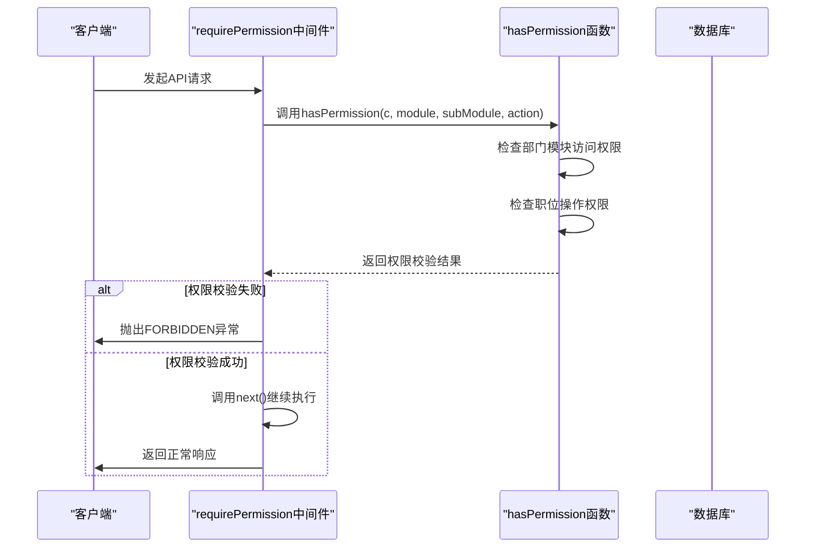
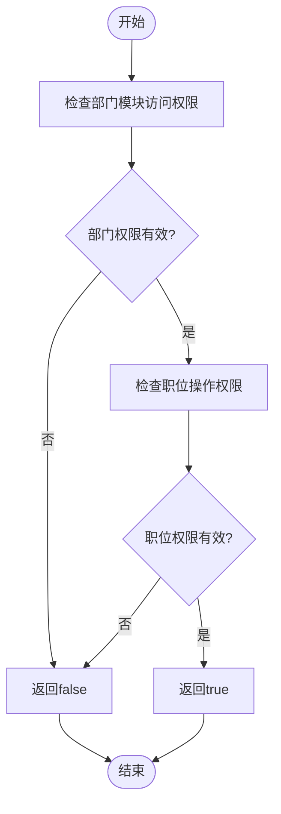
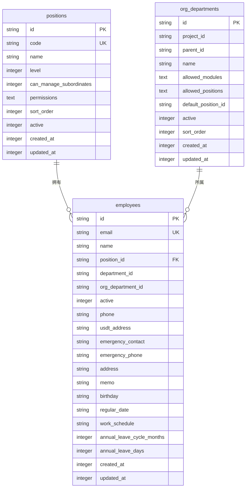
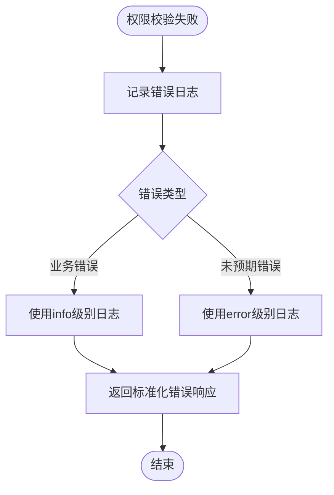

# 后端权限校验机制

<cite>
**本文档引用文件**   
- [permission.ts](file://backend/src/middleware/permission.ts)
- [permissions.ts](file://backend/src/utils/permissions.ts)
- [schema.ts](file://backend/src/db/schema.ts)
- [middleware.ts](file://backend/src/middleware.ts)
- [employees.ts](file://backend/src/routes/employees.ts)
- [position-permissions.ts](file://backend/src/routes/position-permissions.ts)
- [fixed-assets.ts](file://backend/src/routes/fixed-assets.ts)
- [errors.ts](file://backend/src/utils/errors.ts)
- [migration_flatten_positions.sql](file://backend/src/db/migration_flatten_positions.sql)
</cite>

## 目录
1. [权限校验机制概述](#权限校验机制概述)
2. [requirePermission中间件执行流程](#requirepermission中间件执行流程)
3. [hasPermission函数权限匹配逻辑](#haspermission函数权限匹配逻辑)
4. [positions表结构与权限继承](#positions表结构与权限继承)
5. [protectRoute包装器使用示例](#protectroute包装器使用示例)
6. [权限校验失败处理与安全实践](#权限校验失败处理与安全实践)

## 权限校验机制概述

本系统采用基于角色的访问控制（RBAC）模型，通过`module`、`subModule`、`action`三个维度实现细粒度的权限控制。权限系统的核心组件包括`requirePermission`中间件、`hasPermission`权限判断函数以及数据库中的`positions`表结构。系统在用户登录时通过JWT和数据库Session组合方式验证身份，并将用户职位信息预加载到Hono Context中，以降低后续查询开销。

**Section sources**
- [permission.ts](file://backend/src/middleware/permission.ts#L1-L39)
- [permissions.ts](file://backend/src/utils/permissions.ts#L1-L330)
- [middleware.ts](file://backend/src/middleware.ts#L1-L82)

## requirePermission中间件执行流程

`requirePermission`中间件是Hono框架中的核心权限校验组件，它通过工厂函数创建一个异步中间件，拦截请求并进行权限验证。中间件接收`module`、`subModule`、`action`三个参数，分别代表模块、子模块和操作类型。执行流程如下：

1. 调用`hasPermission`函数进行权限校验
2. 如果校验失败，抛出`FORBIDDEN`异常
3. 如果校验成功，调用`next()`继续执行后续中间件或路由处理器

该中间件在Hono应用的路由注册过程中被广泛使用，确保只有具备相应权限的用户才能访问特定API端点。



**Diagram sources **
- [permission.ts](file://backend/src/middleware/permission.ts#L12-L18)
- [permissions.ts](file://backend/src/utils/permissions.ts#L88-L114)

**Section sources**
- [permission.ts](file://backend/src/middleware/permission.ts#L12-L18)

## hasPermission函数权限匹配逻辑

`hasPermission`函数是权限校验的核心逻辑实现，它从Hono Context中获取用户上下文信息，并进行多层级的权限匹配。函数执行流程分为两个主要步骤：

1. **部门模块访问检查**：首先调用`hasDepartmentModuleAccess`函数检查用户所在部门是否允许访问指定模块。总部人员（level=1）不受此限制，其他人员需要检查`departmentModules`列表，支持通配符匹配（如`hr.*`）。
2. **职位操作权限检查**：在通过部门模块检查后，函数会检查用户职位的`permissions`配置，验证是否包含指定的`module`、`subModule`和`action`。

函数通过`getUserPosition`、`getUserEmployee`等辅助函数从Context中获取用户职位和员工信息，并结合`getDepartmentModules`获取部门允许的模块列表，最终实现全面的权限控制。



**Diagram sources **
- [permissions.ts](file://backend/src/utils/permissions.ts#L55-L78)
- [permissions.ts](file://backend/src/utils/permissions.ts#L88-L114)

**Section sources**
- [permissions.ts](file://backend/src/utils/permissions.ts#L88-L114)

## positions表结构与权限继承

`positions`表是权限系统的基础数据结构，定义了系统中所有职位的权限配置。表结构包含以下关键字段：

- `id`: 职位唯一标识
- `code`: 职位代码（如`hq_manager`、`project_manager`）
- `name`: 职位名称
- `level`: 职位层级（1-总部 2-项目 3-组）
- `can_manage_subordinates`: 是否可管理下属
- `permissions`: JSON格式的权限配置

权限继承关系通过`level`字段实现，不同层级的职位具有不同的权限范围。例如，总部主管（level=1）可以访问所有模块，而项目主管（level=2）只能访问本项目相关数据。`allowed_modules`字段在`org_departments`表中定义，用于控制组织部门允许访问的功能模块。



**Diagram sources **
- [schema.ts](file://backend/src/db/schema.ts#L58-L71)
- [schema.ts](file://backend/src/db/schema.ts#L102-L116)

**Section sources**
- [schema.ts](file://backend/src/db/schema.ts#L58-L71)
- [migration_flatten_positions.sql](file://backend/src/db/migration_flatten_positions.sql#L1-L149)

## protectRoute包装器使用示例

`protectRoute`是为OpenAPI路由设计的权限校验包装器，适用于需要直接返回处理函数的场景。与`requirePermission`中间件不同，`protectRoute`直接包装路由处理函数，提供了一种更简洁的权限控制方式。

在`fixed-assets.ts`路由文件中，`protectRoute`被广泛使用：

```typescript
fixedAssetsRoutes.openapi(
  createRoute({ /* 路由配置 */ }),
  protectRoute('asset', 'fixed', 'create', async (c) => {
    // 处理逻辑
  })
)
```

这种模式允许在OpenAPI路由定义中直接集成权限校验，无需额外的中间件堆栈。`protectRoute`首先检查权限，如果校验通过则执行包装的处理函数，否则抛出`FORBIDDEN`异常。

**Section sources**
- [permission.ts](file://backend/src/middleware/permission.ts#L28-L37)
- [fixed-assets.ts](file://backend/src/routes/fixed-assets.ts#L297-L326)

## 权限校验失败处理与安全实践

当权限校验失败时，系统会抛出`FORBIDDEN`异常，由全局错误处理中间件统一处理。错误处理流程包括：

1. 记录详细的错误日志，包含时间戳、URL、方法、用户ID、IP地址等信息
2. 返回标准化的错误响应，包含错误码和消息
3. 对于业务错误使用info级别日志，对于未预期错误使用error级别日志

安全最佳实践包括：
- 使用JWT+数据库Session组合方式验证用户身份
- 将用户职位信息预加载到Context中，减少数据库查询
- 使用KV缓存Session数据，提高性能
- 异步更新会话最后活跃时间，不阻塞请求
- 对敏感操作（如密码重置）进行审计日志记录



**Diagram sources **
- [errors.ts](file://backend/src/utils/errors.ts#L59-L114)
- [middleware.ts](file://backend/src/middleware.ts#L11-L82)

**Section sources**
- [errors.ts](file://backend/src/utils/errors.ts#L59-L114)
- [middleware.ts](file://backend/src/middleware.ts#L11-L82)