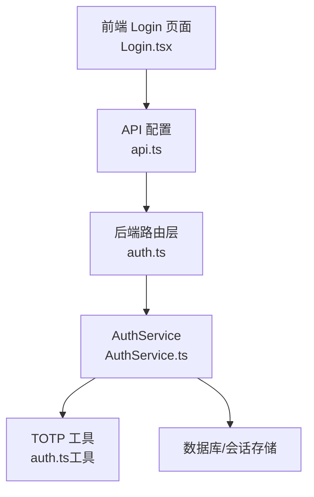
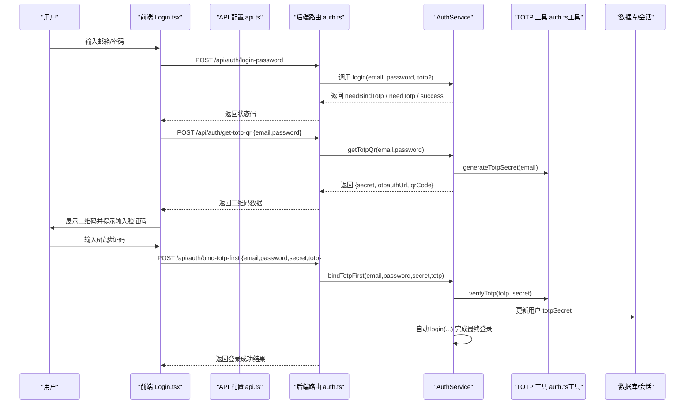
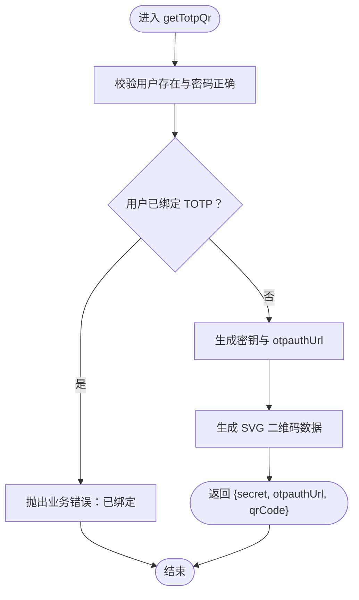
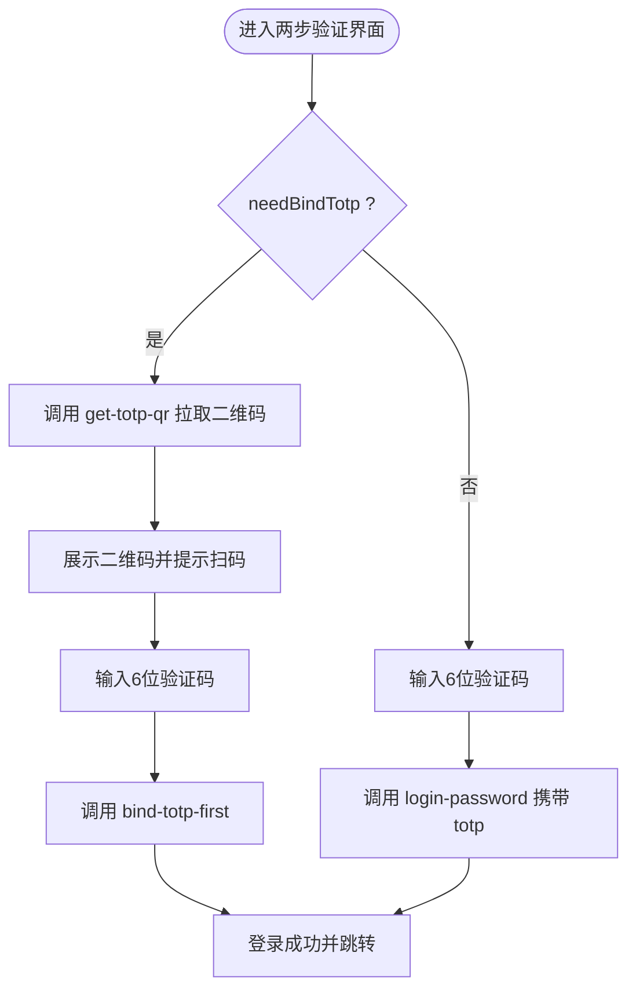
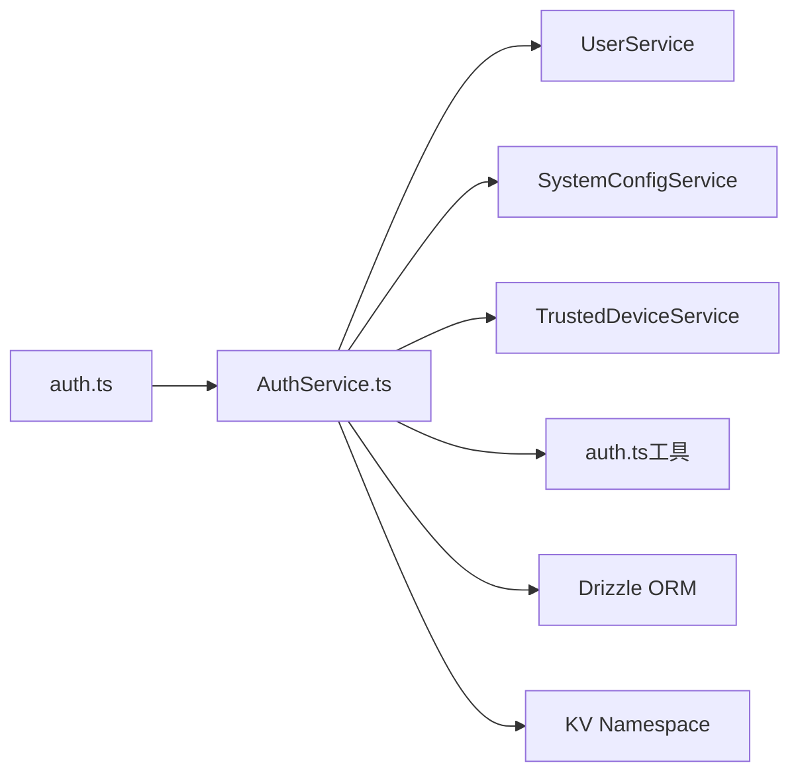

# TOTP绑定流程

<cite>
**本文引用的文件**
- [AuthService.ts](file://backend/src/services/AuthService.ts)
- [auth.ts](file://backend/src/routes/auth.ts)
- [auth.ts（工具）](file://backend/src/utils/auth.ts)
- [business.schema.ts](file://backend/src/schemas/business.schema.ts)
- [errors.ts](file://backend/src/utils/errors.ts)
- [Login.tsx](file://frontend/src/features/auth/pages/Login.tsx)
- [api.ts](file://frontend/src/config/api.ts)
- [migration_trusted_devices.sql](file://backend/src/db/migration_trusted_devices.sql)
</cite>

## 目录
1. [简介](#简介)
2. [项目结构与入口](#项目结构与入口)
3. [核心组件](#核心组件)
4. [架构总览](#架构总览)
5. [详细组件分析](#详细组件分析)
6. [依赖关系分析](#依赖关系分析)
7. [性能与安全考量](#性能与安全考量)
8. [故障排查指南](#故障排查指南)
9. [结论](#结论)

## 简介
本文件面向开发者，系统性说明“TOTP双因素认证”的绑定流程，围绕后端 AuthService 中的 getTotpQr 与 bindTotpFirst 方法，以及前端 Login 页面如何调用这些接口实现绑定界面。文档同时给出绑定流程的时序图、数据流图、错误处理机制，并明确重复绑定的业务规则限制。

## 项目结构与入口
- 后端路由层负责暴露 /api/auth/get-totp-qr 与 /api/auth/bind-totp-first 接口，并将请求转发至 AuthService。
- AuthService 负责：
  - 生成 TOTP 密钥与二维码（SVG 数据 URL）
  - 校验用户凭据与一次性验证码
  - 将密钥写入用户记录并自动登录
- 前端 Login 页面根据后端返回的状态，引导用户扫描二维码并输入验证码，完成绑定或验证。

图表来源
- [Login.tsx](file://frontend/src/features/auth/pages/Login.tsx#L1-L258)
- [api.ts](file://frontend/src/config/api.ts#L1-L40)
- [auth.ts](file://backend/src/routes/auth.ts#L210-L299)
- [AuthService.ts](file://backend/src/services/AuthService.ts#L255-L305)
- [auth.ts（工具）](file://backend/src/utils/auth.ts#L1-L18)

章节来源
- [auth.ts](file://backend/src/routes/auth.ts#L210-L299)
- [AuthService.ts](file://backend/src/services/AuthService.ts#L255-L305)
- [Login.tsx](file://frontend/src/features/auth/pages/Login.tsx#L1-L258)
- [api.ts](file://frontend/src/config/api.ts#L1-L40)

## 核心组件
- 后端路由层
  - 提供 get-totp-qr 与 bind-totp-first 两个接口，分别对应“获取二维码”和“绑定并登录”。
  - 使用 openapi 校验请求体，确保 email、password、secret、totp 等字段合法。
- AuthService
  - getTotpQr：校验用户凭据，若用户未绑定 TOTP，则生成密钥与 otpauthUrl，并生成 SVG 二维码数据，返回给前端。
  - bindTotpFirst：校验用户凭据与验证码，通过后将 secret 写入用户记录，并自动执行一次登录流程。
- 前端 Login 页面
  - 在两步验证阶段根据后端状态决定显示“绑定验证码”还是“验证登录”，并调用相应 API。
  - 首次绑定时自动拉取二维码，用户扫码后输入 6 位验证码完成绑定。

章节来源
- [auth.ts](file://backend/src/routes/auth.ts#L210-L299)
- [AuthService.ts](file://backend/src/services/AuthService.ts#L255-L305)
- [business.schema.ts](file://backend/src/schemas/business.schema.ts#L746-L780)
- [Login.tsx](file://frontend/src/features/auth/pages/Login.tsx#L1-L258)

## 架构总览
下图展示从用户输入到绑定完成的整体流程，包括前后端交互与关键错误分支。

图表来源
- [auth.ts](file://backend/src/routes/auth.ts#L210-L299)
- [AuthService.ts](file://backend/src/services/AuthService.ts#L255-L305)
- [auth.ts（工具）](file://backend/src/utils/auth.ts#L1-L18)
- [Login.tsx](file://frontend/src/features/auth/pages/Login.tsx#L1-L258)
- [api.ts](file://frontend/src/config/api.ts#L1-L40)

## 详细组件分析

### 后端服务：AuthService
- getTotpQr(email, password)
  - 校验用户是否存在与密码正确性
  - 若用户已绑定 TOTP，抛出业务错误（禁止重复绑定）
  - 生成密钥与 otpauthUrl，并生成 SVG 二维码数据（data:image/svg+xml;base64,...）
  - 返回 {secret, otpauthUrl, qrCode}
- bindTotpFirst(email, password, secret, totp)
  - 校验用户与密码
  - 使用 verifyTotp(totp, secret) 校验验证码
  - 将 totpSecret 写入用户记录
  - 记录审计日志
  - 自动执行 login(...) 完成最终登录

图表来源
- [AuthService.ts](file://backend/src/services/AuthService.ts#L255-L281)

章节来源
- [AuthService.ts](file://backend/src/services/AuthService.ts#L255-L305)

### 前端页面：Login.tsx
- 登录阶段
  - 用户提交邮箱/密码后，后端可能返回 needBindTotp 或 needTotp
  - 根据返回状态切换到两步验证界面
- 两步验证阶段
  - 若 needBindTotp：自动拉取二维码数据并展示，等待用户扫码后输入验证码
  - 若 needTotp：直接提示输入验证码进行验证
  - 绑定时调用 /api/auth/bind-totp-first，验证成功后自动登录并跳转

图表来源
- [Login.tsx](file://frontend/src/features/auth/pages/Login.tsx#L98-L160)
- [api.ts](file://frontend/src/config/api.ts#L1-L40)

章节来源
- [Login.tsx](file://frontend/src/features/auth/pages/Login.tsx#L1-L258)
- [api.ts](file://frontend/src/config/api.ts#L1-L40)

### 路由层与数据模型
- 路由层
  - get-totp-qr：请求体使用 loginSchema（email、password、可选 totp），响应体为 {secret, otpauthUrl}
  - bind-totp-first：请求体使用 bindTotpSchema（email、password、secret、totp）
- 请求体校验
  - loginSchema：email 必填，password 必填，totp 可选
  - bindTotpSchema：email、password、secret、totp 均必填

章节来源
- [auth.ts](file://backend/src/routes/auth.ts#L210-L299)
- [business.schema.ts](file://backend/src/schemas/business.schema.ts#L746-L780)

### 错误处理机制
- 业务规则限制
  - 重复绑定：当用户已绑定 TOTP 时，getTotpQr 直接抛出业务错误，阻止二次绑定
- 常见错误场景
  - 用户不存在或密码错误：返回 401
  - 验证码错误：返回 401
  - 验证失败（Zod）：返回 400
  - 服务器异常：返回 500
- 前端处理
  - 登录阶段根据 needBindTotp / needTotp 切换界面
  - 绑定阶段捕获错误并提示用户重新输入

章节来源
- [AuthService.ts](file://backend/src/services/AuthService.ts#L255-L305)
- [errors.ts](file://backend/src/utils/errors.ts#L1-L114)
- [Login.tsx](file://frontend/src/features/auth/pages/Login.tsx#L98-L160)

## 依赖关系分析
- 组件耦合
  - 路由层仅负责参数校验与转发，核心逻辑集中在 AuthService
  - AuthService 依赖 UserService、SystemConfigService、TrustedDeviceService、审计与会话管理
- 外部依赖
  - otplib：生成密钥与验证验证码
  - qrcode-svg：生成 SVG 二维码
  - Drizzle ORM：数据库访问
  - KV 存储：会话缓存

图表来源
- [auth.ts](file://backend/src/routes/auth.ts#L1-L120)
- [AuthService.ts](file://backend/src/services/AuthService.ts#L1-L40)

章节来源
- [auth.ts](file://backend/src/routes/auth.ts#L1-L120)
- [AuthService.ts](file://backend/src/services/AuthService.ts#L1-L40)

## 性能与安全考量
- 性能
  - 二维码生成采用 SVG 数据 URL，避免额外图片请求，前端直接渲染
  - 登录成功后自动写入 KV 与 D1 会话，提升后续鉴权效率
- 安全
  - TOTP 验证在 bindTotpFirst 中严格校验，防止伪造绑定
  - 重复绑定被业务规则禁止，避免同一账户多密钥导致的安全风险
  - 设备信任机制用于新设备登录时的二次验证，降低异地登录风险

[本节为通用建议，不直接分析具体文件]

## 故障排查指南
- 常见问题
  - “已绑定 TOTP”错误：用户已在系统中绑定过 TOTP，无法重复绑定
  - “验证码错误”：输入的 6 位验证码不匹配或过期
  - “密码错误”：邮箱/密码不正确
- 前端定位
  - 两步验证界面未出现二维码：检查 get-totp-qr 是否返回成功
  - 绑定失败：确认验证码是否为 6 位纯数字，且与当前时间窗口匹配
- 后端定位
  - 校验失败：检查 loginSchema 与 bindTotpSchema 的字段是否齐全
  - 业务错误：查看错误码与消息，确认是否命中重复绑定规则

章节来源
- [AuthService.ts](file://backend/src/services/AuthService.ts#L255-L305)
- [errors.ts](file://backend/src/utils/errors.ts#L1-L114)
- [Login.tsx](file://frontend/src/features/auth/pages/Login.tsx#L98-L160)

## 结论
TOTP 绑定流程通过“获取二维码 -> 扫码输入验证码 -> 绑定并自动登录”的闭环实现。后端 AuthService 在 getTotpQr 与 bindTotpFirst 中承担核心职责，前端 Login 页面负责用户体验与状态流转。业务规则明确禁止重复绑定，配合验证码校验与设备信任机制，保障了系统的安全性与可用性。