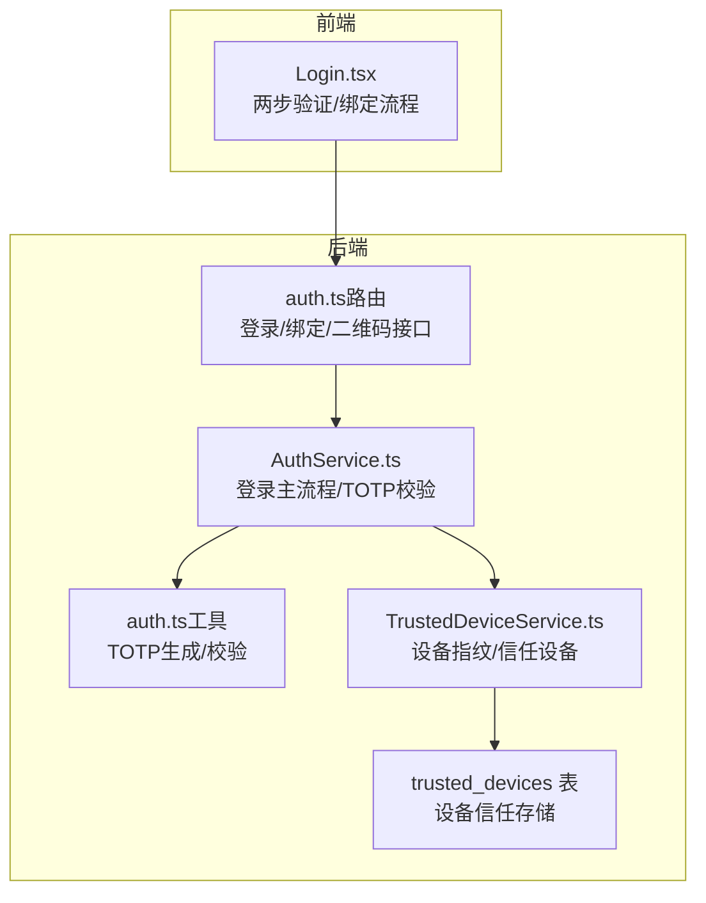
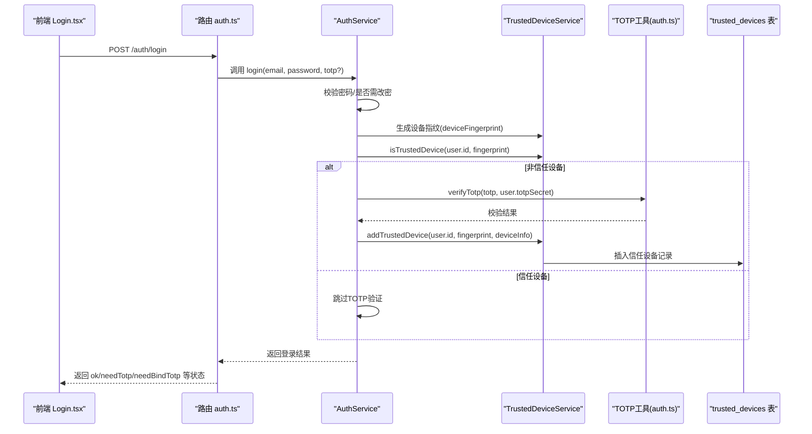
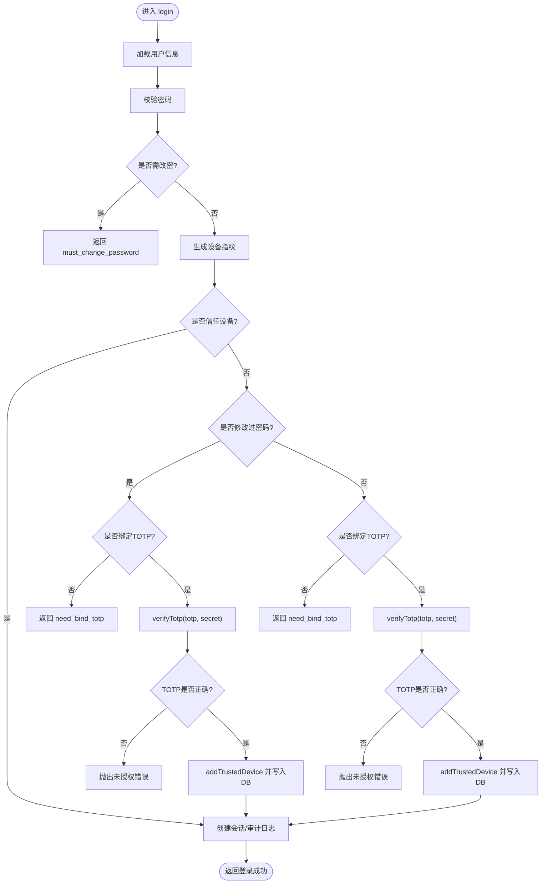
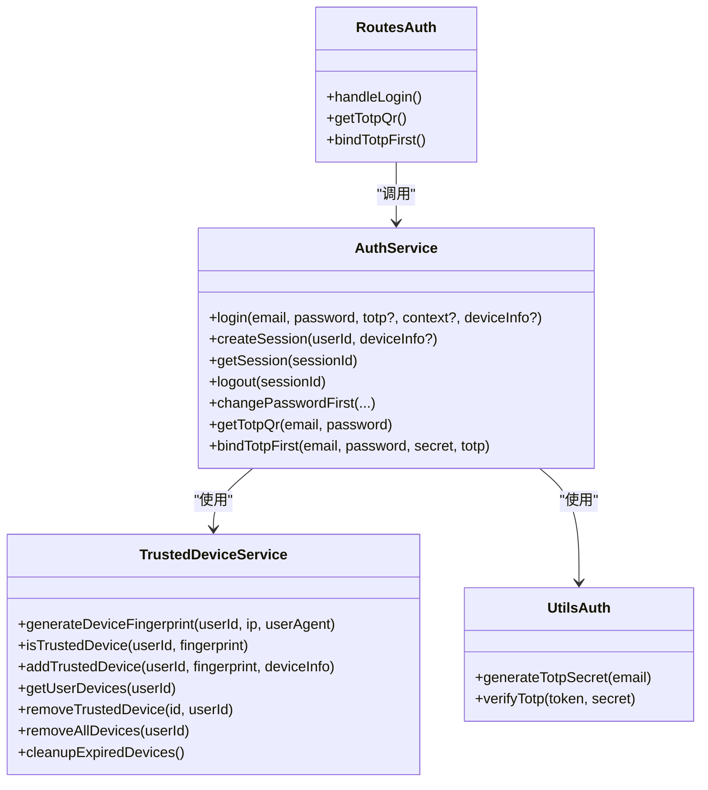

# TOTP验证机制

<cite>
**本文引用的文件**
- [AuthService.ts](file://backend/src/services/AuthService.ts)
- [auth.ts](file://backend/src/utils/auth.ts)
- [TrustedDeviceService.ts](file://backend/src/services/TrustedDeviceService.ts)
- [auth.ts（路由）](file://backend/src/routes/auth.ts)
- [business.schema.ts](file://backend/src/schemas/business.schema.ts)
- [Login.tsx（前端）](file://frontend/src/features/auth/pages/Login.tsx)
- [AuthService.test.ts（测试）](file://backend/test/services/AuthService.test.ts)
- [migration_trusted_devices.sql](file://backend/src/db/migration_trusted_devices.sql)
</cite>

## 目录
1. [简介](#简介)
2. [项目结构](#项目结构)
3. [核心组件](#核心组件)
4. [架构总览](#架构总览)
5. [详细组件分析](#详细组件分析)
6. [依赖关系分析](#依赖关系分析)
7. [性能考量](#性能考量)
8. [故障排查指南](#故障排查指南)
9. [结论](#结论)
10. [附录](#附录)

## 简介
本文件深入解析系统的TOTP（基于时间的一次性验证码）验证机制，重点覆盖：
- AuthService.login方法中“新设备”的TOTP挑战逻辑
- verifyTotp函数如何验证动态验证码
- 验证失败的处理策略与安全防护建议
- 防止暴力破解的建议
- 验证流程的代码示例路径与常见问题解决方案

## 项目结构
围绕TOTP验证的关键文件分布如下：
- 后端服务层：AuthService、TrustedDeviceService
- 工具层：TOTP辅助函数（generateTotpSecret、verifyTotp）
- 路由层：认证相关接口（登录、获取TOTP二维码、绑定TOTP等）
- 前端页面：登录页两步验证流程
- 数据库迁移：trusted_devices表用于设备信任管理

图表来源
- [auth.ts（路由）](file://backend/src/routes/auth.ts#L58-L121)
- [AuthService.ts](file://backend/src/services/AuthService.ts#L29-L131)
- [auth.ts（工具）](file://backend/src/utils/auth.ts#L1-L16)
- [TrustedDeviceService.ts](file://backend/src/services/TrustedDeviceService.ts#L13-L119)
- [migration_trusted_devices.sql](file://backend/src/db/migration_trusted_devices.sql#L1-L16)

章节来源
- [auth.ts（路由）](file://backend/src/routes/auth.ts#L58-L121)
- [AuthService.ts](file://backend/src/services/AuthService.ts#L29-L131)
- [auth.ts（工具）](file://backend/src/utils/auth.ts#L1-L16)
- [TrustedDeviceService.ts](file://backend/src/services/TrustedDeviceService.ts#L13-L119)
- [migration_trusted_devices.sql](file://backend/src/db/migration_trusted_devices.sql#L1-L16)

## 核心组件
- AuthService.login：负责登录主流程，包含密码校验、首次登录改密提示、新设备TOTP挑战、信任设备判定与会话创建。
- TrustedDeviceService：负责设备指纹生成、信任设备查询与添加、设备过期清理。
- 工具函数verifyTotp：基于otplib进行TOTP校验。
- 路由层auth.ts：暴露登录、绑定TOTP、获取二维码等接口，并将结果标准化返回。
- 前端Login.tsx：实现两步验证/绑定流程，按后端返回的状态引导用户下一步操作。

章节来源
- [AuthService.ts](file://backend/src/services/AuthService.ts#L29-L131)
- [TrustedDeviceService.ts](file://backend/src/services/TrustedDeviceService.ts#L13-L119)
- [auth.ts（工具）](file://backend/src/utils/auth.ts#L1-L16)
- [auth.ts（路由）](file://backend/src/routes/auth.ts#L58-L121)
- [Login.tsx（前端）](file://frontend/src/features/auth/pages/Login.tsx#L34-L131)

## 架构总览
下图展示登录与TOTP验证的整体交互流程。

图表来源
- [auth.ts（路由）](file://backend/src/routes/auth.ts#L58-L121)
- [AuthService.ts](file://backend/src/services/AuthService.ts#L29-L131)
- [auth.ts（工具）](file://backend/src/utils/auth.ts#L10-L16)
- [TrustedDeviceService.ts](file://backend/src/services/TrustedDeviceService.ts#L31-L119)
- [migration_trusted_devices.sql](file://backend/src/db/migration_trusted_devices.sql#L1-L16)

## 详细组件分析

### AuthService.login中的新设备TOTP挑战逻辑
- 设备指纹生成：使用用户ID、IP、User-Agent拼接并计算SHA-256，形成设备指纹。
- 信任设备判定：查询trusted_devices表，若记录存在且未过期（默认90天），视为信任设备；过期则删除并返回false。
- 新设备挑战：
  - 若用户已修改过密码且绑定了TOTP：要求提供TOTP，校验失败抛出未授权错误。
  - 若用户未绑定TOTP：返回需要绑定TOTP的状态。
  - 若用户未修改过密码但已绑定TOTP：要求提供TOTP，校验失败抛出未授权错误。
  - 校验成功后，将设备加入信任设备列表，延长后续登录免TOTP。
- 信任设备：若设备已被信任，则跳过TOTP验证，直接进入会话创建与审计日志。

图表来源
- [AuthService.ts](file://backend/src/services/AuthService.ts#L29-L131)
- [auth.ts（工具）](file://backend/src/utils/auth.ts#L10-L16)
- [TrustedDeviceService.ts](file://backend/src/services/TrustedDeviceService.ts#L31-L119)
- [migration_trusted_devices.sql](file://backend/src/db/migration_trusted_devices.sql#L1-L16)

章节来源
- [AuthService.ts](file://backend/src/services/AuthService.ts#L29-L131)
- [TrustedDeviceService.ts](file://backend/src/services/TrustedDeviceService.ts#L31-L119)

### verifyTotp函数的实现与验证策略
- verifyTotp基于otplib的authenticator.verify，传入token与secret进行校验。
- 异常捕获：任何异常均返回false，确保不会因异常导致流程中断。
- 安全要点：
  - 严格限定TOTP长度（前端限制6位），后端schema亦对TOTP长度进行约束。
  - 校验失败立即抛出未授权错误，避免多次尝试。
  - 设备信任仅在TOTP正确时建立，防止恶意设备被信任。

章节来源
- [auth.ts（工具）](file://backend/src/utils/auth.ts#L10-L16)
- [business.schema.ts](file://backend/src/schemas/business.schema.ts#L746-L780)

### 设备信任与指纹机制
- 设备指纹：由用户ID、IP、User-Agent组合并经SHA-256生成，确保跨浏览器/设备场景下的稳定识别。
- 信任设备表：trusted_devices存储设备指纹、设备名、IP、UA、创建与最后使用时间。
- 过期策略：信任设备默认90天有效期，过期自动清理并返回false，降低长期信任风险。
- 设备名解析：根据User-Agent解析出设备类型（如iPhone、Windows PC等），便于用户侧识别。

章节来源
- [TrustedDeviceService.ts](file://backend/src/services/TrustedDeviceService.ts#L13-L119)
- [migration_trusted_devices.sql](file://backend/src/db/migration_trusted_devices.sql#L1-L16)

### 前端两步验证与绑定流程
- 登录阶段：提交邮箱+密码，后端返回needTotp或needBindTotp或mustChangePassword。
- 两步验证阶段：
  - 若needBindTotp：前端请求获取TOTP二维码，用户使用Google Authenticator扫描并输入6位验证码，调用绑定接口完成绑定并自动登录。
  - 若needTotp：用户输入6位验证码，提交后端完成登录。
- 前端对6位验证码进行格式校验，避免无效输入。

章节来源
- [Login.tsx（前端）](file://frontend/src/features/auth/pages/Login.tsx#L34-L131)
- [auth.ts（路由）](file://backend/src/routes/auth.ts#L210-L281)

### 接口与数据模型
- 登录接口：接收email、password、可选totp，返回ok、needTotp、needBindTotp、mustChangePassword等状态。
- 绑定TOTP接口：接收email、password、secret、totp，成功后写入用户totpSecret并自动登录。
- 获取TOTP二维码接口：在用户未绑定TOTP时返回secret、otpauthUrl与二维码SVG数据。

章节来源
- [auth.ts（路由）](file://backend/src/routes/auth.ts#L58-L121)
- [auth.ts（路由）](file://backend/src/routes/auth.ts#L210-L281)
- [AuthService.ts](file://backend/src/services/AuthService.ts#L255-L305)
- [business.schema.ts](file://backend/src/schemas/business.schema.ts#L746-L780)

## 依赖关系分析
- AuthService依赖：
  - TrustedDeviceService：设备指纹生成与信任设备判定
  - UserService/SystemConfigService：用户信息与系统配置（如2FA开关）
  - 工具auth.ts：TOTP生成与校验
  - 数据库schema与sessions表：会话持久化与审计
- TrustedDeviceService依赖：
  - trusted_devices表：设备信任存储
  - Web Crypto API：SHA-256设备指纹生成
- 路由层auth.ts依赖：
  - JWT工具：签发登录令牌
  - 错误处理：统一错误响应

图表来源
- [AuthService.ts](file://backend/src/services/AuthService.ts#L29-L305)
- [TrustedDeviceService.ts](file://backend/src/services/TrustedDeviceService.ts#L13-L167)
- [auth.ts（工具）](file://backend/src/utils/auth.ts#L1-L16)
- [auth.ts（路由）](file://backend/src/routes/auth.ts#L58-L281)

章节来源
- [AuthService.ts](file://backend/src/services/AuthService.ts#L29-L305)
- [TrustedDeviceService.ts](file://backend/src/services/TrustedDeviceService.ts#L13-L167)
- [auth.ts（工具）](file://backend/src/utils/auth.ts#L1-L16)
- [auth.ts（路由）](file://backend/src/routes/auth.ts#L58-L281)

## 性能考量
- 设备指纹计算：SHA-256在Edge Runtime可用，开销较小，建议保持现有实现。
- 信任设备查询：trusted_devices表具备索引，查询性能良好。
- 会话存储：采用KV（高并发）+D1（持久化）双写，KV命中率高，降级到D1保证一致性。
- 前端二维码生成：在Edge Runtime使用qrcode-svg，避免Canvas依赖，减少运行时开销。

章节来源
- [TrustedDeviceService.ts](file://backend/src/services/TrustedDeviceService.ts#L31-L119)
- [AuthService.ts](file://backend/src/services/AuthService.ts#L133-L175)
- [auth.ts（工具）](file://backend/src/utils/auth.ts#L1-L16)

## 故障排查指南
- 验证失败（未授权）
  - 现象：返回needTotp或needBindTotp，或直接抛出未授权错误。
  - 排查：
    - 确认TOTP是否为6位数字
    - 确认TOTP生成时间窗口内（通常30秒）
    - 确认用户已绑定TOTP或已完成绑定流程
    - 检查设备指纹是否被信任（非信任设备需TOTP）
- 绑定失败
  - 现象：bindTotpFirst返回验证码错误。
  - 排查：确认secret与用户输入的TOTP匹配；确认secret来自getTotpQr接口返回。
- 首次登录改密
  - 现象：返回must_change_password。
  - 处理：前端引导用户先修改密码，再进行TOTP绑定或验证。
- 设备信任未生效
  - 现象：仍提示needTotp。
  - 排查：确认addTrustedDevice是否成功插入；检查trusted_devices表记录与过期时间。

章节来源
- [AuthService.ts](file://backend/src/services/AuthService.ts#L29-L131)
- [AuthService.test.ts（测试）](file://backend/test/services/AuthService.test.ts#L42-L98)
- [Login.tsx（前端）](file://frontend/src/features/auth/pages/Login.tsx#L34-L131)

## 结论
本系统通过“设备指纹+信任设备”与“TOTP动态验证码”相结合的方式，在保障安全的同时优化了用户体验。新设备首次登录强制TOTP验证，验证通过后将设备加入信任列表，后续登录可免TOTP。verifyTotp采用otplib进行严格校验，配合设备信任过期策略与会话双写存储，整体具备良好的安全性与性能表现。

## 附录

### 验证流程代码示例路径
- 登录接口与返回状态
  - [handleLogin](file://backend/src/routes/auth.ts#L58-L121)
- 登录主流程与新设备TOTP挑战
  - [login](file://backend/src/services/AuthService.ts#L29-L131)
- TOTP校验函数
  - [verifyTotp](file://backend/src/utils/auth.ts#L10-L16)
- 设备信任与指纹
  - [generateDeviceFingerprint/isTrustedDevice/addTrustedDevice](file://backend/src/services/TrustedDeviceService.ts#L31-L119)
- 获取TOTP二维码与绑定
  - [getTotpQr](file://backend/src/services/AuthService.ts#L255-L281)
  - [bindTotpFirst](file://backend/src/services/AuthService.ts#L283-L305)
- 前端两步验证与绑定流程
  - [Login.tsx](file://frontend/src/features/auth/pages/Login.tsx#L34-L131)

### 常见问题与建议
- 验证码错误
  - 建议：提示用户检查时间同步、重新生成TOTP；确认是否在不同设备上使用同一TOTP。
- 暴力破解防护
  - 建议：结合Cloudflare WAF/IP白名单、速率限制、登录失败计数与临时封禁策略；后端可引入IP/用户维度的限流。
- 设备信任过期
  - 建议：定期清理过期设备；用户可在个人设置中查看与移除信任设备。
- 前端体验
  - 建议：在needBindTotp时自动加载二维码；在needTotp时聚焦验证码输入框；提供清晰的错误提示与重试入口。