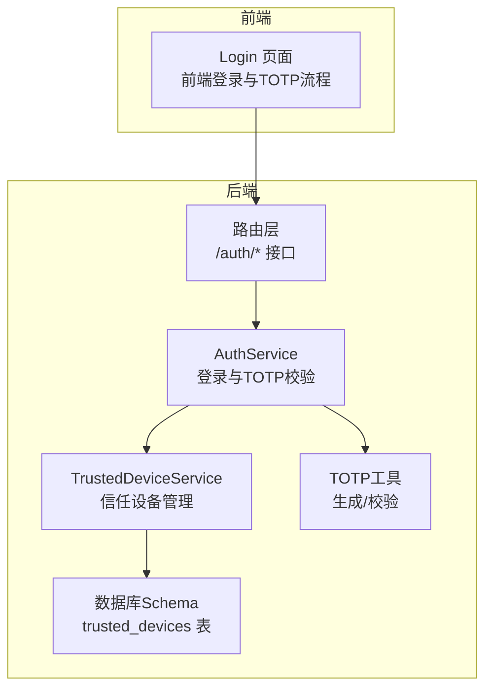
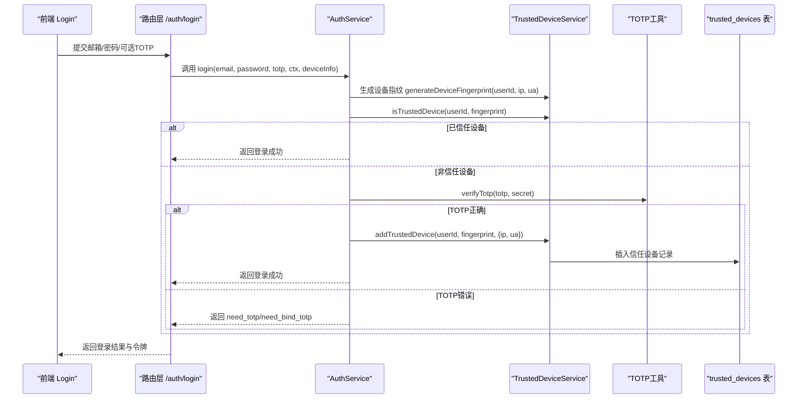
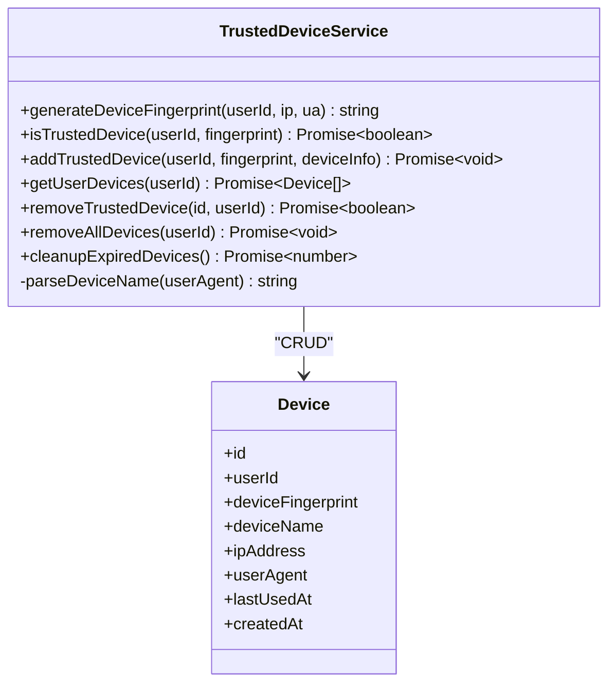
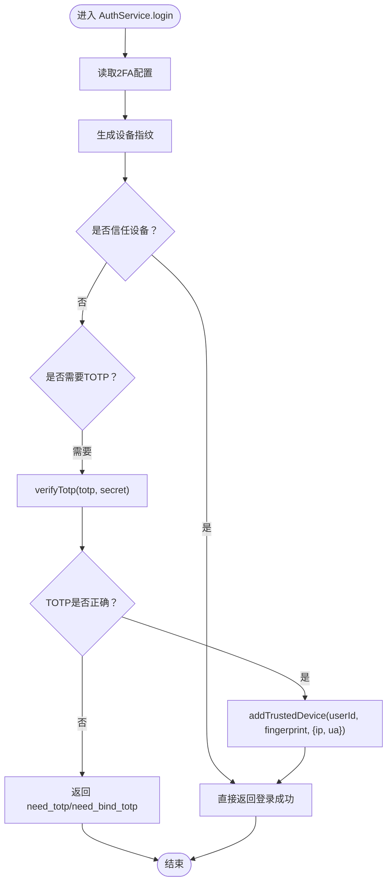
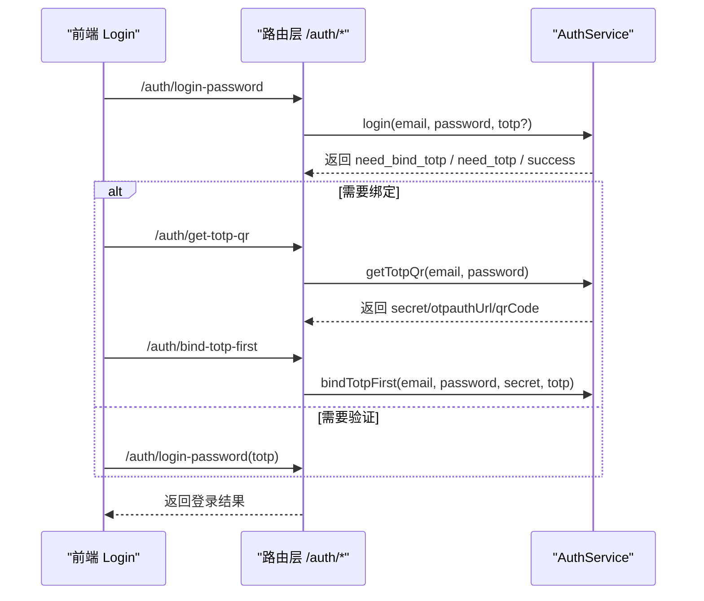
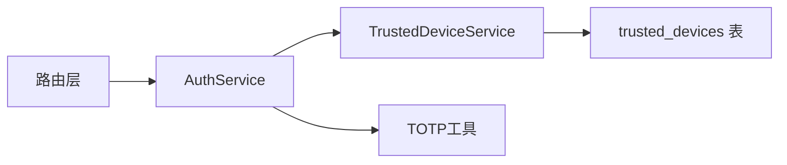

# 信任设备集成

<cite>
**本文引用的文件**
- [backend/src/services/TrustedDeviceService.ts](file://backend/src/services/TrustedDeviceService.ts)
- [backend/src/services/AuthService.ts](file://backend/src/services/AuthService.ts)
- [backend/src/utils/auth.ts](file://backend/src/utils/auth.ts)
- [backend/src/routes/auth.ts](file://backend/src/routes/auth.ts)
- [backend/src/db/migration_trusted_devices.sql](file://backend/src/db/migration_trusted_devices.sql)
- [backend/src/db/schema.ts](file://backend/src/db/schema.ts)
- [frontend/src/features/auth/pages/Login.tsx](file://frontend/src/features/auth/pages/Login.tsx)
</cite>

## 目录
1. [引言](#引言)
2. [项目结构](#项目结构)
3. [核心组件](#核心组件)
4. [架构总览](#架构总览)
5. [详细组件分析](#详细组件分析)
6. [依赖关系分析](#依赖关系分析)
7. [性能考量](#性能考量)
8. [故障排查指南](#故障排查指南)
9. [结论](#结论)
10. [附录](#附录)

## 引言
本文件面向安全工程师与开发者，系统阐述“TOTP与信任设备机制”的协同工作原理。重点包括：
- 在TOTP验证成功后，系统如何通过TrustedDeviceService将当前设备加入信任设备列表；
- 设备指纹生成算法与90天过期策略；
- 防止信任设备被滥用的安全建议；
- 开发者集成参考与流程图示。

## 项目结构
后端采用分层设计：路由层负责请求接入与响应封装，服务层承载业务逻辑（认证、信任设备管理），工具层提供TOTP与加密能力，数据库层通过Drizzle ORM映射SQLite表结构。

图表来源
- [backend/src/routes/auth.ts](file://backend/src/routes/auth.ts#L59-L119)
- [backend/src/services/AuthService.ts](file://backend/src/services/AuthService.ts#L62-L107)
- [backend/src/services/TrustedDeviceService.ts](file://backend/src/services/TrustedDeviceService.ts#L1-L165)
- [backend/src/utils/auth.ts](file://backend/src/utils/auth.ts#L1-L18)
- [backend/src/db/schema.ts](file://backend/src/db/schema.ts#L135-L144)

章节来源
- [backend/src/routes/auth.ts](file://backend/src/routes/auth.ts#L59-L119)
- [backend/src/services/AuthService.ts](file://backend/src/services/AuthService.ts#L62-L107)
- [backend/src/services/TrustedDeviceService.ts](file://backend/src/services/TrustedDeviceService.ts#L1-L165)
- [backend/src/utils/auth.ts](file://backend/src/utils/auth.ts#L1-L18)
- [backend/src/db/schema.ts](file://backend/src/db/schema.ts#L135-L144)

## 核心组件
- TrustedDeviceService：负责设备指纹生成、信任设备查询与过期清理、添加信任设备、移除信任设备等。
- AuthService：负责登录入口、TOTP开关控制、设备指纹生成、信任设备判定与添加。
- TOTP工具：提供TOTP密钥生成与验证码校验。
- 路由层：暴露登录、绑定TOTP、获取二维码等接口，并传递设备信息给AuthService。
- 数据库Schema：trusted_devices表存储信任设备元数据。

章节来源
- [backend/src/services/TrustedDeviceService.ts](file://backend/src/services/TrustedDeviceService.ts#L1-L165)
- [backend/src/services/AuthService.ts](file://backend/src/services/AuthService.ts#L62-L107)
- [backend/src/utils/auth.ts](file://backend/src/utils/auth.ts#L1-L18)
- [backend/src/routes/auth.ts](file://backend/src/routes/auth.ts#L59-L119)
- [backend/src/db/schema.ts](file://backend/src/db/schema.ts#L135-L144)

## 架构总览
下图展示TOTP与信任设备协同的关键流程：前端发起登录，后端根据2FA配置与设备指纹决定是否需要TOTP验证；TOTP通过后，将设备加入信任设备并记录设备信息。

图表来源
- [backend/src/routes/auth.ts](file://backend/src/routes/auth.ts#L59-L119)
- [backend/src/services/AuthService.ts](file://backend/src/services/AuthService.ts#L62-L107)
- [backend/src/services/TrustedDeviceService.ts](file://backend/src/services/TrustedDeviceService.ts#L16-L119)
- [backend/src/utils/auth.ts](file://backend/src/utils/auth.ts#L10-L16)
- [backend/src/db/schema.ts](file://backend/src/db/schema.ts#L135-L144)

## 详细组件分析

### TrustedDeviceService（信任设备服务）
- 设备指纹生成算法
  - 输入：用户ID、客户端IP、User-Agent。
  - 处理：拼接原始串，使用Web Crypto API计算SHA-256，取前32位作为设备指纹标识。
  - 输出：形如“device_<32位十六进制”的指纹字符串。
- 信任设备判定与过期策略
  - 查询：按用户ID与指纹匹配记录。
  - 过期判断：若createdAt距当前超过90天，则删除该记录并返回非信任。
  - 更新使用时间：若未过期，更新lastUsedAt。
- 添加信任设备
  - 解析User-Agent生成设备名称（如iPhone、Android、Windows、Mac、Linux、Chrome、Firefox、Safari等）。
  - 插入记录时同时写入ipAddress、userAgent、createdAt、lastUsedAt。
  - 唯一约束：同一用户+指纹唯一，避免重复插入。
- 设备清理
  - 提供cleanupExpiredDevices方法，按createdAt清理过期设备。
- 用户设备管理
  - 支持列出用户所有信任设备、按ID移除、批量移除。

图表来源
- [backend/src/services/TrustedDeviceService.ts](file://backend/src/services/TrustedDeviceService.ts#L1-L165)
- [backend/src/db/schema.ts](file://backend/src/db/schema.ts#L135-L144)

章节来源
- [backend/src/services/TrustedDeviceService.ts](file://backend/src/services/TrustedDeviceService.ts#L1-L165)
- [backend/src/db/schema.ts](file://backend/src/db/schema.ts#L135-L144)

### AuthService（认证服务）
- 2FA开关与设备指纹
  - 读取系统配置2fa_enabled，默认开启。
  - 生成设备指纹（userId、ip、ua）。
  - 判定是否信任设备：若非信任设备则进入TOTP流程。
- TOTP验证与信任设备添加
  - 若用户密码变更状态或未绑定TOTP，引导绑定或提示输入验证码。
  - 验证通过后，调用TrustedDeviceService.addTrustedDevice，将设备加入信任列表。
- 前端交互
  - 路由层从请求头中提取CF-Connecting-IP/X-Forwarded-For与User-Agent，传入AuthService。

图表来源
- [backend/src/services/AuthService.ts](file://backend/src/services/AuthService.ts#L62-L107)
- [backend/src/utils/auth.ts](file://backend/src/utils/auth.ts#L10-L16)
- [backend/src/services/TrustedDeviceService.ts](file://backend/src/services/TrustedDeviceService.ts#L68-L97)

章节来源
- [backend/src/services/AuthService.ts](file://backend/src/services/AuthService.ts#L62-L107)
- [backend/src/routes/auth.ts](file://backend/src/routes/auth.ts#L59-L119)

### 前端登录与TOTP流程
- 登录阶段：提交邮箱与密码，根据后端返回的状态字段决定下一步。
- 两步验证阶段：
  - 若需绑定TOTP：先获取二维码（getTotpQr），再绑定（bind-totp-first）。
  - 若已有TOTP：提交6位验证码进行登录。
- 设备指纹与信任设备：前端不直接参与设备指纹生成，但会随登录请求携带IP与UA，后端据此生成指纹并判定信任。

图表来源
- [frontend/src/features/auth/pages/Login.tsx](file://frontend/src/features/auth/pages/Login.tsx#L1-L258)
- [backend/src/routes/auth.ts](file://backend/src/routes/auth.ts#L210-L281)
- [backend/src/services/AuthService.ts](file://backend/src/services/AuthService.ts#L265-L305)

章节来源
- [frontend/src/features/auth/pages/Login.tsx](file://frontend/src/features/auth/pages/Login.tsx#L1-L258)
- [backend/src/routes/auth.ts](file://backend/src/routes/auth.ts#L210-L281)
- [backend/src/services/AuthService.ts](file://backend/src/services/AuthService.ts#L265-L305)

## 依赖关系分析
- 组件耦合
  - AuthService依赖TrustedDeviceService与TOTP工具，用于设备指纹生成、信任判定与TOTP校验。
  - 路由层仅负责参数解析与上下文注入，不包含业务逻辑。
- 数据依赖
  - trusted_devices表包含用户ID、指纹、设备名、IP、UA、创建与最后使用时间等字段。
  - 通过索引提升查询效率（按用户ID与指纹组合）。
- 外部依赖
  - Web Crypto API用于SHA-256摘要。
  - otplib用于TOTP密钥生成与校验。

图表来源
- [backend/src/routes/auth.ts](file://backend/src/routes/auth.ts#L59-L119)
- [backend/src/services/AuthService.ts](file://backend/src/services/AuthService.ts#L62-L107)
- [backend/src/services/TrustedDeviceService.ts](file://backend/src/services/TrustedDeviceService.ts#L1-L165)
- [backend/src/utils/auth.ts](file://backend/src/utils/auth.ts#L1-L18)
- [backend/src/db/schema.ts](file://backend/src/db/schema.ts#L135-L144)

章节来源
- [backend/src/routes/auth.ts](file://backend/src/routes/auth.ts#L59-L119)
- [backend/src/services/AuthService.ts](file://backend/src/services/AuthService.ts#L62-L107)
- [backend/src/services/TrustedDeviceService.ts](file://backend/src/services/TrustedDeviceService.ts#L1-L165)
- [backend/src/utils/auth.ts](file://backend/src/utils/auth.ts#L1-L18)
- [backend/src/db/schema.ts](file://backend/src/db/schema.ts#L135-L144)

## 性能考量
- 设备指纹生成
  - 使用SHA-256摘要，复杂度O(n)，n为输入字符串长度，开销极低。
- 信任设备查询
  - 基于用户ID与指纹的联合索引，查询与更新均为O(log n)。
- 过期清理
  - 定期调用cleanupExpiredDevices按createdAt删除过期记录，避免表膨胀。
- 建议
  - 对频繁登录场景，可在边缘层缓存近期信任设备判定结果（短时缓存），减少数据库访问。
  - 对高并发登录，确保数据库连接池与索引维护良好。

[本节为通用性能讨论，无需特定文件来源]

## 故障排查指南
- 常见问题与定位
  - “需要绑定TOTP”：用户未绑定TOTP或密码变更导致首次登录需要绑定。
  - “需要输入验证码”：非信任设备或TOTP错误。
  - “设备已过期”：信任设备90天未使用自动失效，需重新TOTP验证并重新加入信任。
- 建议排查步骤
  - 检查trusted_devices表中是否存在对应用户+指纹记录。
  - 核对createdAt与当前时间差是否超过90天。
  - 确认路由层是否正确透传CF-Connecting-IP与User-Agent。
  - 检查TOTP密钥与验证码是否匹配。
- 相关实现位置
  - 设备指纹生成与过期清理：[backend/src/services/TrustedDeviceService.ts](file://backend/src/services/TrustedDeviceService.ts#L16-L119)
  - 信任设备判定与添加：[backend/src/services/AuthService.ts](file://backend/src/services/AuthService.ts#L62-L107)
  - TOTP校验：[backend/src/utils/auth.ts](file://backend/src/utils/auth.ts#L10-L16)
  - 路由层设备信息透传：[backend/src/routes/auth.ts](file://backend/src/routes/auth.ts#L64-L68)

章节来源
- [backend/src/services/TrustedDeviceService.ts](file://backend/src/services/TrustedDeviceService.ts#L16-L119)
- [backend/src/services/AuthService.ts](file://backend/src/services/AuthService.ts#L62-L107)
- [backend/src/utils/auth.ts](file://backend/src/utils/auth.ts#L10-L16)
- [backend/src/routes/auth.ts](file://backend/src/routes/auth.ts#L64-L68)

## 结论
TOTP与信任设备机制通过“设备指纹+90天过期策略”在保障安全的同时降低后续登录成本。AuthService在TOTP验证通过后调用TrustedDeviceService完成信任设备登记，形成闭环。建议结合定期清理与日志审计，持续优化安全与体验。

[本节为总结性内容，无需特定文件来源]

## 附录

### 设备指纹与过期策略详解
- 设备指纹
  - 输入：用户ID、IP、User-Agent。
  - 算法：SHA-256摘要，取前32位作为指纹标识。
  - 作用：唯一标识设备，用于信任判定。
- 过期策略
  - 有效期：90天。
  - 触发：每次访问更新lastUsedAt；超过期限自动删除。
  - 清理：提供cleanupExpiredDevices方法，按createdAt清理。

章节来源
- [backend/src/services/TrustedDeviceService.ts](file://backend/src/services/TrustedDeviceService.ts#L7-L119)

### 防止信任设备滥用的防护建议（安全工程师）
- 强制2FA：默认启用2FA，确保非信任设备始终需要TOTP。
- 设备信息校验：结合IP与UA变化检测异常登录，必要时触发二次验证。
- 定期清理：周期性执行cleanupExpiredDevices，保持表规模可控。
- 审计与告警：记录信任设备添加、移除、过期事件，异常行为及时告警。
- 最小权限：限制信任设备列表的管理权限，避免越权操作。
- 多因子补充：在高风险场景引入额外因子（如短信验证码、生物识别）。

[本节为通用安全建议，无需特定文件来源]

### 开发者集成示例（开发者）
- 前端
  - 登录成功后根据后端返回字段决定是否进入两步验证页面。
  - 两步验证页面支持“绑定TOTP”和“验证登录”两种路径。
  - 参考路径：[frontend/src/features/auth/pages/Login.tsx](file://frontend/src/features/auth/pages/Login.tsx#L1-L258)
- 后端
  - 登录接口：/auth/login-password，透传设备信息（IP、UA）。
  - 获取二维码：/auth/get-totp-qr，返回secret/otpauthUrl/qrCode。
  - 绑定TOTP：/auth/bind-totp-first，验证后自动登录。
  - 参考路径：
    - [backend/src/routes/auth.ts](file://backend/src/routes/auth.ts#L59-L119)
    - [backend/src/routes/auth.ts](file://backend/src/routes/auth.ts#L210-L281)
    - [backend/src/services/AuthService.ts](file://backend/src/services/AuthService.ts#L265-L305)

章节来源
- [frontend/src/features/auth/pages/Login.tsx](file://frontend/src/features/auth/pages/Login.tsx#L1-L258)
- [backend/src/routes/auth.ts](file://backend/src/routes/auth.ts#L59-L119)
- [backend/src/routes/auth.ts](file://backend/src/routes/auth.ts#L210-L281)
- [backend/src/services/AuthService.ts](file://backend/src/services/AuthService.ts#L265-L305)