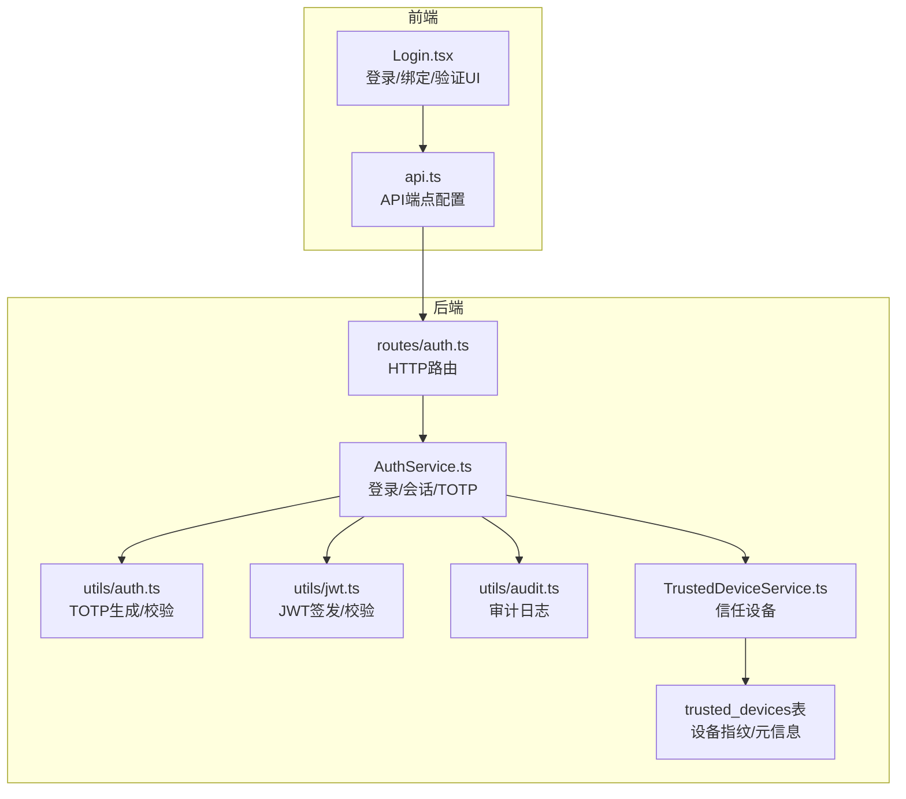
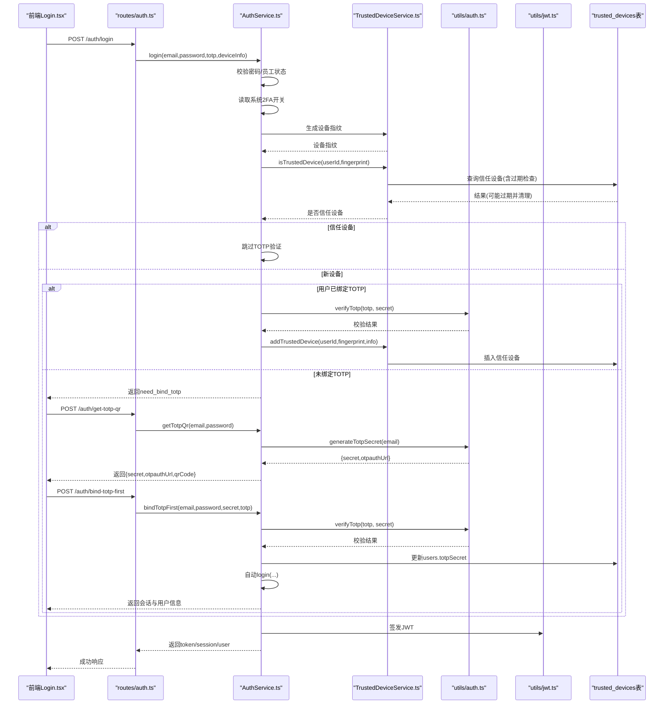
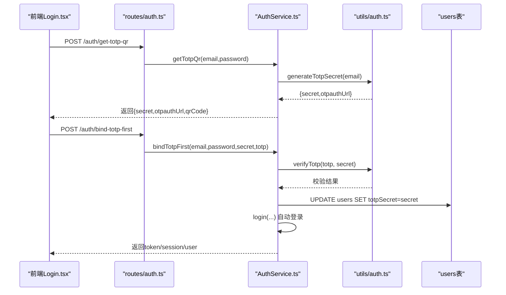
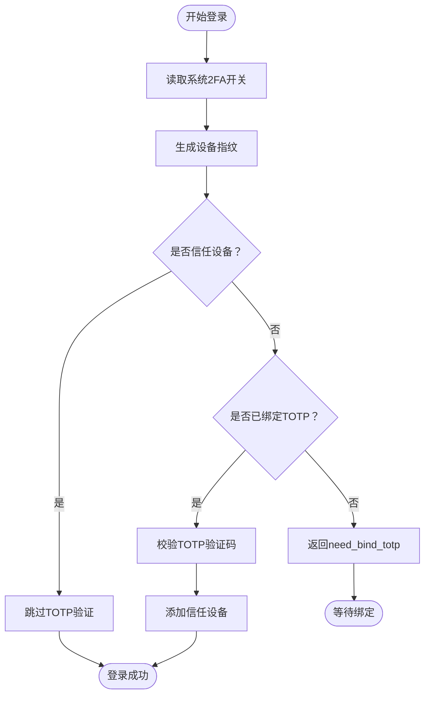
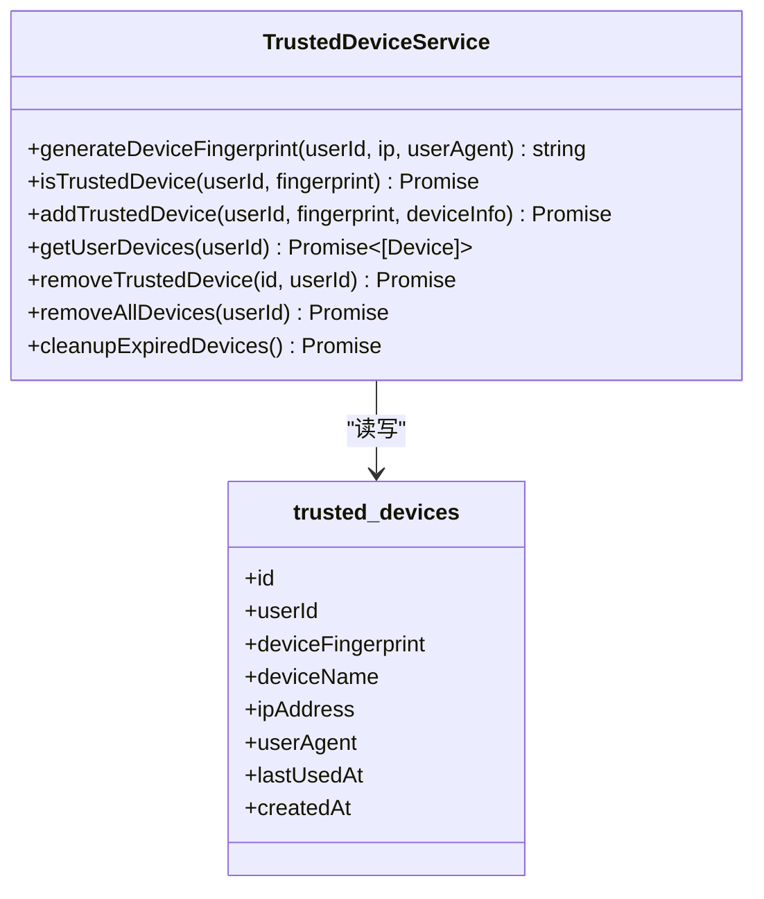
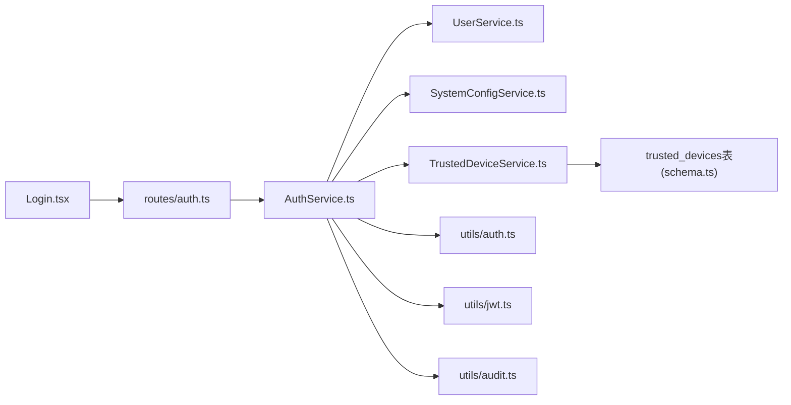

# 双因素认证(TOTP)

<cite>
**本文引用的文件列表**
- [AuthService.ts](file://backend/src/services/AuthService.ts)
- [auth.ts](file://backend/src/utils/auth.ts)
- [TrustedDeviceService.ts](file://backend/src/services/TrustedDeviceService.ts)
- [schema.ts](file://backend/src/db/schema.ts)
- [auth.ts（路由）](file://backend/src/routes/auth.ts)
- [business.schema.ts](file://backend/src/schemas/business.schema.ts)
- [Login.tsx（前端）](file://frontend/src/features/auth/pages/Login.tsx)
- [api.ts（前端API配置）](file://frontend/src/config/api.ts)
- [jwt.ts](file://backend/src/utils/jwt.ts)
- [audit.ts](file://backend/src/utils/audit.ts)
- [migration_trusted_devices.sql](file://backend/src/db/migration_trusted_devices.sql)
- [AuthService.test.ts（测试）](file://backend/test/services/AuthService.test.ts)
</cite>

## 目录
1. [简介](#简介)
2. [项目结构与入口](#项目结构与入口)
3. [核心组件](#核心组件)
4. [架构总览](#架构总览)
5. [关键流程详解](#关键流程详解)
6. [依赖关系分析](#依赖关系分析)
7. [性能与可用性特性](#性能与可用性特性)
8. [安全与防护建议](#安全与防护建议)
9. [故障排查指南](#故障排查指南)
10. [结论](#结论)
11. [附录：集成示例与最佳实践](#附录集成示例与最佳实践)

## 简介
本文件面向安全工程师与开发者，系统性说明本项目的TOTP双因素认证实现机制。重点围绕AuthService中的getTotpQr与bindTotpFirst方法，解释二维码生成、密钥绑定与验证码验证流程；阐述新设备登录时的TOTP挑战流程；说明信任设备机制如何与TOTP协同工作；并给出防止重放攻击与暴力破解的防护建议及TOTP集成的参考示例。

## 项目结构与入口
- 后端服务层：AuthService负责登录、会话、TOTP绑定与验证、信任设备判定等。
- 工具层：auth.ts提供TOTP密钥生成与校验；jwt.ts提供会话令牌签发与校验；audit.ts提供审计日志。
- 数据层：TrustedDeviceService管理信任设备；trusted_devices表存储设备指纹与元信息。
- 路由层：auth.ts路由暴露登录、绑定TOTP、获取二维码等接口。
- 前端：Login.tsx实现登录、首次密码修改、TOTP绑定/验证的交互流程。

图表来源
- [auth.ts（路由）](file://backend/src/routes/auth.ts#L1-L120)
- [AuthService.ts](file://backend/src/services/AuthService.ts#L1-L130)
- [auth.ts](file://backend/src/utils/auth.ts#L1-L18)
- [jwt.ts](file://backend/src/utils/jwt.ts#L1-L119)
- [audit.ts](file://backend/src/utils/audit.ts#L1-L92)
- [TrustedDeviceService.ts](file://backend/src/services/TrustedDeviceService.ts#L1-L167)
- [schema.ts](file://backend/src/db/schema.ts#L135-L144)
- [Login.tsx（前端）](file://frontend/src/features/auth/pages/Login.tsx#L1-L120)
- [api.ts（前端API配置）](file://frontend/src/config/api.ts#L1-L40)

章节来源
- [auth.ts（路由）](file://backend/src/routes/auth.ts#L1-L120)
- [AuthService.ts](file://backend/src/services/AuthService.ts#L1-L130)
- [auth.ts](file://backend/src/utils/auth.ts#L1-L18)
- [jwt.ts](file://backend/src/utils/jwt.ts#L1-L119)
- [audit.ts](file://backend/src/utils/audit.ts#L1-L92)
- [TrustedDeviceService.ts](file://backend/src/services/TrustedDeviceService.ts#L1-L167)
- [schema.ts](file://backend/src/db/schema.ts#L135-L144)
- [Login.tsx（前端）](file://frontend/src/features/auth/pages/Login.tsx#L1-L120)
- [api.ts（前端API配置）](file://frontend/src/config/api.ts#L1-L40)

## 核心组件
- AuthService：登录、会话、TOTP绑定与验证、信任设备判定、审计日志。
- TrustedDeviceService：设备指纹生成、信任设备查询与添加、过期清理。
- utils/auth：TOTP密钥生成与校验。
- utils/jwt：会话令牌签发与校验。
- routes/auth：对外暴露登录、绑定TOTP、获取二维码等REST接口。
- 前端Login.tsx：登录表单、首次密码修改、TOTP绑定/验证流程。

章节来源
- [AuthService.ts](file://backend/src/services/AuthService.ts#L1-L130)
- [TrustedDeviceService.ts](file://backend/src/services/TrustedDeviceService.ts#L1-L167)
- [auth.ts](file://backend/src/utils/auth.ts#L1-L18)
- [jwt.ts](file://backend/src/utils/jwt.ts#L1-L119)
- [auth.ts（路由）](file://backend/src/routes/auth.ts#L1-L120)
- [Login.tsx（前端）](file://frontend/src/features/auth/pages/Login.tsx#L1-L120)

## 架构总览
下图展示TOTP登录与信任设备判定的整体流程，包括新设备挑战、信任设备豁免、TOTP绑定与自动登录。

图表来源
- [auth.ts（路由）](file://backend/src/routes/auth.ts#L120-L282)
- [AuthService.ts](file://backend/src/services/AuthService.ts#L29-L131)
- [TrustedDeviceService.ts](file://backend/src/services/TrustedDeviceService.ts#L13-L119)
- [auth.ts](file://backend/src/utils/auth.ts#L1-L18)
- [jwt.ts](file://backend/src/utils/jwt.ts#L72-L111)
- [schema.ts](file://backend/src/db/schema.ts#L135-L144)

## 关键流程详解

### 1) 二维码生成与密钥绑定（getTotpQr 与 bindTotpFirst）
- getTotpQr
  - 输入：邮箱、密码
  - 校验：用户存在、密码正确、未绑定TOTP
  - 生成：TOTP密钥与otpauth链接；生成SVG二维码数据URL
  - 输出：{secret, otpauthUrl, qrCode}
- bindTotpFirst
  - 输入：邮箱、密码、secret、TOTP验证码
  - 校验：密码正确、TOTP验证码有效
  - 绑定：将secret写入users表；自动执行login并返回会话

图表来源
- [auth.ts（路由）](file://backend/src/routes/auth.ts#L209-L282)
- [AuthService.ts](file://backend/src/services/AuthService.ts#L255-L304)
- [auth.ts](file://backend/src/utils/auth.ts#L1-L18)
- [schema.ts](file://backend/src/db/schema.ts#L11-L24)

章节来源
- [AuthService.ts](file://backend/src/services/AuthService.ts#L255-L304)
- [auth.ts](file://backend/src/utils/auth.ts#L1-L18)
- [auth.ts（路由）](file://backend/src/routes/auth.ts#L209-L282)
- [schema.ts](file://backend/src/db/schema.ts#L11-L24)

### 2) 新设备登录的TOTP挑战流程
- 登录时，系统根据设备指纹判断是否信任设备：
  - 若非信任设备：要求用户提供6位TOTP验证码；
  - 若已绑定TOTP：验证通过后自动加入信任设备；
  - 若未绑定TOTP：返回need_bind_totp，引导绑定。
- 信任设备有效期：90天；过期自动清理并要求重新验证。

图表来源
- [AuthService.ts](file://backend/src/services/AuthService.ts#L62-L107)
- [TrustedDeviceService.ts](file://backend/src/services/TrustedDeviceService.ts#L13-L119)

章节来源
- [AuthService.ts](file://backend/src/services/AuthService.ts#L62-L107)
- [TrustedDeviceService.ts](file://backend/src/services/TrustedDeviceService.ts#L13-L119)

### 3) 信任设备机制与TOTP协同
- 设备指纹：基于用户ID、IP、User-Agent计算SHA-256，前缀化标识。
- 信任设备表：存储设备指纹、设备名称、IP/User-Agent、创建/最近使用时间。
- 过期策略：90天；过期自动删除并刷新最后使用时间。
- 协同效果：信任设备可豁免新设备TOTP挑战，提升用户体验。

图表来源
- [TrustedDeviceService.ts](file://backend/src/services/TrustedDeviceService.ts#L1-L167)
- [schema.ts](file://backend/src/db/schema.ts#L135-L144)
- [migration_trusted_devices.sql](file://backend/src/db/migration_trusted_devices.sql#L1-L17)

章节来源
- [TrustedDeviceService.ts](file://backend/src/services/TrustedDeviceService.ts#L1-L167)
- [schema.ts](file://backend/src/db/schema.ts#L135-L144)
- [migration_trusted_devices.sql](file://backend/src/db/migration_trusted_devices.sql#L1-L17)

### 4) 前端集成与交互
- 登录：提交邮箱/密码，根据返回状态进入“首次密码修改”或“二步验证/绑定”步骤。
- 二步验证/绑定：若未绑定，先获取二维码并提示扫描；输入6位验证码后绑定或验证登录。
- 自动登录：绑定成功后自动登录并返回JWT与会话信息。

章节来源
- [Login.tsx（前端）](file://frontend/src/features/auth/pages/Login.tsx#L1-L258)
- [api.ts（前端API配置）](file://frontend/src/config/api.ts#L1-L40)

## 依赖关系分析
- AuthService依赖：
  - UserService（用户/员工信息）
  - SystemConfigService（2FA开关）
  - TrustedDeviceService（信任设备）
  - utils/auth（TOTP生成/校验）
  - utils/jwt（会话令牌）
  - utils/audit（审计日志）
- TrustedDeviceService依赖Drizzle ORM与trusted_devices表。
- 路由层auth.ts依赖OpenAPI/Hono进行请求校验与响应封装。
- 前端Login.tsx依赖api.ts配置的后端端点。

图表来源
- [AuthService.ts](file://backend/src/services/AuthService.ts#L1-L130)
- [TrustedDeviceService.ts](file://backend/src/services/TrustedDeviceService.ts#L1-L167)
- [auth.ts（路由）](file://backend/src/routes/auth.ts#L1-L120)
- [schema.ts](file://backend/src/db/schema.ts#L135-L144)
- [Login.tsx（前端）](file://frontend/src/features/auth/pages/Login.tsx#L1-L120)

章节来源
- [AuthService.ts](file://backend/src/services/AuthService.ts#L1-L130)
- [auth.ts（路由）](file://backend/src/routes/auth.ts#L1-L120)
- [schema.ts](file://backend/src/db/schema.ts#L135-L144)

## 性能与可用性特性
- 会话存储：优先KV缓存（高并发读取），降级至D1持久化（审计与一致性）。
- 设备指纹：SHA-256哈希，计算成本低，适合高频判定。
- 信任设备：索引优化（user_id、fingerprint），查询高效。
- 令牌签名：HMAC-SHA256，签发/校验轻量，支持边缘运行时。

章节来源
- [AuthService.ts](file://backend/src/services/AuthService.ts#L133-L175)
- [TrustedDeviceService.ts](file://backend/src/services/TrustedDeviceService.ts#L13-L119)
- [jwt.ts](file://backend/src/utils/jwt.ts#L72-L111)
- [migration_trusted_devices.sql](file://backend/src/db/migration_trusted_devices.sql#L1-L17)

## 安全与防护建议
- 防重放攻击
  - 使用短期JWT（默认2小时），结合会话KV过期控制，降低令牌泄露风险。
  - 在审计日志中记录登录IP与UA，便于异常检测。
- 防暴力破解
  - 建议在网关层增加速率限制（每IP/每用户每分钟请求次数）。
  - 对连续失败登录增加临时封禁或CAPTCHA挑战。
  - 严格校验TOTP验证码长度与字符集（仅6位数字）。
- 密钥与传输安全
  - 二维码与密钥仅在HTTPS下传输；避免明文存储secret。
  - 服务器端对TOTP校验失败进行最小化错误反馈，避免信息泄露。
- 设备信任策略
  - 90天信任有效期合理；建议定期清理过期设备并提醒用户重新验证。
  - 对高风险场景（如异地登录）可强制要求TOTP验证。

章节来源
- [jwt.ts](file://backend/src/utils/jwt.ts#L56-L111)
- [audit.ts](file://backend/src/utils/audit.ts#L36-L92)
- [TrustedDeviceService.ts](file://backend/src/services/TrustedDeviceService.ts#L13-L119)
- [AuthService.ts](file://backend/src/services/AuthService.ts#L62-L107)

## 故障排查指南
- 常见问题
  - “请绑定Google验证码”：用户未绑定TOTP，需先调用获取二维码并绑定。
  - “新设备首次登录，请输入Google验证码”：非信任设备，需输入当前TOTP。
  - “验证码错误”：TOTP校验失败，检查时间同步与输入是否为6位数字。
  - “密码未设置/密码错误”：确认用户密码状态与输入。
- 排查步骤
  - 检查系统2FA开关与用户状态。
  - 核对设备指纹生成逻辑与信任设备表数据。
  - 查看审计日志中的登录IP与UA，定位异常来源。
  - 确认前端调用顺序：先get-totp-qr，再bind-totp-first或login带totp。

章节来源
- [AuthService.ts](file://backend/src/services/AuthService.ts#L62-L107)
- [auth.ts（路由）](file://backend/src/routes/auth.ts#L209-L282)
- [audit.ts](file://backend/src/utils/audit.ts#L36-L92)
- [AuthService.test.ts（测试）](file://backend/test/services/AuthService.test.ts#L1-L144)

## 结论
本项目通过TOTP与信任设备机制实现了“新设备挑战+信任豁免”的平衡方案。AuthService统一编排登录、会话、TOTP与信任设备逻辑；TrustedDeviceService提供高效的设备指纹与过期管理；前端Login.tsx提供直观的绑定/验证流程。配合短期JWT与审计日志，整体具备较好的安全性与可用性。建议在生产环境中进一步强化速率限制与风控策略，以抵御重放与暴力破解。

## 附录：集成示例与最佳实践

### A. 前端集成要点（参考）
- 登录流程
  - 提交邮箱/密码，根据needBindTotp/needTotp切换界面。
  - 若needBindTotp：调用获取二维码接口，引导用户扫描并输入6位验证码完成绑定。
  - 若needTotp：直接输入6位验证码进行登录。
- 绑定流程
  - 先调用获取二维码接口，保存secret与otpauthUrl。
  - 用户在Authenticator应用中扫描二维码后，输入当前6位验证码。
  - 调用绑定接口，成功后自动登录并返回token与会话信息。

章节来源
- [Login.tsx（前端）](file://frontend/src/features/auth/pages/Login.tsx#L1-L258)
- [api.ts（前端API配置）](file://frontend/src/config/api.ts#L1-L40)
- [auth.ts（路由）](file://backend/src/routes/auth.ts#L209-L282)

### B. 后端接口清单（参考）
- 获取二维码
  - 方法：POST
  - 路径：/api/auth/get-totp-qr
  - 请求体：邮箱、密码
  - 响应：{secret, otpauthUrl, qrCode}
- 绑定TOTP
  - 方法：POST
  - 路径：/api/auth/bind-totp-first
  - 请求体：邮箱、密码、secret、TOTP验证码
  - 响应：token、session、user
- 登录
  - 方法：POST
  - 路径：/api/auth/login 或 /api/auth/login-password
  - 请求体：邮箱、密码、可选TOTP验证码
  - 响应：根据状态返回need_bind_totp/need_totp或登录成功

章节来源
- [auth.ts（路由）](file://backend/src/routes/auth.ts#L120-L282)
- [business.schema.ts](file://backend/src/schemas/business.schema.ts#L745-L780)

### C. 数据模型与字段（参考）
- users表
  - totpSecret：存储TOTP密钥
  - mustChangePassword/passwordChanged：首次登录与密码修改状态
- trusted_devices表
  - deviceFingerprint：设备指纹
  - deviceName/ipAddress/userAgent：设备与环境信息
  - createdAt/lastUsedAt：创建与最近使用时间

章节来源
- [schema.ts](file://backend/src/db/schema.ts#L11-L24)
- [schema.ts](file://backend/src/db/schema.ts#L135-L144)
- [migration_trusted_devices.sql](file://backend/src/db/migration_trusted_devices.sql#L1-L17)