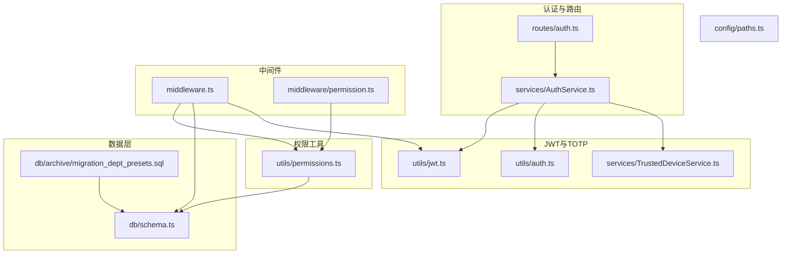
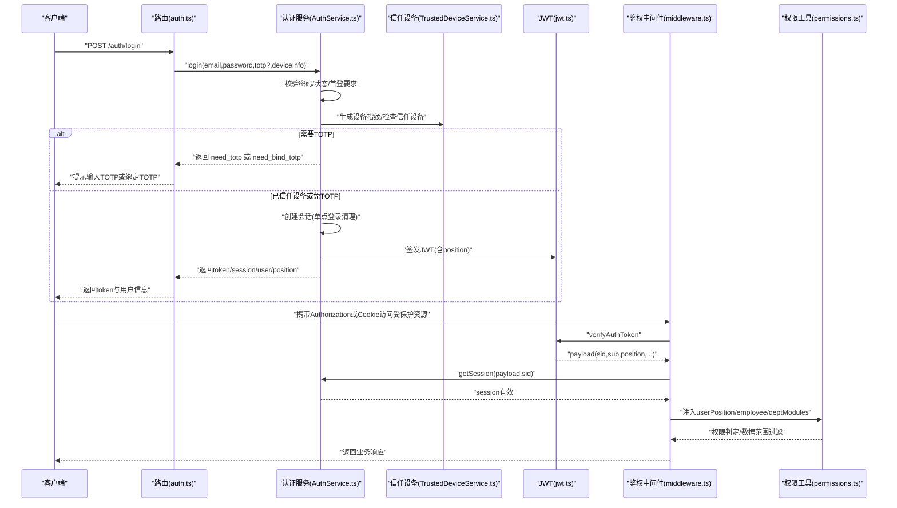
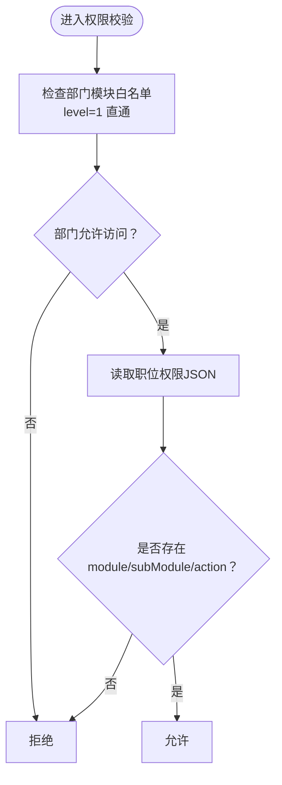
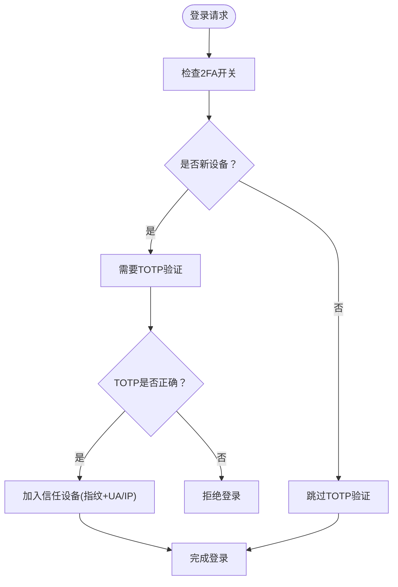
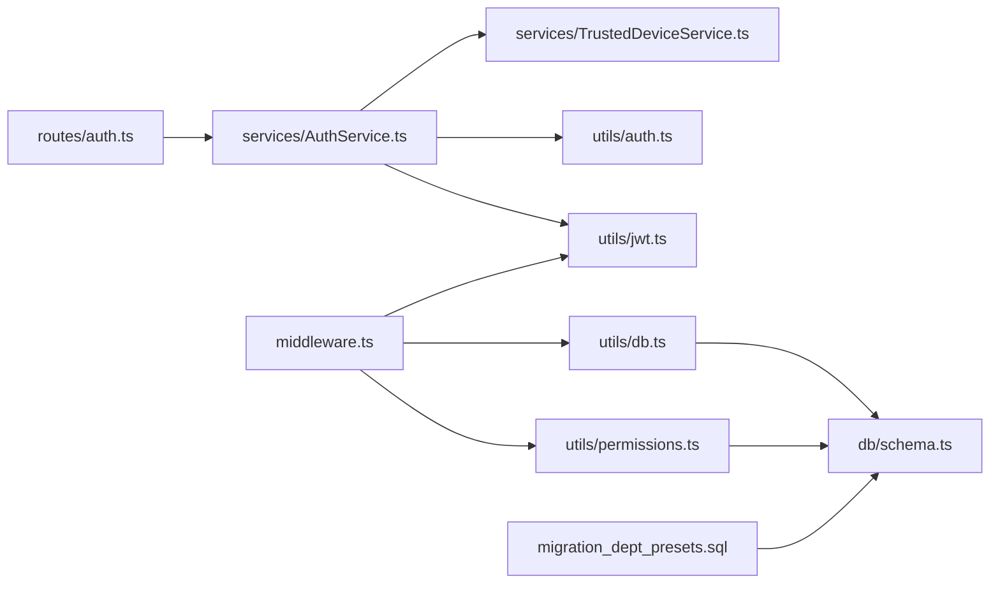

# 认证与权限系统

<cite>
**本文引用的文件**
- [jwt.ts](file://backend/src/utils/jwt.ts)
- [AuthService.ts](file://backend/src/services/AuthService.ts)
- [auth.ts](file://backend/src/routes/auth.ts)
- [middleware.ts](file://backend/src/middleware.ts)
- [permission.ts](file://backend/src/middleware/permission.ts)
- [permissions.ts](file://backend/src/utils/permissions.ts)
- [TrustedDeviceService.ts](file://backend/src/services/TrustedDeviceService.ts)
- [auth.ts](file://backend/src/utils/auth.ts)
- [schema.ts](file://backend/src/db/schema.ts)
- [paths.ts](file://backend/src/config/paths.ts)
- [migration_dept_presets.sql](file://backend/src/db/archive/migration_dept_presets.sql)
- [RBAC.test.ts](file://backend/test/services/RBAC.test.ts)
</cite>

## 目录
1. [简介](#简介)
2. [项目结构](#项目结构)
3. [核心组件](#核心组件)
4. [架构总览](#架构总览)
5. [详细组件分析](#详细组件分析)
6. [依赖关系分析](#依赖关系分析)
7. [性能考量](#性能考量)
8. [故障排查指南](#故障排查指南)
9. [结论](#结论)
10. [附录](#附录)

## 简介
本文件面向安全工程师与开发者，系统性解析本项目的“认证与权限”体系，包括：
- 基于 JWT 的认证流程：从登录、令牌签发到请求验证的全链路
- 基于职位的权限控制（RBAC）：如何通过职位权限与部门模块白名单实现细粒度访问控制
- 部门预设权限配置：结合迁移脚本说明部门允许模块的配置逻辑
- TOTP 双因素认证与信任设备：设备指纹、信任设备存储与自动放行策略
- 安全威胁模型与防护建议
- 开发者权限校验的代码示例路径

## 项目结构
后端采用 Hono + Drizzle ORM 架构，安全相关的关键目录与文件如下：
- 认证与路由：routes/auth.ts、services/AuthService.ts
- 中间件：middleware.ts、middleware/permission.ts
- 权限工具：utils/permissions.ts
- JWT 工具：utils/jwt.ts
- TOTP 与信任设备：utils/auth.ts、services/TrustedDeviceService.ts
- 数据层：db/schema.ts、db/archive/migration_dept_presets.sql
- 路径白名单：config/paths.ts
- 测试：test/services/RBAC.test.ts

图表来源
- [auth.ts](file://backend/src/routes/auth.ts#L1-L120)
- [AuthService.ts](file://backend/src/services/AuthService.ts#L1-L140)
- [middleware.ts](file://backend/src/middleware.ts#L1-L82)
- [permission.ts](file://backend/src/middleware/permission.ts#L1-L39)
- [permissions.ts](file://backend/src/utils/permissions.ts#L1-L120)
- [jwt.ts](file://backend/src/utils/jwt.ts#L1-L119)
- [auth.ts](file://backend/src/utils/auth.ts#L1-L18)
- [TrustedDeviceService.ts](file://backend/src/services/TrustedDeviceService.ts#L1-L167)
- [schema.ts](file://backend/src/db/schema.ts#L100-L145)
- [paths.ts](file://backend/src/config/paths.ts#L1-L23)
- [migration_dept_presets.sql](file://backend/src/db/archive/migration_dept_presets.sql#L1-L73)

章节来源
- [auth.ts](file://backend/src/routes/auth.ts#L1-L120)
- [AuthService.ts](file://backend/src/services/AuthService.ts#L1-L140)
- [middleware.ts](file://backend/src/middleware.ts#L1-L82)
- [permission.ts](file://backend/src/middleware/permission.ts#L1-L39)
- [permissions.ts](file://backend/src/utils/permissions.ts#L1-L120)
- [jwt.ts](file://backend/src/utils/jwt.ts#L1-L119)
- [auth.ts](file://backend/src/utils/auth.ts#L1-L18)
- [TrustedDeviceService.ts](file://backend/src/services/TrustedDeviceService.ts#L1-L167)
- [schema.ts](file://backend/src/db/schema.ts#L100-L145)
- [paths.ts](file://backend/src/config/paths.ts#L1-L23)
- [migration_dept_presets.sql](file://backend/src/db/archive/migration_dept_presets.sql#L1-L73)

## 核心组件
- JWT 工具：负责 JWT 头、载荷、签名、过期校验与提取 Bearer Token
- 认证服务：处理登录、会话创建、登出、首次改密、TOTP 绑定与二维码生成
- 中间件：统一鉴权入口，从 Cookie/Headers 提取令牌，验证并注入用户上下文
- 权限工具：实现部门模块白名单、职位权限矩阵、数据访问范围过滤等
- 信任设备服务：设备指纹生成、信任设备判定与维护
- 路由保护：基于 requirePermission/protectRoute 的权限拦截

章节来源
- [jwt.ts](file://backend/src/utils/jwt.ts#L1-L119)
- [AuthService.ts](file://backend/src/services/AuthService.ts#L1-L140)
- [middleware.ts](file://backend/src/middleware.ts#L1-L82)
- [permissions.ts](file://backend/src/utils/permissions.ts#L1-L120)
- [TrustedDeviceService.ts](file://backend/src/services/TrustedDeviceService.ts#L1-L167)
- [auth.ts](file://backend/src/routes/auth.ts#L1-L120)

## 架构总览
下图展示从客户端到服务端的认证与权限校验主流程。

图表来源
- [auth.ts](file://backend/src/routes/auth.ts#L1-L120)
- [AuthService.ts](file://backend/src/services/AuthService.ts#L1-L140)
- [TrustedDeviceService.ts](file://backend/src/services/TrustedDeviceService.ts#L1-L167)
- [jwt.ts](file://backend/src/utils/jwt.ts#L1-L119)
- [middleware.ts](file://backend/src/middleware.ts#L1-L82)
- [permissions.ts](file://backend/src/utils/permissions.ts#L1-L120)

## 详细组件分析

### JWT 认证与令牌生命周期
- 令牌结构：标准 JWT Header/Payload/Sig；Payload 包含 sid、sub、email、name、position 等
- 签发：使用 HMAC-SHA256，secret 由环境变量提供，TTL 默认 2 小时
- 验证：校验签名与过期时间，失败返回 401
- 提取：支持 Authorization: Bearer、Cookie、自定义头 x-caiwu-token
- 登录成功后，路由将 position 信息写入 JWT，中间件在后续请求中解码并注入上下文

章节来源
- [jwt.ts](file://backend/src/utils/jwt.ts#L1-L119)
- [auth.ts](file://backend/src/routes/auth.ts#L1-L120)

### 登录与会话管理
- 登录流程要点：
  - 校验用户存在、员工状态、密码
  - 首次登录强制修改密码
  - 双因子开关来自系统配置，默认开启
  - 新设备需 TOTP 验证并通过后加入信任设备
  - 信任设备可免去后续 TOTP 验证
- 会话：
  - 单点登录：同一用户旧会话被清理
  - KV + D1 双写缓存，KV 作为热缓存，D1 作为持久化备份
  - 会话过期时间 7 天，异步更新 last_active_at

章节来源
- [AuthService.ts](file://backend/src/services/AuthService.ts#L1-L140)
- [auth.ts](file://backend/src/routes/auth.ts#L1-L120)
- [middleware.ts](file://backend/src/middleware.ts#L1-L82)

### 基于职位的权限控制（RBAC）
- 权限判定两阶段：
  1) 部门模块白名单：总部人员(level=1)不受限制；否则检查 allowed_modules（支持通配符）
  2) 职位权限矩阵：按 module/subModule/action 逐级匹配
- 职位权限来源：
  - positions.permissions 字段为 JSON 结构，按模块/子模块组织动作数组
  - 通过 hasPermission(ctx, module, subModule, action) 进行判断
- 数据访问控制：
  - 不同层级（总部/项目/组/工程师）对表数据的可见范围不同
  - 提供 getDataAccessFilter(ctx, tableAlias) 返回 where 条件与绑定参数，用于 SQL 查询过滤

图表来源
- [permissions.ts](file://backend/src/utils/permissions.ts#L1-L120)

章节来源
- [permissions.ts](file://backend/src/utils/permissions.ts#L1-L120)
- [RBAC.test.ts](file://backend/test/services/RBAC.test.ts#L155-L209)

### 部门预设权限配置（migration_dept_presets.sql）
- org_departments.allowed_modules：部门允许访问的模块集合，支持通配符
- allowed_positions/default_position_id：部门允许的职位与默认职位
- 示例：
  - 总部 HR/FIN/ADM：允许 hr.*、finance.*、report.*、self.*
  - 项目 HR/FIN/ADM：允许 hr.*、finance.*、report.*、self.*（项目场景）
  - 总部管理层：allowed_modules 设置为 "*"，授予全部权限
- 该配置与 hasDepartmentModuleAccess 逻辑配合，决定模块级访问边界

章节来源
- [migration_dept_presets.sql](file://backend/src/db/archive/migration_dept_presets.sql#L1-L73)
- [permissions.ts](file://backend/src/utils/permissions.ts#L1-L120)
- [schema.ts](file://backend/src/db/schema.ts#L100-L116)

### TOTP 双因素认证与信任设备
- TOTP 生成与验证：使用 totplib，提供生成密钥、生成二维码、验证令牌
- 设备指纹：基于 userId + IP + UA 的 SHA-256 摘要，形成唯一标识
- 信任设备：
  - 首次通过 TOTP 验证的新设备会被加入信任设备表
  - 信任有效期 90 天，过期自动失效并清理
  - 每次访问会更新 lastUsedAt
- 登录流程：
  - 若启用 2FA 且非信任设备，则要求输入 TOTP
  - 信任设备则直接放行

图表来源
- [AuthService.ts](file://backend/src/services/AuthService.ts#L1-L140)
- [TrustedDeviceService.ts](file://backend/src/services/TrustedDeviceService.ts#L1-L167)
- [auth.ts](file://backend/src/utils/auth.ts#L1-L18)

章节来源
- [AuthService.ts](file://backend/src/services/AuthService.ts#L1-L140)
- [TrustedDeviceService.ts](file://backend/src/services/TrustedDeviceService.ts#L1-L167)
- [auth.ts](file://backend/src/utils/auth.ts#L1-L18)

### 请求验证与路由保护
- 中间件：
  - 公共路径白名单：健康检查、登录、绑定 TOTP 等
  - 非公共路径：从 Cookie/Headers 提取令牌，verifyAuthToken 校验
  - 从 KV/D1 加载 session 并注入 userPosition/employee/departmentModules
- 路由保护：
  - requirePermission/module/subModule/action：中间件式权限拦截
  - protectRoute：包装路由处理器进行权限检查
  - /my-permissions：返回当前职位的权限 JSON

章节来源
- [middleware.ts](file://backend/src/middleware.ts#L1-L82)
- [paths.ts](file://backend/src/config/paths.ts#L1-L23)
- [permission.ts](file://backend/src/middleware/permission.ts#L1-L39)
- [auth.ts](file://backend/src/routes/auth.ts#L388-L418)

## 依赖关系分析
- 认证链路：routes/auth.ts -> services/AuthService.ts -> utils/auth.ts/TOTP -> services/TrustedDeviceService.ts -> utils/jwt.ts
- 鉴权链路：middleware.ts -> utils/jwt.ts -> utils/db.ts -> db/schema.ts
- 权限链路：middleware.ts -> utils/permissions.ts -> db/schema.ts
- 部门预设：db/archive/migration_dept_presets.sql -> db/schema.ts

图表来源
- [auth.ts](file://backend/src/routes/auth.ts#L1-L120)
- [AuthService.ts](file://backend/src/services/AuthService.ts#L1-L140)
- [TrustedDeviceService.ts](file://backend/src/services/TrustedDeviceService.ts#L1-L167)
- [auth.ts](file://backend/src/utils/auth.ts#L1-L18)
- [jwt.ts](file://backend/src/utils/jwt.ts#L1-L119)
- [middleware.ts](file://backend/src/middleware.ts#L1-L82)
- [db/schema.ts](file://backend/src/db/schema.ts#L100-L145)
- [permissions.ts](file://backend/src/utils/permissions.ts#L1-L120)
- [migration_dept_presets.sql](file://backend/src/db/archive/migration_dept_presets.sql#L1-L73)

章节来源
- [auth.ts](file://backend/src/routes/auth.ts#L1-L120)
- [AuthService.ts](file://backend/src/services/AuthService.ts#L1-L140)
- [middleware.ts](file://backend/src/middleware.ts#L1-L82)
- [permissions.ts](file://backend/src/utils/permissions.ts#L1-L120)
- [schema.ts](file://backend/src/db/schema.ts#L100-L145)
- [migration_dept_presets.sql](file://backend/src/db/archive/migration_dept_presets.sql#L1-L73)

## 性能考量
- 令牌签发/验证：HMAC-SHA256，开销极低；建议使用短 TTL（默认 2 小时），结合会话缓存
- 会话缓存：KV 作为热缓存，D1 作为持久化；KV TTL 与会话过期一致，避免重复查询
- 中间件：一次性加载 session + user + position + employee + departmentModules，减少后续查询
- 权限判定：JSON 结构简单，hasPermission 为 O(1) 查找；部门模块白名单支持通配符，注意匹配顺序
- 设备信任：索引覆盖 user_id/device_fingerprint，90 天清理过期设备，避免无限增长

[本节为通用指导，不涉及具体文件分析]

## 故障排查指南
- 401 未授权
  - 检查 Authorization 头或 Cookie 是否携带有效 token
  - 确认 AUTH_JWT_SECRET 配置正确
  - 检查 verifyAuthToken 抛错日志
- 403 禁止访问
  - 检查职位 permissions 是否配置
  - 检查部门 allowed_modules 是否包含目标模块
  - 使用 /my-permissions 核对当前权限
- 登录失败
  - 用户不存在/密码错误/账户停用/员工记录无效
  - 首次登录需修改密码
  - 2FA 开启且新设备需 TOTP
- 信任设备问题
  - 设备指纹变化（IP/UA）导致非信任设备
  - 90 天过期自动失效，需重新验证

章节来源
- [middleware.ts](file://backend/src/middleware.ts#L1-L82)
- [auth.ts](file://backend/src/routes/auth.ts#L1-L120)
- [AuthService.ts](file://backend/src/services/AuthService.ts#L1-L140)
- [TrustedDeviceService.ts](file://backend/src/services/TrustedDeviceService.ts#L1-L167)

## 结论
本系统采用“JWT + 会话 + 职位权限 + 部门模块白名单”的综合安全方案：
- JWT 轻量高效，配合短 TTL 与会话缓存，兼顾安全与性能
- RBAC 通过职位 JSON 权限与部门模块白名单实现细粒度控制
- TOTP + 信任设备在提升安全性的同时，优化用户体验
- 数据访问控制与审计日志贯穿业务流程，便于合规与追踪

[本节为总结性内容，不涉及具体文件分析]

## 附录

### 开发者权限校验示例（代码片段路径）
- 在路由中使用 requirePermission：
  - [position-permissions 路由示例](file://backend/src/routes/position-permissions.ts#L33-L85)
- 在处理器中使用 protectRoute：
  - [position-permissions 路由示例](file://backend/src/routes/position-permissions.ts#L115-L169)
- 手动校验权限：
  - [权限工具 hasPermission](file://backend/src/utils/permissions.ts#L88-L114)
- 获取用户权限 JSON：
  - [路由 /my-permissions](file://backend/src/routes/auth.ts#L391-L418)
- 数据访问范围过滤：
  - [getDataAccessFilter](file://backend/src/utils/permissions.ts#L273-L322)

### 安全威胁模型与防护建议
- 威胁模型
  - 令牌泄露：通过短 TTL、严格传输层安全、最小暴露面缓解
  - 会话劫持：结合 Cookie 属性与前端安全策略
  - 权限绕过：严格的中间件与权限工具，避免硬编码权限
  - 设备滥用：信任设备 90 天过期与指纹变更，防止长期滥用
- 防护建议
  - 强制 HTTPS 与安全头
  - 定期清理过期信任设备
  - 审计登录/登出与权限变更
  - 限制敏感操作的 TOTP 验证

[本节为概念性内容，不涉及具体文件分析]