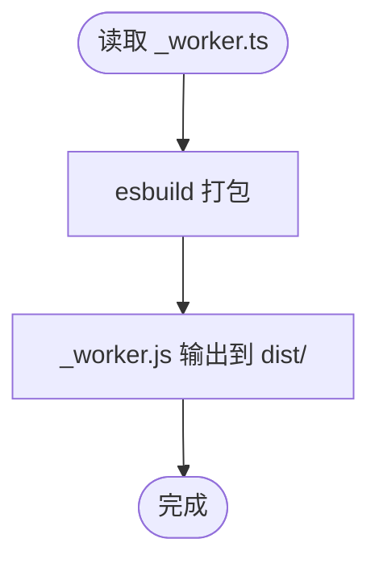

# 前端应用部署

<cite>
**本文引用的文件**
- [frontend/package.json](file://frontend/package.json)
- [frontend/vite.config.ts](file://frontend/vite.config.ts)
- [frontend/_worker.ts](file://frontend/_worker.ts)
- [frontend/src/config/api.ts](file://frontend/src/config/api.ts)
- [frontend/src/api/http.ts](file://frontend/src/api/http.ts)
- [frontend/index.html](file://frontend/index.html)
- [frontend/public/_headers](file://frontend/public/_headers)
- [frontend/tsconfig.json](file://frontend/tsconfig.json)
- [frontend/src/main.tsx](file://frontend/src/main.tsx)
- [backend/wrangler.toml](file://backend/wrangler.toml)
</cite>

## 目录
1. [简介](#简介)
2. [项目结构](#项目结构)
3. [核心组件](#核心组件)
4. [架构总览](#架构总览)
5. [详细组件分析](#详细组件分析)
6. [依赖关系分析](#依赖关系分析)
7. [性能考虑](#性能考虑)
8. [故障排查指南](#故障排查指南)
9. [结论](#结论)
10. [附录](#附录)

## 简介
本文件面向前端应用的构建与部署，围绕 Vite 构建流程、esbuild 将 _worker.ts 打包为 dist/_worker.js 的步骤、静态资源生成与 CDN/对象存储部署策略、环境变量配置与后端 API 连接方式，以及 preview 命令的使用场景进行系统化说明，并给出前端 _worker.js 与后端 API 协同工作的保障建议。

## 项目结构
前端工程位于 frontend 目录，采用 Vite 作为构建工具，使用 esbuild 对 Cloudflare Workers 风格的 _worker.ts 进行独立打包，形成 dist/_worker.js，供 Cloudflare Pages 或 Workers 以静态资源形式托管与代理 API 请求。

图表来源
- [frontend/package.json](file://frontend/package.json#L1-L45)
- [frontend/vite.config.ts](file://frontend/vite.config.ts#L1-L48)
- [frontend/_worker.ts](file://frontend/_worker.ts#L1-L71)
- [frontend/src/config/api.ts](file://frontend/src/config/api.ts#L1-L179)
- [frontend/src/api/http.ts](file://frontend/src/api/http.ts#L1-L99)
- [frontend/index.html](file://frontend/index.html#L1-L15)
- [frontend/public/_headers](file://frontend/public/_headers#L1-L4)
- [frontend/tsconfig.json](file://frontend/tsconfig.json#L1-L18)
- [frontend/src/main.tsx](file://frontend/src/main.tsx#L1-L43)

章节来源
- [frontend/package.json](file://frontend/package.json#L1-L45)
- [frontend/vite.config.ts](file://frontend/vite.config.ts#L1-L48)
- [frontend/_worker.ts](file://frontend/_worker.ts#L1-L71)
- [frontend/src/config/api.ts](file://frontend/src/config/api.ts#L1-L179)
- [frontend/src/api/http.ts](file://frontend/src/api/http.ts#L1-L99)
- [frontend/index.html](file://frontend/index.html#L1-L15)
- [frontend/public/_headers](file://frontend/public/_headers#L1-L4)
- [frontend/tsconfig.json](file://frontend/tsconfig.json#L1-L18)
- [frontend/src/main.tsx](file://frontend/src/main.tsx#L1-L43)

## 核心组件
- 构建脚本与产物
  - build：先执行 Vite 构建，再调用 build-worker 生成 _worker.js。
  - build-worker：使用 esbuild 将 _worker.ts 打包为 dist/_worker.js，格式为 ES 模块，目标为 ES2022。
  - preview：在本地启动预览服务器，默认端口 5173。
- Vite 配置
  - 插件：React 插件与 gzip/brotli 压缩插件。
  - 代理：开发阶段将 /api 代理到后端 Worker 地址。
  - 构建：输出目录 dist，Rollup 分包策略按依赖拆分 vendor。
- API 配置
  - 开发环境：使用本地代理地址；生产环境：使用相对路径，由 Pages 内部绑定 Worker。
  - 统一请求封装：自动注入 Authorization、X-Caiwu-Token，处理 401、JSON/文本/Blob 响应类型。
- Worker 代理
  - 将 /api/* 请求转发至后端 Worker，复制必要请求头，修正 Cookie 属性与 CORS 头，异常时返回 502 JSON。
- 安全头
  - public/_headers 中包含 CSP、connect-src 等安全策略，限制脚本、样式、图片、字体来源与网络连接范围。

章节来源
- [frontend/package.json](file://frontend/package.json#L1-L45)
- [frontend/vite.config.ts](file://frontend/vite.config.ts#L1-L48)
- [frontend/src/config/api.ts](file://frontend/src/config/api.ts#L1-L179)
- [frontend/src/api/http.ts](file://frontend/src/api/http.ts#L1-L99)
- [frontend/_worker.ts](file://frontend/_worker.ts#L1-L71)
- [frontend/public/_headers](file://frontend/public/_headers#L1-L4)

## 架构总览
前端应用通过 Vite 构建静态资源，同时使用 esbuild 生成独立的 _worker.js，用于在 Cloudflare Pages 上以 Functions Advanced 模式代理 API 请求。生产环境通过相对路径访问后端 API，开发环境通过 Vite 代理到后端 Worker。

图表来源
- [frontend/_worker.ts](file://frontend/_worker.ts#L1-L71)
- [frontend/vite.config.ts](file://frontend/vite.config.ts#L1-L48)
- [frontend/src/config/api.ts](file://frontend/src/config/api.ts#L1-L179)

## 详细组件分析

### Vite 构建流程与产物
- 构建顺序
  - 先执行 Vite 构建，生成 dist 目录下的静态资源。
  - 再执行 esbuild 打包 _worker.ts，输出 dist/_worker.js。
- 关键配置
  - 输出目录：dist。
  - 压缩：启用 gzip 与 brotli 压缩，减小传输体积。
  - 代理：开发环境将 /api 代理到后端 Worker 地址，便于前后端联调。
  - 分包：manualChunks 将 react 生态、antd 及第三方库拆分为独立 chunk，提升缓存命中率。
- 产物说明
  - dist/index.html、dist/assets/* 等静态资源。
  - dist/_worker.js 为独立的 Worker 脚本，用于代理 API 请求。

图表来源
- [frontend/package.json](file://frontend/package.json#L1-L45)
- [frontend/vite.config.ts](file://frontend/vite.config.ts#L1-L48)

章节来源
- [frontend/package.json](file://frontend/package.json#L1-L45)
- [frontend/vite.config.ts](file://frontend/vite.config.ts#L1-L48)

### esbuild 打包 _worker.ts 为 dist/_worker.js
- 目标与格式
  - 平台：neutral（不绑定特定平台，适配 Pages Functions）。
  - 输出格式：ESM。
  - 目标：ES2022。
  - 输出文件：dist/_worker.js。
- 作用
  - 在 Cloudflare Pages Functions Advanced 模式下，将 /api/* 请求转发到后端 Worker，实现静态站点与 API 的一体化部署。

图表来源
- [frontend/package.json](file://frontend/package.json#L1-L45)
- [frontend/_worker.ts](file://frontend/_worker.ts#L1-L71)

章节来源
- [frontend/package.json](file://frontend/package.json#L1-L45)
- [frontend/_worker.ts](file://frontend/_worker.ts#L1-L71)

### API 配置与请求封装
- API 基础路径
  - 开发环境：使用本地代理地址。
  - 生产环境：使用空字符串（相对路径），由 Pages 内部绑定 Worker。
- 请求封装
  - 自动设置 Content-Type、Authorization、X-Caiwu-Token。
  - 统一处理 401 未授权（登出并跳转登录页）。
  - 支持 JSON、文本、Blob 响应类型。
  - 统一错误提示与异常抛出。
- 与 Worker 代理协作
  - 生产环境通过相对路径访问 /api/*，由 _worker.js 代理到后端 Worker。
  - 开发环境通过 Vite 代理到后端 Worker，避免跨域问题。

图表来源
- [frontend/src/config/api.ts](file://frontend/src/config/api.ts#L1-L179)
- [frontend/src/api/http.ts](file://frontend/src/api/http.ts#L1-L99)
- [frontend/_worker.ts](file://frontend/_worker.ts#L1-L71)

章节来源
- [frontend/src/config/api.ts](file://frontend/src/config/api.ts#L1-L179)
- [frontend/src/api/http.ts](file://frontend/src/api/http.ts#L1-L99)
- [frontend/_worker.ts](file://frontend/_worker.ts#L1-L71)

### 预览命令（preview）使用场景
- 本地预览
  - 使用 npm run preview 在本地启动预览服务器，默认端口 5173。
  - 适合在构建完成后快速验证静态资源与 Worker 代理是否正常。
- 注意事项
  - 预览模式不会执行 esbuild 打包 _worker.ts，需先执行 npm run build。
  - 若需要验证 API 代理，可在预览环境中通过 Vite 代理或直接访问后端 Worker。

章节来源
- [frontend/package.json](file://frontend/package.json#L1-L45)
- [frontend/vite.config.ts](file://frontend/vite.config.ts#L1-L48)

### 静态资源生成与部署到 CDN/对象存储
- 静态资源
  - Vite 构建生成 dist 目录，包含 HTML、JS、CSS、图片等静态资源。
- 部署策略
  - Cloudflare Pages：将 dist 直接作为静态资源发布；_worker.js 通过 Pages Functions Advanced 模式部署。
  - 对象存储（如 R2）：可将 dist 上传到对象存储桶，结合 CDN 加速；_worker.js 作为独立脚本或通过 Pages Functions 绑定。
- 安全头
  - public/_headers 中包含 CSP、connect-src 等策略，建议在 CDN/对象存储层面保持一致，避免跨域与安全策略冲突。

章节来源
- [frontend/vite.config.ts](file://frontend/vite.config.ts#L1-L48)
- [frontend/public/_headers](file://frontend/public/_headers#L1-L4)

### 环境变量配置与后端 API 连接
- 环境变量
  - 开发环境：通过 Vite 代理 /api 到后端 Worker 地址，无需额外环境变量。
  - 生产环境：API_BASE 为空字符串（相对路径），由 Pages 内部绑定 Worker。
- 后端 API 连接
  - 生产环境：前端通过相对路径访问 /api/*，由 _worker.js 代理到后端 Worker。
  - 开发环境：Vite 代理 /api 到后端 Worker，避免跨域问题。
- Worker 绑定
  - 后端 Wrangler 配置中包含服务绑定与变量，前端通过相对路径访问即可。

章节来源
- [frontend/src/config/api.ts](file://frontend/src/config/api.ts#L1-L179)
- [frontend/vite.config.ts](file://frontend/vite.config.ts#L1-L48)
- [backend/wrangler.toml](file://backend/wrangler.toml#L1-L45)

## 依赖关系分析
- 构建链路
  - package.json 的 build 依赖 vite.config.ts 的构建配置与 esbuild 的 _worker.ts 打包。
- 运行链路
  - src/config/api.ts 提供 API 基础路径与路由清单，src/api/http.ts 提供统一请求封装。
  - _worker.ts 在 Pages 上代理 /api/* 请求到后端 Worker。
- 安全与兼容
  - public/_headers 提供安全头策略；tsconfig.json 指定编译目标与模块解析策略。

图表来源
- [frontend/package.json](file://frontend/package.json#L1-L45)
- [frontend/vite.config.ts](file://frontend/vite.config.ts#L1-L48)
- [frontend/src/config/api.ts](file://frontend/src/config/api.ts#L1-L179)
- [frontend/src/api/http.ts](file://frontend/src/api/http.ts#L1-L99)
- [frontend/_worker.ts](file://frontend/_worker.ts#L1-L71)
- [frontend/public/_headers](file://frontend/public/_headers#L1-L4)
- [frontend/tsconfig.json](file://frontend/tsconfig.json#L1-L18)

章节来源
- [frontend/package.json](file://frontend/package.json#L1-L45)
- [frontend/vite.config.ts](file://frontend/vite.config.ts#L1-L48)
- [frontend/src/config/api.ts](file://frontend/src/config/api.ts#L1-L179)
- [frontend/src/api/http.ts](file://frontend/src/api/http.ts#L1-L99)
- [frontend/_worker.ts](file://frontend/_worker.ts#L1-L71)
- [frontend/public/_headers](file://frontend/public/_headers#L1-L4)
- [frontend/tsconfig.json](file://frontend/tsconfig.json#L1-L18)

## 性能考虑
- 资源压缩
  - 启用 gzip 与 brotli 压缩，降低带宽占用。
- 分包策略
  - 使用 manualChunks 将 react 生态、antd、第三方库拆分为独立 chunk，提升缓存复用率。
- 请求优化
  - 统一请求封装减少重复逻辑，合理设置 React Query 的 staleTime/gcTime，降低无效请求。
- Worker 代理
  - 通过 _worker.js 代理 API，避免浏览器直连后端导致的跨域与头部处理复杂度。

章节来源
- [frontend/vite.config.ts](file://frontend/vite.config.ts#L1-L48)
- [frontend/src/api/http.ts](file://frontend/src/api/http.ts#L1-L99)
- [frontend/src/main.tsx](file://frontend/src/main.tsx#L1-L43)

## 故障排查指南
- 构建失败
  - 确认已安装依赖且版本满足要求。
  - 检查 esbuild 是否成功生成 dist/_worker.js。
- 预览无法访问 API
  - 预览前先执行 npm run build，确保 dist/_worker.js 存在。
  - 开发环境可通过 Vite 代理 /api 到后端 Worker。
- 生产环境 401 未授权
  - 检查本地存储中的 token 是否有效，确认 api.ts 注入了 Authorization/X-Caiwu-Token。
- Worker 代理异常
  - 查看 _worker.ts 的错误日志与 502 响应，确认后端地址与请求头是否正确。
- 安全策略冲突
  - 检查 public/_headers 中的 CSP 与 connect-src，确保允许必要的域名与脚本来源。

章节来源
- [frontend/package.json](file://frontend/package.json#L1-L45)
- [frontend/vite.config.ts](file://frontend/vite.config.ts#L1-L48)
- [frontend/src/api/http.ts](file://frontend/src/api/http.ts#L1-L99)
- [frontend/_worker.ts](file://frontend/_worker.ts#L1-L71)
- [frontend/public/_headers](file://frontend/public/_headers#L1-L4)

## 结论
本前端工程通过 Vite 与 esbuild 的组合，实现了静态资源与 Worker 代理脚本的统一构建与部署。生产环境采用相对路径访问 API，并由 _worker.js 在 Pages 上代理到后端 Worker，开发环境通过 Vite 代理简化联调。配合分包、压缩与安全头策略，可在保证性能的同时提升安全性与可维护性。

## 附录
- 常用命令
  - 开发：npm run dev
  - 构建：npm run build
  - 预览：npm run preview
- 关键文件定位
  - 构建脚本与打包：frontend/package.json
  - Vite 配置与代理：frontend/vite.config.ts
  - Worker 代理：frontend/_worker.ts
  - API 配置与请求封装：frontend/src/config/api.ts、frontend/src/api/http.ts
  - 入口 HTML：frontend/index.html
  - 安全头：frontend/public/_headers
  - 编译选项：frontend/tsconfig.json
  - 应用启动：frontend/src/main.tsx
  - 后端绑定：backend/wrangler.toml