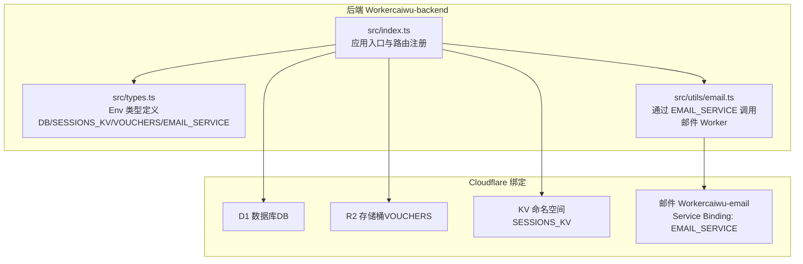
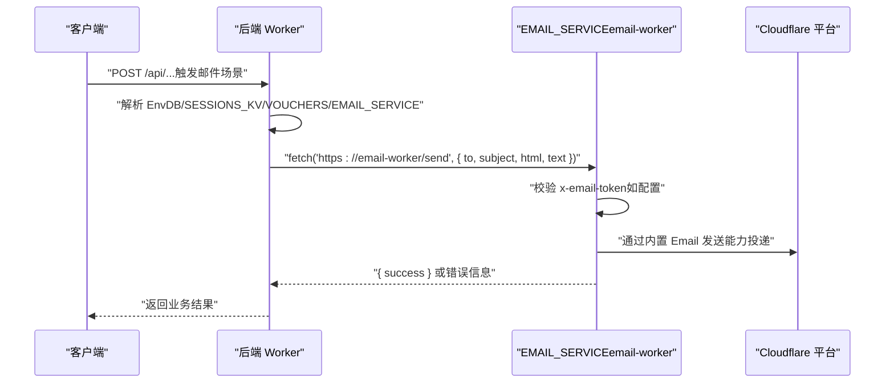
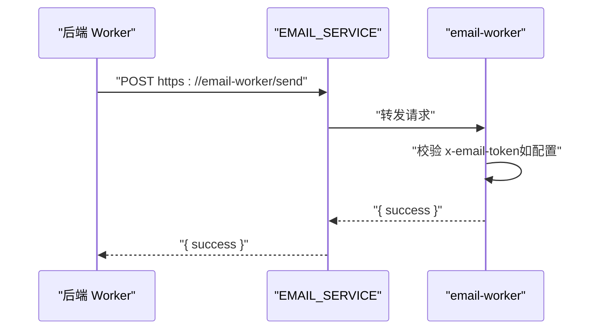
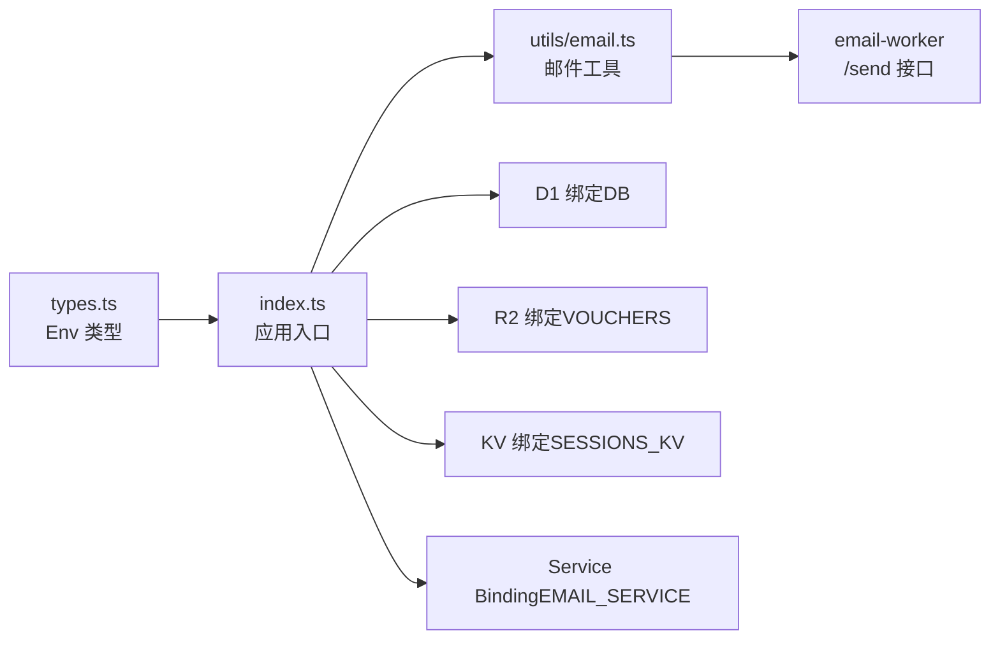

# 后端服务部署

<cite>
**本文引用的文件**
- [backend/wrangler.toml](file://backend/wrangler.toml)
- [backend/package.json](file://backend/package.json)
- [backend/src/index.ts](file://backend/src/index.ts)
- [backend/src/types.ts](file://backend/src/types.ts)
- [backend/src/utils/email.ts](file://backend/src/utils/email.ts)
- [email-worker/wrangler.toml](file://email-worker/wrangler.toml)
- [email-worker/src/index.ts](file://email-worker/src/index.ts)
- [backend/drizzle.config.ts](file://backend/drizzle.config.ts)
</cite>

## 目录
1. [简介](#简介)
2. [项目结构](#项目结构)
3. [核心组件](#核心组件)
4. [架构总览](#架构总览)
5. [详细组件分析](#详细组件分析)
6. [依赖分析](#依赖分析)
7. [性能考虑](#性能考虑)
8. [故障排查指南](#故障排查指南)
9. [结论](#结论)
10. [附录](#附录)

## 简介
本指南面向在 Cloudflare Workers 上部署后端服务的工程师，聚焦于后端 Worker 的 wrangler.toml 配置项与 package.json 脚本说明，并提供本地开发（wrangler dev）与生产部署（wrangler deploy）的完整流程；同时解释如何通过 wrangler secret 设置 AUTH_JWT_SECRET 等敏感密钥，以及后端服务如何通过 Service Binding 调用独立的邮件 Worker（email-worker）实现跨 Worker 的服务间通信。

## 项目结构
后端服务位于 backend 目录，采用 Hono 框架构建，使用 Drizzle ORM 连接 D1 数据库，R2 存储桶用于凭证附件，KV 命名空间用于会话缓存；邮件发送通过独立的 email-worker 提供，后端通过 Service Binding 调用该 Worker。

图表来源
- [backend/src/index.ts](file://backend/src/index.ts#L1-L137)
- [backend/src/types.ts](file://backend/src/types.ts#L1-L18)
- [backend/src/utils/email.ts](file://backend/src/utils/email.ts#L101-L140)
- [backend/wrangler.toml](file://backend/wrangler.toml#L1-L45)
- [email-worker/wrangler.toml](file://email-worker/wrangler.toml#L1-L18)

章节来源
- [backend/wrangler.toml](file://backend/wrangler.toml#L1-L45)
- [backend/src/index.ts](file://backend/src/index.ts#L1-L137)

## 核心组件
- 应用入口与路由：后端 Worker 在入口文件中注册全局中间件、CORS、健康检查、OpenAPI 文档与各业务路由模块。
- 绑定与类型：Env 类型定义了 DB、SESSIONS_KV、VOUCHERS、EMAIL_SERVICE 等绑定，以及 AUTH_JWT_SECRET 等敏感变量。
- 邮件服务：通过 EMAIL_SERVICE Fetcher 调用 email-worker 的 /send 接口，支持可选的 x-email-token 鉴权。
- 数据库与存储：D1 作为主数据库，R2 用于凭证附件，KV 用于会话缓存；wrangler.toml 明确绑定名称与资源 ID。

章节来源
- [backend/src/index.ts](file://backend/src/index.ts#L43-L137)
- [backend/src/types.ts](file://backend/src/types.ts#L1-L18)
- [backend/src/utils/email.ts](file://backend/src/utils/email.ts#L101-L140)
- [backend/wrangler.toml](file://backend/wrangler.toml#L1-L45)

## 架构总览
后端 Worker 通过 Service Binding 与 email-worker 通信，使用 D1/R2/KV 三大原生资源；生产环境密钥通过 wrangler secret 注入，本地开发使用 dev 环境 vars。

图表来源
- [backend/src/utils/email.ts](file://backend/src/utils/email.ts#L101-L140)
- [email-worker/src/index.ts](file://email-worker/src/index.ts#L1-L43)
- [backend/wrangler.toml](file://backend/wrangler.toml#L33-L38)

## 详细组件分析

### wrangler.toml 配置详解
- name：Worker 名称，决定部署后的服务标识。
- main：入口文件路径，后端为 src/index.ts。
- compatibility_date：兼容性日期，影响运行时行为与可用特性。
- compatibility_flags：启用 nodejs_compat，便于使用部分 Node 生态工具链。
- d1_databases：将 D1 数据库绑定命名为 DB，需配置 database_name 与 database_id。
- r2_buckets：将 R2 存储桶绑定命名为 VOUCHERS，需配置 bucket_name。
- kv_namespaces：将 KV 命名空间绑定命名为 SESSIONS_KV，需配置 id。
- observability：可观测性开关与采样率，生产建议开启日志与调用日志。
- vars：生产环境变量（如 CF_ACCOUNT_ID、CF_ZONE_ID、CF_IP_LIST_ID），用于 Cloudflare 相关功能。
- services：通过 Service Binding 将 email-worker 服务绑定为 EMAIL_SERVICE，用于跨 Worker 调用。
- env.dev.vars：本地开发环境的 AUTH_JWT_SECRET 示例值，生产请使用 wrangler secret。

章节来源
- [backend/wrangler.toml](file://backend/wrangler.toml#L1-L45)

### package.json 脚本说明
- dev：本地开发命令，启动 wrangler dev 并指定入口文件。
- deploy：生产部署命令，使用 wrangler deploy 指定入口文件。
- migrate：执行本地 D1 迁移脚本（schema.sql）。
- migrate:all：遍历迁移文件并在远程执行（逐个文件执行并忽略已应用的）。
- migrate:remote：同上，但明确使用远程执行。
- gen:openapi：导出 OpenAPI 文档。
- test：运行单元测试（Vitest）。

章节来源
- [backend/package.json](file://backend/package.json#L1-L43)

### 本地开发与生产部署
- 本地开发：使用 npm run dev（即 wrangler dev src/index.ts），结合 env.dev.vars 中的 AUTH_JWT_SECRET 进行本地调试。
- 生产部署：使用 npm run deploy（即 wrangler deploy src/index.ts），生产密钥通过 wrangler secret 注入。
- 本地与生产密钥分离：dev 环境使用 vars，生产使用 secret，避免明文泄露。

章节来源
- [backend/package.json](file://backend/package.json#L1-L43)
- [backend/wrangler.toml](file://backend/wrangler.toml#L42-L45)

### 敏感密钥设置（wrangler secret）
- AUTH_JWT_SECRET：用于签发与校验 JWT，生产环境通过 wrangler secret put AUTH_JWT_SECRET 设置。
- EMAIL_TOKEN：可选的邮件 Worker 访问令牌，如配置则后端调用 email-worker 时需携带 x-email-token。
- 其他 Cloudflare 相关 Token（如 CF_EMAIL_TOKEN、CF_FIREWALL_TOKEN、CF_IP_LISTS_TOKEN）：用于 Cloudflare API 调用，同样建议通过 secret 管理。

章节来源
- [backend/wrangler.toml](file://backend/wrangler.toml#L39-L45)
- [backend/src/types.ts](file://backend/src/types.ts#L1-L18)
- [backend/src/utils/email.ts](file://backend/src/utils/email.ts#L114-L120)

### 服务间调用（后端调用邮件 Worker）
- 绑定声明：backend/wrangler.toml 中通过 [[services]] 将 email-worker 命名为 EMAIL_SERVICE。
- 类型约束：backend/src/types.ts 中 Env 包含 EMAIL_SERVICE?: Fetcher，确保编译期类型安全。
- 调用实现：backend/src/utils/email.ts 中通过 env.EMAIL_SERVICE.fetch(...) 调用 email-worker 的 /send 接口，支持可选的 x-email-token 鉴权。
- 邮件 Worker：email-worker/wrangler.toml 中声明 name、main、compatibility_date、compatibility_flags、account_id 与 send_email 绑定；email-worker/src/index.ts 提供 /health 与 /send 接口，支持可选的 EMAIL_TOKEN 校验。

图表来源
- [backend/src/utils/email.ts](file://backend/src/utils/email.ts#L101-L140)
- [email-worker/src/index.ts](file://email-worker/src/index.ts#L1-L43)
- [backend/wrangler.toml](file://backend/wrangler.toml#L33-L38)

章节来源
- [backend/src/types.ts](file://backend/src/types.ts#L1-L18)
- [backend/src/utils/email.ts](file://backend/src/utils/email.ts#L101-L140)
- [email-worker/wrangler.toml](file://email-worker/wrangler.toml#L1-L18)
- [email-worker/src/index.ts](file://email-worker/src/index.ts#L1-L43)

### 数据库与迁移
- D1 数据库：通过 wrangler.toml 的 d1_databases 绑定 DB，后端通过 env.DB 使用 Drizzle ORM。
- 迁移工具：使用 drizzle-kit（drizzle.config.ts）管理迁移，配合 package.json 的 migrate/migrate:all 脚本执行本地与远程迁移。
- schema.sql：初始化表结构，配合测试与本地开发使用。

章节来源
- [backend/wrangler.toml](file://backend/wrangler.toml#L6-L10)
- [backend/drizzle.config.ts](file://backend/drizzle.config.ts#L1-L8)
- [backend/package.json](file://backend/package.json#L1-L43)

## 依赖分析
- 组件耦合
  - 后端 Worker 依赖 D1、R2、KV、EMAIL_SERVICE 四类绑定，类型在 Env 中统一约束。
  - 邮件发送逻辑与 email-worker 解耦，通过 Service Binding 与可选令牌实现安全访问。
- 外部依赖
  - Hono 框架、Drizzle ORM、bcryptjs、uuid、zod 等。
- 潜在循环依赖
  - 邮件工具与业务服务之间通过动态导入避免循环依赖（例如 EmployeeService 中延迟导入 email 工具）。

图表来源
- [backend/src/types.ts](file://backend/src/types.ts#L1-L18)
- [backend/src/index.ts](file://backend/src/index.ts#L1-L137)
- [backend/src/utils/email.ts](file://backend/src/utils/email.ts#L101-L140)
- [backend/wrangler.toml](file://backend/wrangler.toml#L1-L45)
- [email-worker/wrangler.toml](file://email-worker/wrangler.toml#L1-L18)

## 性能考虑
- 数据库连接与超时：健康检查对 DB 查询设置了超时保护，避免阻塞。
- 日志采样：可观测性日志默认开启，生产可根据流量调整 head_sampling_rate 与 invocation_logs。
- 跨 Worker 调用：EMAIL_SERVICE 为轻量级 HTTP 调用，建议在业务层合并短时任务，减少不必要的调用次数。

章节来源
- [backend/src/index.ts](file://backend/src/index.ts#L67-L82)
- [backend/wrangler.toml](file://backend/wrangler.toml#L19-L27)

## 故障排查指南
- 本地开发无法访问 EMAIL_SERVICE
  - 确认 backend/wrangler.toml 中 [[services]] 是否正确声明 EMAIL_SERVICE 指向 email-worker。
  - 确认 email-worker 已部署且环境为 production（或与 backend 配置一致）。
- 生产环境 JWT 签发失败
  - 确认已通过 wrangler secret 设置 AUTH_JWT_SECRET。
  - 检查后端日志中的错误信息，核对密钥长度与字符集要求。
- 邮件发送失败
  - 若配置了 EMAIL_TOKEN，需确保请求头携带正确的 x-email-token。
  - 检查 email-worker 的 /send 接口返回的错误信息，确认必填字段（to、subject、html/text）齐全。
- D1/R2/KV 绑定异常
  - 确认 wrangler.toml 中绑定名称与资源 ID/名称一致。
  - 检查迁移脚本是否成功执行，必要时使用 migrate/migrate:all 重新执行。

章节来源
- [backend/wrangler.toml](file://backend/wrangler.toml#L33-L38)
- [backend/src/utils/email.ts](file://backend/src/utils/email.ts#L114-L140)
- [email-worker/src/index.ts](file://email-worker/src/index.ts#L1-L43)
- [backend/package.json](file://backend/package.json#L1-L43)

## 结论
本指南梳理了后端 Worker 在 Cloudflare Workers 上的部署要点：明确 wrangler.toml 的 name、main、compatibility_date、D1/R2/KV 绑定与 Service Binding 配置；解释 package.json 脚本的职责；给出本地开发与生产部署的命令；说明通过 wrangler secret 管理敏感密钥的方法；并详述后端调用 email-worker 的服务间通信机制。遵循上述步骤可确保服务稳定、安全地运行于 Cloudflare 平台。

## 附录
- 常用命令
  - 本地开发：npm run dev
  - 生产部署：npm run deploy
  - 数据库迁移：npm run migrate / npm run migrate:all / npm run migrate:remote
  - 导出 OpenAPI：npm run gen:openapi
  - 测试：npm run test
- 生产密钥设置
  - AUTH_JWT_SECRET：wrangler secret put AUTH_JWT_SECRET
  - EMAIL_TOKEN（可选）：wrangler secret put EMAIL_TOKEN
  - 其他 Cloudflare Token：按需设置对应 secret

章节来源
- [backend/package.json](file://backend/package.json#L1-L43)
- [backend/wrangler.toml](file://backend/wrangler.toml#L39-L45)
- [email-worker/wrangler.toml](file://email-worker/wrangler.toml#L11-L16)