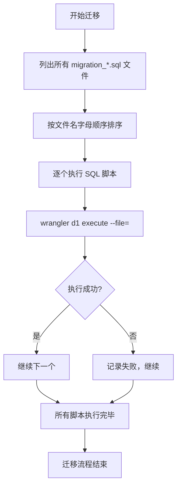
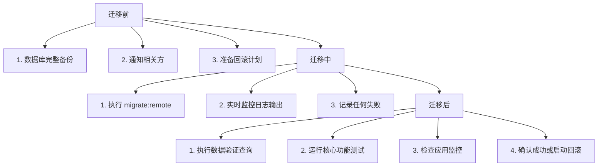

# 数据库迁移管理

<cite>
**本文档引用的文件**  
- [package.json](file://backend/package.json)
- [wrangler.toml](file://backend/wrangler.toml)
- [schema.sql](file://backend/src/db/schema.sql)
- [schema.ts](file://backend/src/db/schema.ts)
- [migration_add_created_by_to_repayments.sql](file://backend/src/db/migration_add_created_by_to_repayments.sql)
- [migration_add_return_type.sql](file://backend/src/db/migration_add_return_type.sql)
- [migration_flatten_positions.sql](file://backend/src/db/migration_flatten_positions.sql)
- [migration_optimize_permissions.sql](file://backend/src/db/migration_optimize_permissions.sql)
- [migration_trusted_devices.sql](file://backend/src/db/migration_trusted_devices.sql)
- [reset_problematic_tables.sql](file://backend/src/db/reset_problematic_tables.sql)
- [archive/migration_add_audit_ip.sql](file://backend/src/db/archive/migration_add_audit_ip.sql)
- [archive/migration_borrowings_approval.sql](file://backend/src/db/archive/migration_borrowings_approval.sql)
- [archive/migration_cleanup.sql](file://backend/src/db/archive/migration_cleanup.sql)
- [drizzle.config.ts](file://backend/drizzle.config.ts)
- [db.ts](file://backend/src/utils/db.ts)
</cite>

## 目录
1. [引言](#引言)
2. [迁移脚本命名约定与执行顺序](#迁移脚本命名约定与执行顺序)
3. [远程迁移执行流程](#远程迁移执行流程)
4. [幂等性设计与错误处理](#幂等性设计与错误处理)
5. [迁移全流程：备份、监控与验证](#迁移全流程：备份、监控与验证)
6. [结论](#结论)

## 引言

本项目采用基于 Cloudflare D1 的 SQLite 数据库架构，通过 SQL 脚本实现数据库模式和数据的演进。所有迁移脚本集中存放于 `src/db/` 目录下，通过 `wrangler d1 execute` 命令在远程 D1 数据库上安全执行。本文档旨在提供生产环境数据库迁移的最佳实践，涵盖命名约定、执行机制、幂等性保障、错误处理以及完整的迁移前中后流程，确保数据一致性与系统稳定性。

**Section sources**
- [package.json](file://backend/package.json)
- [wrangler.toml](file://backend/wrangler.toml)

## 迁移脚本命名约定与执行顺序

### 命名约定

项目中的数据库迁移脚本遵循清晰的命名规范，以确保可读性和可维护性：

- **前缀命名**：所有待执行的迁移脚本均以 `migration_` 为前缀，例如 `migration_add_created_by_to_repayments.sql`。此约定便于通过通配符（如 `src/db/migration_*.sql`）批量识别和执行。
- **语义化描述**：前缀后的名称应清晰描述迁移的目的，通常采用 `动词_名词` 的格式，如 `add_created_by_to_repayments` 表示为 `repayments` 表添加 `created_by` 字段。
- **归档管理**：已完成或不再使用的迁移脚本被移至 `src/db/archive/` 目录，但仍保留 `migration_` 前缀，以供历史追溯。

### 执行顺序

迁移脚本的执行顺序至关重要，直接决定了数据库状态的正确演进。本项目通过以下机制保证顺序：

- **文件名决定顺序**：脚本的执行顺序由其在文件系统中的名称决定。由于 `bash` 的通配符展开是按字母顺序进行的，因此脚本的命名必须确保按时间或逻辑顺序排列。
- **无版本号控制**：当前机制未在文件名中包含时间戳或版本号，因此依赖开发者按正确顺序创建和提交脚本。例如，`migration_a.sql` 会在 `migration_b.sql` 之前执行。
- **批量执行**：通过 `package.json` 中的 `migrate:remote` 脚本，使用 `for` 循环遍历所有匹配 `migration_*.sql` 的文件，并按顺序逐一执行。



**Diagram sources**
- [package.json](file://backend/package.json#L10-L11)
- [migration_add_created_by_to_repayments.sql](file://backend/src/db/migration_add_created_by_to_repayments.sql#L1)
- [migration_add_return_type.sql](file://backend/src/db/migration_add_return_type.sql#L1)

**Section sources**
- [package.json](file://backend/package.json#L10-L11)
- [src/db/](file://backend/src/db/)

## 远程迁移执行流程

### 利用 `migrate:remote` 脚本

项目通过 `package.json` 中定义的 `migrate:remote` 脚本来安全地在远程 D1 数据库上应用迁移。

```json
"migrate:remote": "bash -c 'for file in src/db/migration_*.sql; do echo \"Running: $file\"; wrangler d1 execute caiwu-db --remote --file=\"$file\" || echo \"Failed or already applied: $file\"; done'"
```

该脚本的核心逻辑如下：

1. **遍历脚本**：使用 `for file in src/db/migration_*.sql` 遍历 `src/db/` 目录下所有符合命名约定的 SQL 文件。
2. **打印日志**：`echo "Running: $file"` 输出当前正在执行的脚本名称，便于追踪进度。
3. **执行命令**：调用 `wrangler d1 execute caiwu-db --remote --file=\"$file\"` 命令。
   - `caiwu-db`：目标 D1 数据库的绑定名称（在 `wrangler.toml` 中定义）。
   - `--remote`：指定在远程生产环境执行，而非本地开发环境。
   - `--file`：指定要执行的 SQL 脚本文件。
4. **错误处理**：使用 `||` 操作符，当 `wrangler` 命令执行失败（返回非零状态码）时，会输出 `Failed or already applied: $file`。这既处理了执行失败的情况，也暗示了某些脚本可能因幂等性设计而“已应用”。

### 执行环境配置

`wrangler.toml` 文件定义了数据库的绑定信息，确保 `wrangler` 命令能正确连接到远程 D1 实例。

```toml
[[d1_databases]]
binding = "DB"
database_name = "caiwu-db"
database_id = "582b2cc8-fb7f-47a3-9b12-a264621c2eeb"
```

**Section sources**
- [package.json](file://backend/package.json#L11)
- [wrangler.toml](file://backend/wrangler.toml#L6-L9)

## 幂等性设计与错误处理

### 幂等性设计

幂等性是确保迁移脚本可重复安全执行的关键。项目中的迁移脚本采用了多种策略来实现幂等性：

- **`OR REPLACE` 语句**：在 `migration_flatten_positions.sql` 中，使用 `INSERT OR REPLACE INTO` 而非 `INSERT INTO`。这确保了即使脚本多次运行，也只会存在一条记录，避免了主键冲突。
- **`IF NOT EXISTS` 子句**：在 `schema.sql` 中，所有 `CREATE TABLE` 语句都包含 `IF NOT EXISTS`，防止因表已存在而导致错误。
- **`DROP TABLE IF EXISTS`**：在 `reset_problematic_tables.sql` 中，使用 `DROP TABLE IF EXISTS` 来安全地删除可能不存在的表，避免脚本中断。
- **条件更新**：在 `migration_borrowings_approval.sql` 中，`UPDATE` 语句包含 `WHERE status IS NULL` 条件，确保只对历史数据进行一次性的状态初始化，后续执行不会产生副作用。

### 错误处理策略

迁移过程中的错误处理旨在保证流程的健壮性：

- **非中断式执行**：`migrate:remote` 脚本使用 `|| echo` 结构，即使单个脚本执行失败，循环也不会中断，后续脚本仍会继续执行。这允许在一次运行中尝试所有迁移，并集中报告问题。
- **日志记录**：每个脚本执行前后都有 `echo` 命令输出，清晰地记录了执行的脚本和可能的失败，便于事后排查。
- **手动干预**：对于关键的、可能破坏数据的迁移（如 `reset_problematic_tables.sql`），其执行应被视为高风险操作，需要在执行前进行充分的备份和验证，而不是完全依赖自动化脚本。

**Section sources**
- [migration_flatten_positions.sql](file://backend/src/db/migration_flatten_positions.sql#L10)
- [schema.sql](file://backend/src/db/schema.sql#L4)
- [reset_problematic_tables.sql](file://backend/src/db/reset_problematic_tables.sql#L1)
- [archive/migration_borrowings_approval.sql](file://backend/src/db/archive/migration_borrowings_approval.sql#L7)
- [package.json](file://backend/package.json#L11)

## 迁移全流程：备份、监控与验证

为确保生产环境迁移的安全，必须遵循一个完整的流程。

### 迁移前：备份

在执行任何迁移之前，必须对当前数据库状态进行完整备份。

1.  **导出数据库**：使用 `wrangler d1 database list` 和 `wrangler d1 database download` 命令下载数据库的 `.sqlite` 文件。
    ```bash
    wrangler d1 database download caiwu-db --output=backup_before_migration_$(date +%Y%m%d_%H%M%S).sqlite
    ```
2.  **验证备份**：检查下载的文件大小和完整性，确保备份成功。

### 迁移中：监控

在迁移执行过程中，需要实时监控其状态。

1.  **执行脚本**：运行 `npm run migrate:remote`。
2.  **观察日志**：密切关注终端输出，确认每个脚本都按预期开始执行。
3.  **识别失败**：留意 `Failed or already applied` 的提示，记录下失败的脚本名称。

### 迁移后：验证

迁移完成后，必须立即验证数据库的完整性和正确性。

1.  **功能测试**：在测试环境中，使用与生产环境相同的数据集，运行核心业务流程（如创建报销、处理借款），验证功能是否正常。
2.  **数据一致性检查**：
    - 使用 `wrangler d1 execute` 执行 `SELECT` 查询，验证新字段是否已添加，数据是否正确迁移。
    - 例如，验证 `repayments` 表是否包含 `created_by` 字段：`PRAGMA table_info(repayments);`
3.  **Schema 对比**：将迁移后的数据库 Schema 与预期的 `schema.sql` 进行对比，确保完全一致。
4.  **监控告警**：检查应用的监控系统（如日志、错误率），确保没有因迁移引入新的异常。



**Diagram sources**
- [package.json](file://backend/package.json#L11)
- [migration_add_created_by_to_repayments.sql](file://backend/src/db/migration_add_created_by_to_repayments.sql#L1)

**Section sources**
- [package.json](file://backend/package.json#L11)
- [migration_add_created_by_to_repayments.sql](file://backend/src/db/migration_add_created_by_to_repayments.sql)

## 结论

生产环境的数据库迁移是一项高风险操作。本项目通过 `migration_*.sql` 命名约定和 `migrate:remote` 脚本建立了一套可行的自动化流程。然而，自动化并非万能。**安全的迁移 = 自动化脚本 + 严格的流程 + 人工监督**。务必遵循“备份、执行、监控、验证”的完整流程，利用幂等性设计降低风险，并准备好回滚方案，才能确保数据安全和业务连续性。