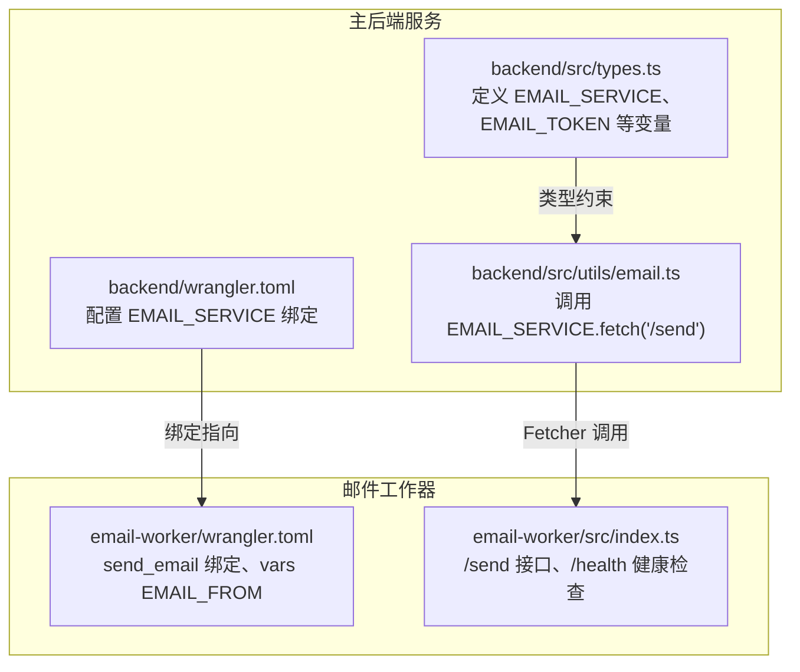
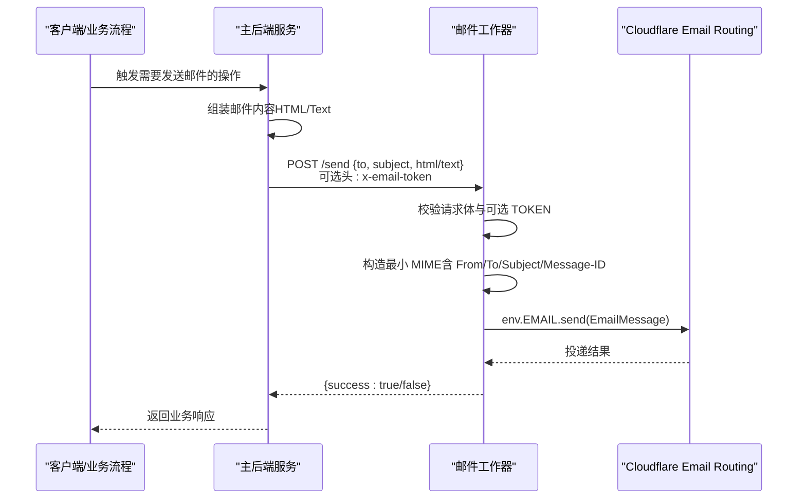
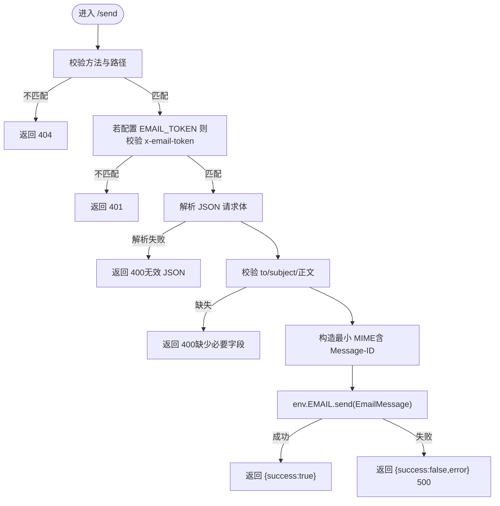
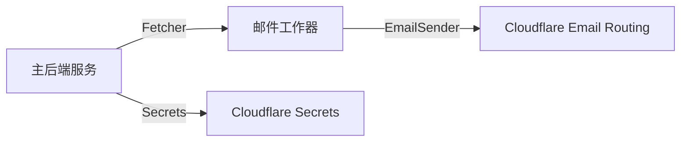

# 邮件工作器部署

<cite>
**本文引用的文件**
- [email-worker/wrangler.toml](file://email-worker/wrangler.toml)
- [email-worker/src/index.ts](file://email-worker/src/index.ts)
- [email-worker/package.json](file://email-worker/package.json)
- [backend/wrangler.toml](file://backend/wrangler.toml)
- [backend/src/utils/email.ts](file://backend/src/utils/email.ts)
- [backend/src/types.ts](file://backend/src/types.ts)
- [backend/package.json](file://backend/package.json)
</cite>

## 目录
1. [简介](#简介)
2. [项目结构](#项目结构)
3. [核心组件](#核心组件)
4. [架构总览](#架构总览)
5. [详细组件分析](#详细组件分析)
6. [依赖关系分析](#依赖关系分析)
7. [性能考虑](#性能考虑)
8. [故障排查指南](#故障排查指南)
9. [结论](#结论)
10. [附录](#附录)

## 简介
本部署文档面向独立的邮件工作器（email-worker），聚焦以下目标：
- 解释 wrangler.toml 中 send_email 绑定的配置方式
- 说明 EMAIL_FROM 发件人地址的设置要求及域名验证注意事项
- 指导如何使用 wrangler secret put 命令安全地设置 EMAIL_TOKEN，避免凭据泄露
- 描述该工作器与主后端服务的集成关系，以及其在异步邮件发送中的角色
- 提供部署命令和健康检查建议

## 项目结构
邮件工作器位于 email-worker 目录，主后端服务位于 backend 目录。二者通过 Cloudflare Workers 的 Service Binding 进行集成，主后端通过 EMAIL_SERVICE Fetcher 调用邮件工作器的 /send 接口完成异步邮件发送。

图表来源
- [backend/src/utils/email.ts](file://backend/src/utils/email.ts#L99-L140)
- [backend/src/types.ts](file://backend/src/types.ts#L1-L20)
- [backend/wrangler.toml](file://backend/wrangler.toml#L33-L38)
- [email-worker/wrangler.toml](file://email-worker/wrangler.toml#L1-L18)
- [email-worker/src/index.ts](file://email-worker/src/index.ts#L1-L75)

章节来源
- [email-worker/wrangler.toml](file://email-worker/wrangler.toml#L1-L18)
- [email-worker/src/index.ts](file://email-worker/src/index.ts#L1-L75)
- [backend/wrangler.toml](file://backend/wrangler.toml#L33-L38)
- [backend/src/utils/email.ts](file://backend/src/utils/email.ts#L99-L140)
- [backend/src/types.ts](file://backend/src/types.ts#L1-L20)

## 核心组件
- 邮件工作器入口与接口
  - /send：接收 JSON 请求体（to、subject、html、text），构造最小 MIME 并通过绑定的 EmailSender 发送
  - /health：返回健康状态
  - 环境变量
    - EMAIL：Cloudflare 内置 EmailSender 绑定
    - EMAIL_TOKEN：可选，启用简单令牌鉴权
    - EMAIL_FROM：发件人地址，需在 Cloudflare Email Routing 域名下
- 主后端集成
  - 通过 EMAIL_SERVICE Fetcher 调用 https://email-worker/send
  - 可选携带 x-email-token 头，值来自 EMAIL_TOKEN

章节来源
- [email-worker/src/index.ts](file://email-worker/src/index.ts#L1-L75)
- [backend/src/utils/email.ts](file://backend/src/utils/email.ts#L99-L140)
- [backend/src/types.ts](file://backend/src/types.ts#L1-L20)

## 架构总览
邮件工作器作为独立的 Cloudflare Worker，负责实际的邮件投递；主后端服务只负责业务逻辑与数据处理，并通过 Service Binding 异步调用邮件工作器，实现解耦与可扩展性。

图表来源
- [backend/src/utils/email.ts](file://backend/src/utils/email.ts#L99-L140)
- [email-worker/src/index.ts](file://email-worker/src/index.ts#L1-L75)

## 详细组件分析

### 邮件工作器配置与绑定
- send_email 绑定
  - 在 email-worker/wrangler.toml 中声明 [[send_email]]，绑定名为 EMAIL，对应 env.EMAIL
- 发件人 EMAIL_FROM
  - 在 vars 中设置 EMAIL_FROM，需确保该地址属于已在 Cloudflare Email Routing 中验证的域名
- 安全令牌 EMAIL_TOKEN
  - 使用 wrangler secret put EMAIL_TOKEN 存储，避免明文出现在配置文件中
  - 若配置了 EMAIL_TOKEN，则 /send 接口要求请求头 x-email-token 匹配

章节来源
- [email-worker/wrangler.toml](file://email-worker/wrangler.toml#L1-L18)
- [email-worker/src/index.ts](file://email-worker/src/index.ts#L1-L75)

### 主后端集成与调用流程
- Service Binding
  - backend/wrangler.toml 中通过 [[services]] 将 EMAIL_SERVICE 绑定到 email-worker 的生产环境
- 调用方式
  - backend/src/utils/email.ts 中通过 env.EMAIL_SERVICE.fetch('https://email-worker/send', ...) 发送邮件
  - 可选携带 x-email-token 头，值来自 env.EMAIL_TOKEN

章节来源
- [backend/wrangler.toml](file://backend/wrangler.toml#L33-L38)
- [backend/src/utils/email.ts](file://backend/src/utils/email.ts#L99-L140)
- [backend/src/types.ts](file://backend/src/types.ts#L1-L20)

### /send 接口处理逻辑
- 方法与路径校验：仅接受 POST /send
- 可选鉴权：若配置 EMAIL_TOKEN，则要求请求头 x-email-token 一致
- 请求体校验：必须包含 to、subject，且至少提供 html 或 text 之一
- 发件人选择：优先使用 EMAIL_FROM，否则使用默认发件人
- MIME 构造：补充必要的 From、To、Subject、Message-ID、Content-Type 与正文
- 发送：通过 env.EMAIL.send(EmailMessage) 投递
- 错误处理：对 JSON 解析失败、必填字段缺失、发送异常等场景返回相应错误码与消息

图表来源
- [email-worker/src/index.ts](file://email-worker/src/index.ts#L1-L75)

章节来源
- [email-worker/src/index.ts](file://email-worker/src/index.ts#L1-L75)

### /health 健康检查
- 方法：GET /health
- 行为：返回 { status: "ok" }
- 用途：用于平台健康探针与部署验证

章节来源
- [email-worker/src/index.ts](file://email-worker/src/index.ts#L1-L75)

## 依赖关系分析
- 组件耦合
  - 主后端仅依赖 EMAIL_SERVICE 类型与 EMAIL_TOKEN（可选），耦合度低
  - 邮件工作器依赖 Cloudflare 内置 EmailSender 与 EmailMessage
- 外部依赖
  - Cloudflare Email Routing：需要在 Email Routing 中添加并验证发件域名
  - Cloudflare Workers：wrangler CLI 用于部署与密钥管理

图表来源
- [backend/src/utils/email.ts](file://backend/src/utils/email.ts#L99-L140)
- [email-worker/src/index.ts](file://email-worker/src/index.ts#L1-L75)

章节来源
- [backend/src/utils/email.ts](file://backend/src/utils/email.ts#L99-L140)
- [backend/src/types.ts](file://backend/src/types.ts#L1-L20)
- [email-worker/src/index.ts](file://email-worker/src/index.ts#L1-L75)

## 性能考虑
- 异步发送：主后端通过 EMAIL_SERVICE 异步调用，避免阻塞业务流程
- 最小 MIME：仅构造必要字段，减少构建开销
- 健康检查：/health 无状态、轻量，适合高频探测
- 部署与扩缩容：Cloudflare Workers 具备自动扩缩容能力，适合突发邮件流量

## 故障排查指南
- 发送失败
  - 检查 EMAIL_SERVICE 是否正确绑定到邮件工作器
  - 确认 EMAIL_FROM 属于已验证的 Email Routing 域名
  - 如启用 EMAIL_TOKEN，确认请求头 x-email-token 与配置一致
- 健康检查
  - 访问 /health，确认返回 { status: "ok" }
- 常见错误
  - 400：请求体格式错误或缺少必要字段
  - 401：TOKEN 鉴权失败
  - 404：请求方法或路径不正确
  - 500：发送异常（查看工作器日志）

章节来源
- [email-worker/src/index.ts](file://email-worker/src/index.ts#L1-L75)
- [backend/src/utils/email.ts](file://backend/src/utils/email.ts#L99-L140)

## 结论
邮件工作器通过 Cloudflare Workers 的内置 EmailSender 与 Service Binding，实现了与主后端的解耦集成。通过 EMAIL_FROM 与 EMAIL_TOKEN 的合理配置，既满足发件人域名验证要求，又保障了调用安全。配合 /health 健康检查与异步发送机制，可在生产环境中稳定、高效地处理邮件发送任务。

## 附录

### 部署命令
- 邮件工作器部署
  - 在 email-worker 目录执行部署命令（示例）
  - 使用 wrangler secret put EMAIL_TOKEN 存储令牌
- 主后端部署
  - 在 backend 目录执行部署命令（示例）
  - 确保 backend/wrangler.toml 中 EMAIL_SERVICE 绑定正确

章节来源
- [email-worker/package.json](file://email-worker/package.json#L1-L14)
- [backend/package.json](file://backend/package.json#L1-L43)
- [email-worker/wrangler.toml](file://email-worker/wrangler.toml#L1-L18)
- [backend/wrangler.toml](file://backend/wrangler.toml#L33-L38)

### 发件人与域名验证要点
- EMAIL_FROM 必须属于已在 Cloudflare Email Routing 中完成验证的域名
- 若需要为新域名启用验证，应先在 Email Routing 中添加并完成验证流程
- 邮件工作器仅负责投递，具体域名策略与路由规则由 Cloudflare Email Routing 控制

章节来源
- [email-worker/wrangler.toml](file://email-worker/wrangler.toml#L1-L18)