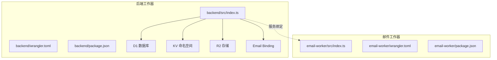
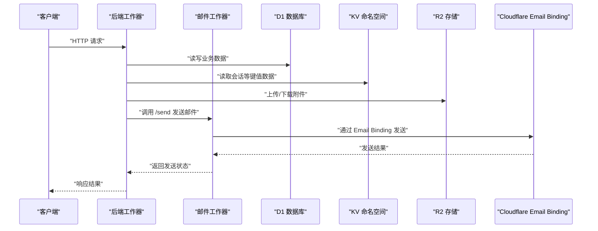
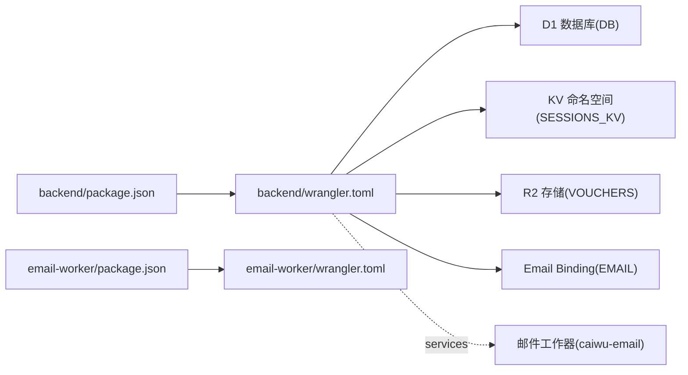

# 部署与运维

<cite>
**本文引用的文件**
- [backend/wrangler.toml](file://backend/wrangler.toml)
- [email-worker/wrangler.toml](file://email-worker/wrangler.toml)
- [backend/package.json](file://backend/package.json)
- [email-worker/package.json](file://email-worker/package.json)
- [backend/src/index.ts](file://backend/src/index.ts)
- [email-worker/src/index.ts](file://email-worker/src/index.ts)
- [backend/src/db/schema.sql](file://backend/src/db/schema.sql)
- [backend/init_prod.sql](file://backend/init_prod.sql)
- [backend/src/db/reset_problematic_tables.sql](file://backend/src/db/reset_problematic_tables.sql)
- [backend/src/db/archive/migration_cleanup.sql](file://backend/src/db/archive/migration_cleanup.sql)
- [backend/src/utils/logger.ts](file://backend/src/utils/logger.ts)
- [backend/src/utils/errors.ts](file://backend/src/utils/errors.ts)
- [backend/src/utils/audit.ts](file://backend/src/utils/audit.ts)
</cite>

## 目录
1. [简介](#简介)
2. [项目结构](#项目结构)
3. [核心组件](#核心组件)
4. [架构总览](#架构总览)
5. [详细组件分析](#详细组件分析)
6. [依赖关系分析](#依赖关系分析)
7. [性能与监控](#性能与监控)
8. [部署与运维实践](#部署与运维实践)
9. [故障排查指南](#故障排查指南)
10. [结论](#结论)

## 简介
本指南面向运维团队，系统性说明如何使用 Wrangler CLI 将后端与邮件工作器部署到 Cloudflare Workers，并覆盖生产与预发布环境的部署流程、配置项说明、监控策略、数据库迁移与回滚、健康检查与应急恢复方案。文档基于仓库现有配置与代码进行梳理，确保可操作与可追溯。

## 项目结构
- 后端工作器位于 backend/，使用 Hono 框架，通过 D1 数据库存储业务数据，通过 KV 存储会话，通过 R2 存储凭证附件，通过 Email Binding 发送邮件。
- 邮件工作器位于 email-worker/，提供受控的邮件发送接口，供后端调用。
- 两处均提供 wrangler.toml 作为部署配置入口，并在 backend/package.json 中提供 wrangler 命令脚本。

图表来源
- [backend/src/index.ts](file://backend/src/index.ts#L64-L82)
- [backend/wrangler.toml](file://backend/wrangler.toml#L1-L45)
- [email-worker/src/index.ts](file://email-worker/src/index.ts#L1-L75)
- [email-worker/wrangler.toml](file://email-worker/wrangler.toml#L1-L18)

章节来源
- [backend/wrangler.toml](file://backend/wrangler.toml#L1-L45)
- [email-worker/wrangler.toml](file://email-worker/wrangler.toml#L1-L18)
- [backend/package.json](file://backend/package.json#L1-L43)
- [email-worker/package.json](file://email-worker/package.json#L1-L14)

## 核心组件
- 后端工作器
  - 提供健康检查与版本信息接口，便于运维巡检与灰度验证。
  - 通过 D1、KV、R2、Email Binding 完成数据持久化、会话存储、附件存储与邮件发送。
  - 日志与错误处理统一，便于集中观测与定位问题。
- 邮件工作器
  - 提供 /health 健康检查与 /send 发送接口，支持可选令牌鉴权，保障安全调用。
  - 通过 Cloudflare Email Binding 发送邮件，简化邮件通道接入。

章节来源
- [backend/src/index.ts](file://backend/src/index.ts#L64-L82)
- [backend/src/index.ts](file://backend/src/index.ts#L122-L133)
- [email-worker/src/index.ts](file://email-worker/src/index.ts#L15-L21)
- [email-worker/src/index.ts](file://email-worker/src/index.ts#L23-L41)
- [email-worker/src/index.ts](file://email-worker/src/index.ts#L61-L72)

## 架构总览
后端工作器与邮件工作器通过服务绑定互联，后端负责业务逻辑与数据管理，邮件工作器负责邮件投递。整体以 D1 为核心数据源，配合 KV、R2 与 Email Binding 形成完整的云原生能力。

图表来源
- [backend/src/index.ts](file://backend/src/index.ts#L64-L82)
- [email-worker/src/index.ts](file://email-worker/src/index.ts#L15-L21)
- [email-worker/src/index.ts](file://email-worker/src/index.ts#L61-L72)
- [backend/wrangler.toml](file://backend/wrangler.toml#L1-L45)
- [email-worker/wrangler.toml](file://email-worker/wrangler.toml#L1-L18)

## 详细组件分析

### 后端工作器配置与绑定
- 名称与入口
  - name 与 main 指定工作器名称与入口文件。
- 兼容性
  - compatibility_date 与 compatibility_flags 保证运行时兼容。
- 数据库与存储绑定
  - D1 数据库绑定 DB，用于业务数据。
  - KV 命名空间 SESSIONS_KV，用于会话等键值数据。
  - R2 存储 VOUCHERS，用于凭证附件。
- 观测性
  - observability.enabled 控制是否启用可观测性；logs.invocation_logs 控制调用日志采集。
- 变量与密钥
  - vars 包含账户、区域、IP 白名单规则集 ID 等基础变量。
  - JWT 密钥等敏感变量通过 Wrangler Secret 管理，不在配置文件中明文存放。
- 服务绑定
  - services 指向邮件工作器的生产环境服务，实现跨 Worker 的调用。

章节来源
- [backend/wrangler.toml](file://backend/wrangler.toml#L1-L45)

### 邮件工作器配置与绑定
- 名称与入口
  - name 与 main 指定工作器名称与入口文件。
- 兼容性
  - compatibility_date 与 compatibility_flags 保证运行时兼容。
- Email Binding
  - send_email 绑定名为 EMAIL 的内置邮件发送能力。
- 变量与密钥
  - vars 中包含发件人 EMAIL_FROM；敏感变量 EMAIL_TOKEN 通过 Wrangler Secret 管理。

章节来源
- [email-worker/wrangler.toml](file://email-worker/wrangler.toml#L1-L18)

### 后端健康检查与版本接口
- /api/health：快速检测数据库连通性，带超时保护，便于灰度与滚动更新期间的健康探测。
- /api/version：返回版本标识，便于发布追踪。
- /api/ui 与 /api/doc：Swagger UI 与 OpenAPI 文档，便于联调与审计。

章节来源
- [backend/src/index.ts](file://backend/src/index.ts#L64-L82)
- [backend/src/index.ts](file://backend/src/index.ts#L84-L84)
- [backend/src/index.ts](file://backend/src/index.ts#L122-L133)

### 邮件工作器健康检查与鉴权
- /health：返回工作器健康状态。
- /send：POST 接口，支持可选令牌鉴权（x-email-token），校验必填字段（收件人、主题、HTML 或文本内容）。

章节来源
- [email-worker/src/index.ts](file://email-worker/src/index.ts#L15-L21)
- [email-worker/src/index.ts](file://email-worker/src/index.ts#L23-L41)
- [email-worker/src/index.ts](file://email-worker/src/index.ts#L61-L72)

### 数据库模式与迁移
- schema.sql：定义完整业务表结构与索引，涵盖用户、员工、组织、财务流水、资产、租赁、报销等核心领域。
- 迁移脚本：archive 下包含多轮历史迁移 SQL，以及清理脚本与重置脚本，便于生产环境按序应用或回退。
- 初始化脚本：init_prod.sql 提供生产环境最小化初始化示例（含管理员账号与基础数据）。

章节来源
- [backend/src/db/schema.sql](file://backend/src/db/schema.sql#L1-L662)
- [backend/src/db/archive/migration_cleanup.sql](file://backend/src/db/archive/migration_cleanup.sql#L1-L21)
- [backend/src/db/reset_problematic_tables.sql](file://backend/src/db/reset_problematic_tables.sql#L1-L6)
- [backend/init_prod.sql](file://backend/init_prod.sql#L1-L20)

### 日志、错误与审计
- 日志系统：统一 logger，支持 info/warn/error 等级别，结构化输出，便于在 Cloudflare 日志中检索。
- 错误处理：全局 errorHandler，区分业务错误、验证错误与未预期错误，统一输出结构化错误日志。
- 审计日志：logAuditAction 将操作者、实体、IP、IP 归属地等信息写入审计表，支持 waitUntil 异步落盘，避免阻塞主流程。

章节来源
- [backend/src/utils/logger.ts](file://backend/src/utils/logger.ts#L1-L84)
- [backend/src/utils/errors.ts](file://backend/src/utils/errors.ts#L56-L112)
- [backend/src/utils/audit.ts](file://backend/src/utils/audit.ts#L36-L91)

## 依赖关系分析
- 后端对 D1/KV/R2/Email Binding 的依赖通过 wrangler.toml 的绑定声明体现。
- 后端与邮件工作器通过 services 绑定建立跨 Worker 调用关系。
- package.json 中的脚本封装了本地开发、部署与数据库迁移命令，便于 CI/CD 集成。

图表来源
- [backend/package.json](file://backend/package.json#L1-L43)
- [email-worker/package.json](file://email-worker/package.json#L1-L14)
- [backend/wrangler.toml](file://backend/wrangler.toml#L1-L45)
- [email-worker/wrangler.toml](file://email-worker/wrangler.toml#L1-L18)

章节来源
- [backend/package.json](file://backend/package.json#L1-L43)
- [email-worker/package.json](file://email-worker/package.json#L1-L14)
- [backend/wrangler.toml](file://backend/wrangler.toml#L1-L45)
- [email-worker/wrangler.toml](file://email-worker/wrangler.toml#L1-L18)

## 性能与监控
- 观测性
  - backend/wrangler.toml 中开启 logs.invocation_logs，便于捕获请求级调用日志。
  - 建议在生产环境开启 observability.enabled 并设置 head_sampling_rate，平衡采样率与可观测性成本。
- 日志与错误
  - 使用 logger 输出结构化日志，结合 errorHandler 的统一错误输出，便于在 Cloudflare 日志面板中聚合检索。
- 健康检查
  - 后端 /api/health 采用快速查询+超时保护，适合高并发场景下的探活。
- 审计
  - 审计日志异步写入，避免阻塞主流程；建议定期导出审计日志用于合规与风控分析。

章节来源
- [backend/wrangler.toml](file://backend/wrangler.toml#L19-L27)
- [backend/src/index.ts](file://backend/src/index.ts#L64-L82)
- [backend/src/utils/logger.ts](file://backend/src/utils/logger.ts#L1-L84)
- [backend/src/utils/errors.ts](file://backend/src/utils/errors.ts#L56-L112)
- [backend/src/utils/audit.ts](file://backend/src/utils/audit.ts#L36-L91)

## 部署与运维实践

### 1) 环境变量与密钥管理
- 敏感变量（如 JWT 密钥、邮件令牌）通过 Wrangler Secret 管理，不在配置文件中明文存放。
- 建议在 CI/CD 中分环境注入密钥，避免误提交。

章节来源
- [backend/wrangler.toml](file://backend/wrangler.toml#L39-L45)
- [email-worker/wrangler.toml](file://email-worker/wrangler.toml#L15-L17)

### 2) 生产与预发布环境部署命令
- 后端工作器
  - 本地开发：使用本地调试命令启动后端。
  - 部署：使用部署命令将后端工作器发布到指定环境。
- 邮件工作器
  - 本地开发：使用本地调试命令启动邮件工作器。
  - 部署：使用部署命令将邮件工作器发布到指定环境。
- 数据库迁移
  - 本地迁移：执行 schema.sql 初始化或按序执行迁移脚本。
  - 远程迁移：在生产环境按顺序执行迁移脚本，失败时逐个排查并跳过已应用的脚本。

章节来源
- [backend/package.json](file://backend/package.json#L1-L43)
- [email-worker/package.json](file://email-worker/package.json#L1-L14)
- [backend/src/db/schema.sql](file://backend/src/db/schema.sql#L1-L662)
- [backend/src/db/archive/migration_cleanup.sql](file://backend/src/db/archive/migration_cleanup.sql#L1-L21)

### 3) 配置文件关键参数说明
- 后端 wrangler.toml
  - D1 绑定 DB：指向生产 D1 数据库实例。
  - KV 绑定 SESSIONS_KV：用于会话等键值数据。
  - R2 绑定 VOUCHERS：用于凭证附件存储。
  - 服务绑定 EMAIL_SERVICE：指向邮件工作器的生产环境服务。
  - 变量 CF_ACCOUNT_ID/CF_ZONE_ID/CF_IP_LIST_ID：用于集成 Cloudflare 相关能力。
  - 观测性：logs.invocation_logs 打开调用日志采集。
- 邮件工作器 wrangler.toml
  - send_email 绑定 EMAIL：启用 Cloudflare 内置邮件发送能力。
  - 变量 EMAIL_FROM：发件人地址（需在 Cloudflare Email Routing 域名下）。
  - EMAIL_TOKEN：通过 Secret 管理的令牌，用于 /send 接口鉴权。

章节来源
- [backend/wrangler.toml](file://backend/wrangler.toml#L1-L45)
- [email-worker/wrangler.toml](file://email-worker/wrangler.toml#L1-L18)

### 4) 数据库迁移与回滚
- 迁移策略
  - 优先执行 schema.sql 完整初始化，随后按序执行 migration_*.sql。
  - 对于生产环境，建议先在预发布环境验证，再逐步应用到生产。
- 回滚策略
  - 若某迁移失败，保留现场并记录失败脚本，后续修复后再重试。
  - 使用 reset_problematic_tables.sql 清理异常表，再重新执行对应迁移。
  - 使用 migration_cleanup.sql 清理废弃列与备份表，保持生产库整洁。
- 初始化
  - 使用 init_prod.sql 快速创建管理员与基础数据，便于上线后快速验证。

章节来源
- [backend/src/db/schema.sql](file://backend/src/db/schema.sql#L1-L662)
- [backend/src/db/reset_problematic_tables.sql](file://backend/src/db/reset_problematic_tables.sql#L1-L6)
- [backend/src/db/archive/migration_cleanup.sql](file://backend/src/db/archive/migration_cleanup.sql#L1-L21)
- [backend/init_prod.sql](file://backend/init_prod.sql#L1-L20)

### 5) 健康检查与应急恢复
- 健康检查
  - 后端：/api/health 返回数据库连通性；/api/version 返回版本信息。
  - 邮件工作器：/health 返回工作器健康状态。
- 应急恢复
  - 当出现数据异常或表结构问题时，可使用 reset_problematic_tables.sql 清理异常表，再重新执行对应迁移。
  - 若业务中断，可临时降级或回滚到上一个稳定版本的工作器与数据库状态。
  - 审计日志可用于定位问题根因，结合错误日志与调用日志进行复盘。

章节来源
- [backend/src/index.ts](file://backend/src/index.ts#L64-L82)
- [email-worker/src/index.ts](file://email-worker/src/index.ts#L15-L21)
- [backend/src/db/reset_problematic_tables.sql](file://backend/src/db/reset_problematic_tables.sql#L1-L6)

## 故障排查指南
- 日志与错误
  - 使用 logger 输出结构化日志，结合 errorHandler 的统一错误输出，定位业务错误、验证错误与未预期错误。
- 审计与追踪
  - 审计日志异步写入，可在 Cloudflare 日志中检索操作者、实体、IP、IP 归属地等信息。
- 健康检查
  - 通过 /api/health 与 /health 快速判断后端与邮件工作器状态。
- 数据库问题
  - 若出现表结构异常，使用 reset_problematic_tables.sql 清理后重跑迁移。
  - 若出现废弃列或备份表，使用 migration_cleanup.sql 清理。

章节来源
- [backend/src/utils/logger.ts](file://backend/src/utils/logger.ts#L1-L84)
- [backend/src/utils/errors.ts](file://backend/src/utils/errors.ts#L56-L112)
- [backend/src/utils/audit.ts](file://backend/src/utils/audit.ts#L36-L91)
- [backend/src/db/reset_problematic_tables.sql](file://backend/src/db/reset_problematic_tables.sql#L1-L6)

## 结论
本指南基于仓库现有配置与代码，给出了后端与邮件工作器在 Cloudflare Workers 上的部署与运维实践，覆盖了配置要点、健康检查、监控策略、数据库迁移与回滚、应急恢复方案。建议在生产环境中严格区分密钥与变量，按序执行迁移并在预发布环境充分验证，同时利用健康检查与日志审计提升可观测性与可恢复性。