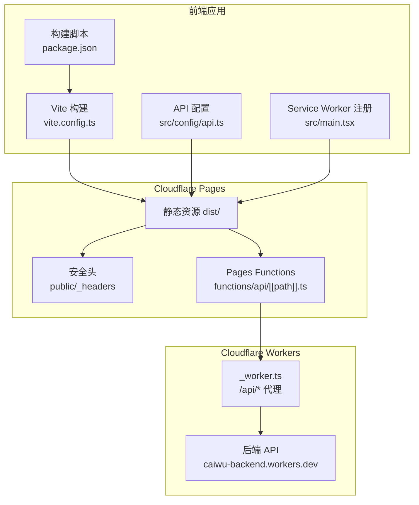
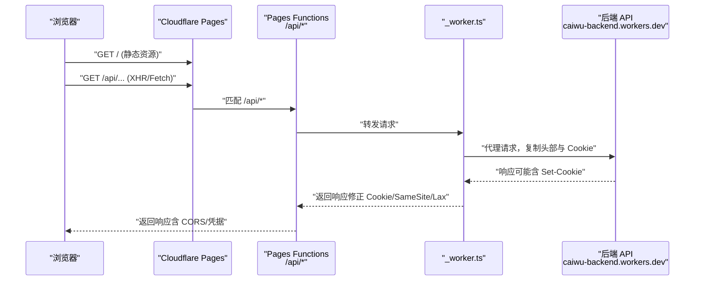
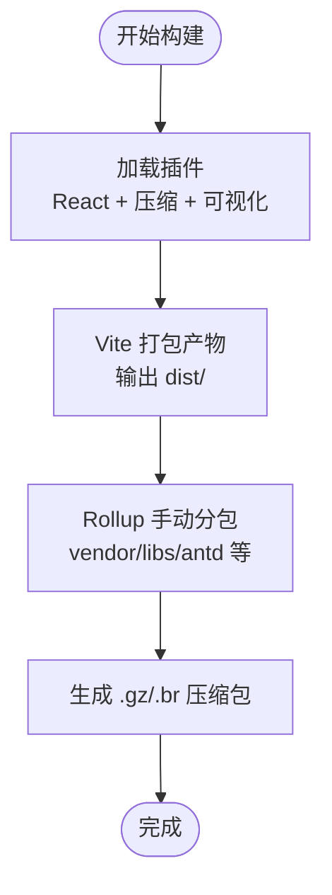
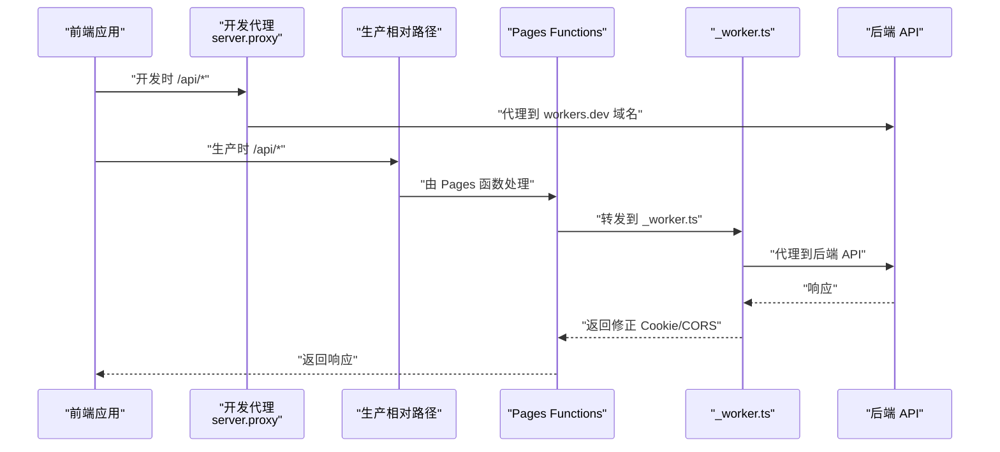
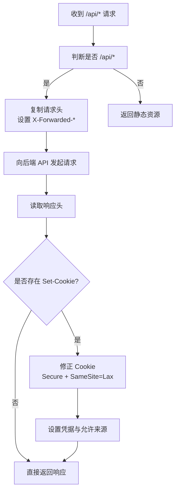
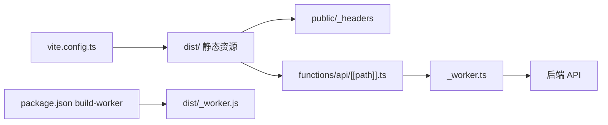

# 前端部署

<cite>
**本文引用的文件**
- [frontend/vite.config.ts](file://frontend/vite.config.ts)
- [frontend/package.json](file://frontend/package.json)
- [frontend/public/_headers](file://frontend/public/_headers)
- [frontend/_worker.ts](file://frontend/_worker.ts)
- [frontend/functions/api/[[path]].ts](file://frontend/functions/api/[[path]].ts)
- [frontend/src/config/api.ts](file://frontend/src/config/api.ts)
- [frontend/src/main.tsx](file://frontend/src/main.tsx)
- [frontend/README.md](file://frontend/README.md)
- [backend/wrangler.toml](file://backend/wrangler.toml)
- [.cursorrules](file://.cursorrules)
</cite>

## 目录
1. [简介](#简介)
2. [项目结构](#项目结构)
3. [核心组件](#核心组件)
4. [架构总览](#架构总览)
5. [详细组件分析](#详细组件分析)
6. [依赖关系分析](#依赖关系分析)
7. [性能考量](#性能考量)
8. [故障排查指南](#故障排查指南)
9. [结论](#结论)
10. [附录](#附录)

## 简介
本指南面向前端工程师与运维人员，围绕通过 Vite 构建生产静态资源、启用 gzip 与 brotli 压缩、将产物部署至 Cloudflare Pages 或其他静态托管平台、配置代理与生产环境 API 网关映射策略、部署配套的 _worker.ts 边缘函数、理解 public/_headers 的安全头与缓存策略、以及环境变量管理与版本发布/回滚策略进行系统性说明。文档同时提供可视化图示帮助理解端到端流程。

## 项目结构
前端工程位于 frontend 目录，核心关注点包括：
- 构建与压缩：vite.config.ts 中的压缩插件与分包策略
- 代理与 API 映射：开发期代理与生产期相对路径 API 配置
- 边缘函数：_worker.ts 用于 /api/* 请求代理与 Cookie 处理
- 安全头：public/_headers 文件设置 CSP、缓存与连接策略
- 部署脚本：package.json 中的构建与打包命令
- Pages 函数：functions/api/[[path]].ts 作为 Pages Functions 的 API 代理

图表来源
- [frontend/vite.config.ts](file://frontend/vite.config.ts#L1-L56)
- [frontend/package.json](file://frontend/package.json#L1-L51)
- [frontend/src/config/api.ts](file://frontend/src/config/api.ts#L1-L188)
- [frontend/src/main.tsx](file://frontend/src/main.tsx#L1-L78)
- [frontend/public/_headers](file://frontend/public/_headers#L1-L4)
- [frontend/functions/api/[[path]].ts](file://frontend/functions/api/[[path]].ts#L1-L41)
- [frontend/_worker.ts](file://frontend/_worker.ts#L1-L71)

章节来源
- [frontend/vite.config.ts](file://frontend/vite.config.ts#L1-L56)
- [frontend/package.json](file://frontend/package.json#L1-L51)
- [frontend/src/config/api.ts](file://frontend/src/config/api.ts#L1-L188)
- [frontend/src/main.tsx](file://frontend/src/main.tsx#L1-L78)
- [frontend/public/_headers](file://frontend/public/_headers#L1-L4)
- [frontend/functions/api/[[path]].ts](file://frontend/functions/api/[[path]].ts#L1-L41)
- [frontend/_worker.ts](file://frontend/_worker.ts#L1-L71)

## 核心组件
- Vite 构建与压缩
  - 在 vite.config.ts 中启用 gzip 与 brotli 压缩插件，并开启可视化分析，提升首屏与资源加载性能。
  - 使用 Rollup 手动分包策略，将 React 生态、Ant Design 及常用库拆分为独立 chunk，优化缓存命中与并行下载。
- API 代理与映射
  - 开发期通过 server.proxy 将 /api/* 代理到后端 Worker 域名；生产期使用相对路径，通过 Pages 内部绑定的 Worker 实现 API 透传。
- 边缘函数与 Pages 函数
  - _worker.ts：在 Pages 上对 /api/* 请求进行代理，复制请求头并处理 Set-Cookie，确保跨域凭据与 SameSite/Lax 策略兼容。
  - functions/api/[[path]].ts：作为 Pages Functions 的高级模式，代理 /api/* 到后端 Worker，处理 Cookie 与 CORS。
- 安全头与缓存策略
  - public/_headers：集中设置 CSP、连接源、帧嵌套限制等，保障前端在 Pages 上的安全性与稳定性。
- 构建脚本与产物
  - package.json 中的 build 与 build-worker 脚本，先执行 Vite 构建，再用 esbuild 打包 _worker.ts 为 dist/_worker.js，供 Pages 使用。

章节来源
- [frontend/vite.config.ts](file://frontend/vite.config.ts#L1-L56)
- [frontend/package.json](file://frontend/package.json#L1-L51)
- [frontend/public/_headers](file://frontend/public/_headers#L1-L4)
- [frontend/_worker.ts](file://frontend/_worker.ts#L1-L71)
- [frontend/functions/api/[[path]].ts](file://frontend/functions/api/[[path]].ts#L1-L41)
- [frontend/src/config/api.ts](file://frontend/src/config/api.ts#L1-L188)

## 架构总览
下图展示从浏览器到后端 API 的端到端请求链路，涵盖开发期代理、生产期 Pages 绑定与 Workers 代理、以及安全头与缓存策略。

图表来源
- [frontend/functions/api/[[path]].ts](file://frontend/functions/api/[[path]].ts#L1-L41)
- [frontend/_worker.ts](file://frontend/_worker.ts#L1-L71)
- [frontend/src/config/api.ts](file://frontend/src/config/api.ts#L1-L188)

## 详细组件分析

### Vite 构建与压缩
- 压缩插件
  - 同时启用 gzip 与 brotli 压缩，扩展名为 .gz 与 .br，显著降低传输体积。
  - 启用可视化分析，便于评估各资源大小与分包效果。
- 分包策略
  - 将 react、react-dom、react-router-dom、antd、@ant-design/icons、@tanstack/react-query、dayjs、zustand、qrcode.react 等拆分为独立 chunk，提升缓存复用与并行加载效率。
- 构建目录
  - 输出目录为 dist，Rollup 配置支持手动分包与后续 CDN/缓存策略对接。

图表来源
- [frontend/vite.config.ts](file://frontend/vite.config.ts#L1-L56)

章节来源
- [frontend/vite.config.ts](file://frontend/vite.config.ts#L1-L56)

### API 代理与生产环境映射策略
- 开发期代理
  - server.proxy 将 /api/* 代理到后端 Worker 域名，便于本地联调。
- 生产期映射
  - src/config/api.ts 在生产环境使用空字符串作为 API_HOST，从而走相对路径，由 Pages 内部绑定的 Worker 代理到后端 API。
- Pages 函数映射
  - functions/api/[[path]].ts 作为高级模式函数，将 /api/* 路径重写为后端 API 路径并转发，保留必要头部，处理 Set-Cookie 与 CORS。

图表来源
- [frontend/src/config/api.ts](file://frontend/src/config/api.ts#L1-L188)
- [frontend/functions/api/[[path]].ts](file://frontend/functions/api/[[path]].ts#L1-L41)
- [frontend/_worker.ts](file://frontend/_worker.ts#L1-L71)

章节来源
- [frontend/src/config/api.ts](file://frontend/src/config/api.ts#L1-L188)
- [frontend/functions/api/[[path]].ts](file://frontend/functions/api/[[path]].ts#L1-L41)
- [frontend/_worker.ts](file://frontend/_worker.ts#L1-L71)

### 边缘函数与 Pages 函数
- _worker.ts
  - 识别 /api/* 请求，构造目标后端地址，复制请求头（过滤敏感头），设置 X-Forwarded-* 以便后端识别协议与主机。
  - 对 Set-Cookie 进行修正（去除 domain、追加 Secure、设置 SameSite=Lax），并根据 Origin 设置 Access-Control-Allow-Credentials 与 Access-Control-Allow-Origin。
  - 捕获异常并返回标准化错误响应。
- functions/api/[[path]].ts
  - 作为 Pages Functions 的高级模式，将 /api/* 路径重写为后端 API 路径，复制头部并处理 Cookie/CORS，返回响应体与状态码。

图表来源
- [frontend/_worker.ts](file://frontend/_worker.ts#L1-L71)
- [frontend/functions/api/[[path]].ts](file://frontend/functions/api/[[path]].ts#L1-L41)

章节来源
- [frontend/_worker.ts](file://frontend/_worker.ts#L1-L71)
- [frontend/functions/api/[[path]].ts](file://frontend/functions/api/[[path]].ts#L1-L41)

### 安全头与缓存策略（public/_headers）
- 内容安全策略（CSP）
  - 限定默认源、脚本、样式、字体、图片、连接源与帧嵌入者，确保在 Cloudflare Pages 上的安全性。
- 连接源
  - 允许必要的云服务域名（如 cloudflareinsights.com、*.cloudflare.com），以及后端 API 域名。
- 缓存与安全
  - 通过 CSP 与连接策略减少跨站风险，结合 Pages 的缓存层提升性能。

章节来源
- [frontend/public/_headers](file://frontend/public/_headers#L1-L4)

### 构建脚本与产物
- package.json
  - build：先执行 Vite 构建，再调用 build-worker 脚本，使用 esbuild 将 _worker.ts 打包为 dist/_worker.js。
  - build-worker：以 ESM 形式打包，目标为 ES2022，输出到 dist/_worker.js，供 Pages 使用。
- 产物位置
  - Vite 构建产物位于 dist/，包含静态资源与 _worker.js。

章节来源
- [frontend/package.json](file://frontend/package.json#L1-L51)

### Service Worker 与离线体验
- src/main.tsx
  - 在浏览器加载完成后注册 /sw.js，用于离线缓存与渐进式增强（若存在）。
- 注意
  - 若未提供 sw.js，需确认 public/sw.js 是否存在或移除注册逻辑。

章节来源
- [frontend/src/main.tsx](file://frontend/src/main.tsx#L1-L78)

## 依赖关系分析
- 构建与打包
  - Vite 插件链：React 插件 -> 压缩插件（gzip/brotli）-> 可视化分析 -> Rollup 手动分包。
  - esbuild 用于将 _worker.ts 打包为 dist/_worker.js。
- 运行时依赖
  - 前端通过相对路径访问 API，在生产环境由 Pages 内部绑定的 Worker 代理到后端 API。
- 安全与缓存
  - public/_headers 提供统一的安全头策略，与 Pages 的缓存层协同工作。

图表来源
- [frontend/vite.config.ts](file://frontend/vite.config.ts#L1-L56)
- [frontend/package.json](file://frontend/package.json#L1-L51)
- [frontend/public/_headers](file://frontend/public/_headers#L1-L4)
- [frontend/functions/api/[[path]].ts](file://frontend/functions/api/[[path]].ts#L1-L41)
- [frontend/_worker.ts](file://frontend/_worker.ts#L1-L71)

章节来源
- [frontend/vite.config.ts](file://frontend/vite.config.ts#L1-L56)
- [frontend/package.json](file://frontend/package.json#L1-L51)
- [frontend/public/_headers](file://frontend/public/_headers#L1-L4)
- [frontend/functions/api/[[path]].ts](file://frontend/functions/api/[[path]].ts#L1-L41)
- [frontend/_worker.ts](file://frontend/_worker.ts#L1-L71)

## 性能考量
- 压缩与缓存
  - 启用 gzip 与 brotli 压缩，结合浏览器与 Pages 的缓存策略，显著降低带宽占用与首屏加载时间。
- 分包与缓存命中
  - 将第三方库拆分为独立 chunk，提升浏览器缓存命中率，减少重复下载。
- 传输与头部
  - _worker.ts 与 Pages Functions 仅转发必要头部，避免不必要的开销；同时修正 Cookie 与 CORS，减少二次往返。
- Service Worker
  - 注册 /sw.js 可提升离线体验与缓存命中，但需确保 sw.js 存在且逻辑合理。

章节来源
- [frontend/vite.config.ts](file://frontend/vite.config.ts#L1-L56)
- [frontend/src/main.tsx](file://frontend/src/main.tsx#L1-L78)

## 故障排查指南
- 构建失败
  - 确认 package.json 中的 build 与 build-worker 脚本执行成功，dist 目录生成。
  - 若 esbuild 报错，检查 _worker.ts 的语法与导入路径。
- API 无法访问
  - 开发期：确认 server.proxy 的 target 地址可达。
  - 生产期：确认 Pages 内部已绑定 Worker，且 src/config/api.ts 在生产环境使用相对路径。
  - Pages 函数：确认 functions/api/[[path]].ts 已部署，路径匹配 /api/*。
- Cookie 与跨域问题
  - _worker.ts 会修正 Set-Cookie 的 domain、secure 与 SameSite；若仍出现跨域问题，检查前端 Origin 与后端 CORS 设置。
- 安全头导致资源加载失败
  - public/_headers 中的 CSP 限制了脚本、样式、字体与连接源，若资源加载失败，请核对域名白名单。
- Service Worker 注册失败
  - 确认 public/sw.js 存在；若不存在，移除注册逻辑或提供 sw.js。

章节来源
- [frontend/package.json](file://frontend/package.json#L1-L51)
- [frontend/src/config/api.ts](file://frontend/src/config/api.ts#L1-L188)
- [frontend/functions/api/[[path]].ts](file://frontend/functions/api/[[path]].ts#L1-L41)
- [frontend/_worker.ts](file://frontend/_worker.ts#L1-L71)
- [frontend/public/_headers](file://frontend/public/_headers#L1-L4)
- [frontend/src/main.tsx](file://frontend/src/main.tsx#L1-L78)

## 结论
通过 Vite 的压缩与分包策略、Cloudflare Pages 的静态托管能力、以及 _worker.ts 与 Pages Functions 的 API 代理，前端应用可在生产环境中实现高性能、安全与稳定的交付。配合 public/_headers 的安全头策略与合理的环境变量管理，可进一步提升安全性与可维护性。建议在 CI/CD 中固化构建与部署流程，并建立版本发布与回滚策略。

## 附录

### 部署到 Cloudflare Pages 的完整流程
- 本地构建
  - 执行构建脚本，生成 dist/ 与 dist/_worker.js。
- 在 Cloudflare Dashboard 中配置 Pages：
  - 选择仓库与分支，设置构建命令为 npm run build，输出目录为 dist。
  - 在 Settings -> Functions 中启用 Functions，并确保 functions/api/[[path]].ts 可用。
- 绑定 Worker
  - 在 Pages Settings -> Functions -> Bindings 中，将 /api/* 绑定到后端 Worker（例如 caiwu-backend）。
- 验证
  - 访问 Pages 域名，验证静态资源与 API 代理正常。

章节来源
- [frontend/package.json](file://frontend/package.json#L1-L51)
- [frontend/functions/api/[[path]].ts](file://frontend/functions/api/[[path]].ts#L1-L41)
- [frontend/_worker.ts](file://frontend/_worker.ts#L1-L71)
- [frontend/README.md](file://frontend/README.md#L1-L117)

### 生产环境 API 网关映射策略
- 开发期：server.proxy 将 /api/* 代理到后端 Worker 域名。
- 生产期：src/config/api.ts 使用空字符串作为 API_HOST，走相对路径，由 Pages 内部绑定的 Worker 代理到后端 API。
- Pages 函数：functions/api/[[path]].ts 作为高级模式函数，将 /api/* 重写并转发。

章节来源
- [frontend/src/config/api.ts](file://frontend/src/config/api.ts#L1-L188)
- [frontend/functions/api/[[path]].ts](file://frontend/functions/api/[[path]].ts#L1-L41)
- [frontend/_worker.ts](file://frontend/_worker.ts#L1-L71)

### public/_headers 的作用与配置要点
- 设置内容安全策略（CSP）、连接源、帧嵌入限制等，确保在 Pages 上的安全性。
- 与后端 API 域名、CDN 与统计服务域名保持一致，避免资源加载失败。

章节来源
- [frontend/public/_headers](file://frontend/public/_headers#L1-L4)

### 环境变量管理与版本发布/回滚策略
- 环境变量
  - 后端 JWT 密钥、邮件服务 Token、Cloudflare 账户与 Zone ID 等通过 wrangler secret 或 vars 配置。
- 版本发布与回滚
  - 在 CI/CD 中固定构建产物（dist/）与 _worker.js，记录版本号与提交 SHA。
  - 回滚时恢复上一个稳定版本的 dist/ 与 _worker.js，或切换 Pages 的部署分支。

章节来源
- [backend/wrangler.toml](file://backend/wrangler.toml#L1-L48)
- [.cursorrules](file://.cursorrules#L284-L408)