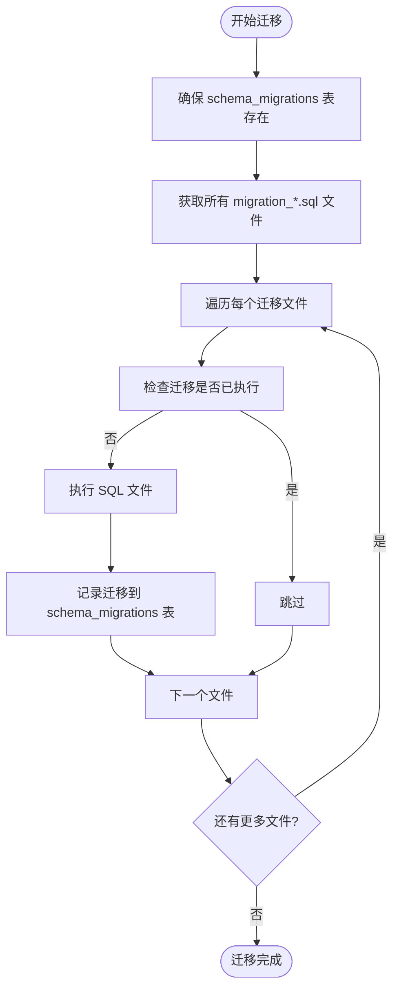

# 后端部署

<cite>
**本文档引用的文件**
- [wrangler.toml](file://backend/wrangler.toml)
- [package.json](file://backend/package.json)
- [src/index.ts](file://backend/src/index.ts)
- [drizzle.config.ts](file://backend/drizzle.config.ts)
- [src/db/index.ts](file://backend/src/db/index.ts)
- [scripts/migrate-up.ts](file://backend/scripts/migrate-up.ts)
- [scripts/check-migrations.ts](file://backend/scripts/check-migrations.ts)
- [src/utils/cloudflare.ts](file://backend/src/utils/cloudflare.ts)
- [src/db/schema.ts](file://backend/src/db/schema.ts)
</cite>

## 目录
1. [简介](#简介)
2. [wrangler.toml 配置详解](#wranglertoml-配置详解)
3. [环境变量与密钥管理](#环境变量与密钥管理)
4. [数据库迁移流程](#数据库迁移流程)
5. [部署前检查与构建](#部署前检查与构建)
6. [执行部署](#执行部署)
7. [自定义域名与SSL配置](#自定义域名与ssl配置)
8. [健康检查与服务验证](#健康检查与服务验证)

## 简介

本文档提供了将后端服务部署到 Cloudflare Workers 的完整指南。该指南涵盖了从配置 `wrangler.toml` 文件、管理环境变量和密钥，到执行数据库迁移、代码检查和最终部署的全过程。同时，还包括了如何配置自定义域名和SSL证书，以及如何验证部署后的服务状态。

**Section sources**
- [wrangler.toml](file://backend/wrangler.toml)
- [package.json](file://backend/package.json)

## wrangler.toml 配置详解

`wrangler.toml` 是 Cloudflare Workers 项目的配置文件，定义了服务的名称、入口点、兼容性设置以及与各种 Cloudflare 服务的绑定。

### D1 数据库绑定

D1 是 Cloudflare 提供的 SQLite 数据库服务。在 `wrangler.toml` 中，通过 `[[d1_databases]]` 配置块来绑定 D1 数据库。

```toml
[[d1_databases]]
binding = "DB"
database_name = "caiwu-db"
database_id = "582b2cc8-fb7f-47a3-9b12-a264621c2eeb"
```

- `binding`: 在 Worker 代码中引用此数据库的变量名。在代码中，可以通过 `env.DB` 访问该数据库实例。
- `database_name`: 数据库的逻辑名称。
- `database_id`: 数据库的唯一标识符，由 Cloudflare 生成。

在代码中，使用 `drizzle-orm` 来操作 D1 数据库。例如，在 `src/db/index.ts` 中创建数据库实例：

```typescript
export function createDb(d1: D1Database) {
  return drizzle(d1, { schema })
}
```

**Section sources**
- [wrangler.toml](file://backend/wrangler.toml#L6-L9)
- [src/db/index.ts](file://backend/src/db/index.ts)

### R2 存储桶绑定

R2 是 Cloudflare 提供的对象存储服务。通过 `[[r2_buckets]]` 配置块来绑定 R2 存储桶。

```toml
[[r2_buckets]]
binding = "VOUCHERS"
bucket_name = "caiwu-vouchers"
```

- `binding`: 在 Worker 代码中引用此存储桶的变量名。在代码中，可以通过 `env.VOUCHERS` 访问该存储桶。
- `bucket_name`: R2 存储桶的名称。

**Section sources**
- [wrangler.toml](file://backend/wrangler.toml#L11-L13)

### KV 命名空间绑定

KV (Key-Value) 是 Cloudflare 提供的键值存储服务，常用于存储会话信息。通过 `[[kv_namespaces]]` 配置块来绑定 KV 命名空间。

```toml
[[kv_namespaces]]
binding = "SESSIONS_KV"
id = "35e234c4fcf04c5e84b814e0aed53788"
```

- `binding`: 在 Worker 代码中引用此命名空间的变量名。在代码中，可以通过 `env.SESSIONS_KV` 访问该命名空间。
- `id`: KV 命名空间的唯一标识符。

**Section sources**
- [wrangler.toml](file://backend/wrangler.toml#L15-L17)

### 外部服务绑定

Cloudflare Workers 可以通过服务绑定（Service Bindings）调用其他 Workers 服务。本项目中，后端服务需要调用 `email-worker` 来发送邮件。

```toml
[[services]]
binding = "EMAIL_SERVICE"
service = "caiwu-email"
environment = "production"
```

- `binding`: 在代码中引用此服务的变量名，如 `env.EMAIL_SERVICE`。
- `service`: 被调用的 Worker 服务的名称。
- `environment`: 指定调用的服务环境，如 `production` 或 `staging`。

**Section sources**
- [wrangler.toml](file://backend/wrangler.toml#L34-L37)
- [email-worker/wrangler.toml](file://email-worker/wrangler.toml#L1)

## 环境变量与密钥管理

环境变量（`vars`）和密钥（`secrets`）用于在不同环境中配置服务，同时保护敏感信息。

### 环境变量 (vars)

环境变量是明文存储的配置项，适用于非敏感信息。在 `wrangler.toml` 中，使用 `[vars]` 配置块定义。

```toml
[vars]
CF_ACCOUNT_ID = "611d1a2e53f6c6d0922ff231e6a63211"
CF_ZONE_ID = "18ecc2631881b0e9e03b3ab259d69249"
CF_IP_LIST_ID = "d506362da37b45a2a510eb348d8f1ed2"
```

这些变量在代码中通过 `env` 对象访问，例如 `env.CF_ACCOUNT_ID`。

### 密钥 (secrets)

密钥用于存储敏感信息，如 JWT 密钥、API Token 等。密钥不会存储在 `wrangler.toml` 文件中，而是通过 `wrangler secret put` 命令上传到 Cloudflare。

```toml
# 生产环境密钥通过 Cloudflare Secret 设置
# 请运行: wrangler secret put AUTH_JWT_SECRET
```

在代码中，密钥同样通过 `env` 对象访问，例如 `env.AUTH_JWT_SECRET`。

### 开发与生产环境区分

为了区分开发和生产环境，可以在 `wrangler.toml` 中使用 `[env.dev]` 配置块为开发环境设置特定的变量。

```toml
[env.dev.vars]
AUTH_JWT_SECRET = "dev-jwt-secret-for-local-testing-only"
```

当使用 `wrangler dev` 命令时，会自动加载开发环境的配置。而生产环境的密钥则通过 `wrangler secret` 命令单独设置，确保安全性。

**Section sources**
- [wrangler.toml](file://backend/wrangler.toml#L28-L47)
- [src/index.ts](file://backend/src/index.ts#L215)

## 数据库迁移流程

数据库迁移是确保数据库模式与代码同步的关键步骤。本项目使用 Drizzle ORM 进行模式管理和迁移。

### Drizzle ORM 配置

`drizzle.config.ts` 文件定义了 Drizzle ORM 的配置。

```typescript
export default defineConfig({
    dialect: "sqlite",
    schema: "./src/db/schema.ts",
    out: "./drizzle",
});
```

- `dialect`: 指定数据库方言，此处为 `sqlite`。
- `schema`: 指向包含所有表定义的 TypeScript 文件。
- `out`: 指定生成 SQL 迁移文件的输出目录。

### 迁移脚本执行

项目提供了多个 npm 脚本来管理迁移：

- `migrate:check`: 检查本地数据库的迁移状态。
- `migrate:check:remote`: 检查远程数据库的迁移状态。
- `migrate:up`: 执行所有未执行的迁移（本地）。
- `migrate:up:remote`: 执行所有未执行的迁移（远程）。

`scripts/migrate-up.ts` 脚本是迁移的核心，其流程如下：

1.  **确保迁移追踪表存在**：首先确保 `schema_migrations` 表存在，该表用于记录已执行的迁移。
2.  **获取所有迁移文件**：读取 `src/db/` 目录下所有以 `migration_` 开头的 `.sql` 文件，并按文件名排序。
3.  **检查并执行迁移**：遍历每个迁移文件，检查其是否已在 `schema_migrations` 表中记录。如果未执行，则执行该 SQL 文件，并将文件名、校验和等信息记录到表中。

该脚本还处理了幂等性问题，如果迁移因“已存在”等错误而失败，会将其视为已成功执行并记录，避免阻塞后续迁移。



**Diagram sources**
- [drizzle.config.ts](file://backend/drizzle.config.ts)
- [scripts/migrate-up.ts](file://backend/scripts/migrate-up.ts)
- [src/db/schema.ts](file://backend/src/db/schema.ts)

**Section sources**
- [drizzle.config.ts](file://backend/drizzle.config.ts)
- [scripts/migrate-up.ts](file://backend/scripts/migrate-up.ts)
- [package.json](file://backend/package.json#L14-L15)

## 部署前检查与构建

在部署之前，应执行一系列检查以确保代码质量和一致性。

### 类型校验

使用 TypeScript 的类型检查功能来发现潜在的类型错误。

```bash
npm run typecheck
```

该命令执行 `tsc --noEmit`，只进行类型检查而不生成编译后的文件。

### 代码格式化

使用 Prettier 统一代码风格。

```bash
# 检查格式
npm run format:check

# 修复格式
npm run format
```

### 代码质量检查

使用 ESLint 检查代码中的潜在问题和不符合规范的地方。

```bash
# 检查
npm run lint

# 修复可修复的问题
npm run lint:fix
```

### 迁移状态检查

在部署前，务必检查数据库迁移状态，确保生产环境的数据库模式是最新的。

```bash
# 检查远程数据库迁移状态
npm run migrate:check:remote
```

**Section sources**
- [package.json](file://backend/package.json#L27-L31)
- [scripts/check-migrations.ts](file://backend/scripts/check-migrations.ts)

## 执行部署

完成所有检查后，即可使用 Wrangler CLI 进行部署。

### 部署命令

```bash
npm run deploy
```

该命令执行 `wrangler deploy src/index.ts`，将 `src/index.ts` 作为入口文件部署到 Cloudflare Workers。

### 部署流程

1.  **构建**：Wrangler 会根据 `package.json` 和 `tsconfig.json` 进行构建。
2.  **上传**：将构建后的代码和配置上传到 Cloudflare。
3.  **激活**：新版本的代码被激活并开始处理流量。

**Section sources**
- [package.json](file://backend/package.json#L8)
- [wrangler.toml](file://backend/wrangler.toml#L2)

## 自定义域名与SSL配置

部署后，可以通过自定义域名访问服务，并由 Cloudflare 自动提供 SSL 证书。

### 添加自定义域名

1.  登录 Cloudflare 控制台。
2.  导航到 Workers & Pages 服务。
3.  找到 `caiwu-backend` 服务。
4.  在 "Triggers" -> "Routes" 中，添加自定义域名的路由，例如 `api.yourcompany.com/*`。
5.  确保您的域名 DNS 已经指向 Cloudflare。

### SSL 证书

Cloudflare 会为所有通过其代理的域名自动提供免费的 SSL 证书（使用 Universal SSL）。一旦路由配置完成，访问 `https://api.yourcompany.com` 将自动启用 HTTPS。

**Section sources**
- [wrangler.toml](file://backend/wrangler.toml#L2)

## 健康检查与服务验证

部署后，应立即验证服务是否正常运行。

### 健康检查端点

后端服务提供了一个 `/api/health` 端点，用于检查核心依赖项的状态。

```typescript
app.get('/api/health', async c => {
  const checks = {
    db: false,
    kv: false,
    r2: false,
  }
  // ... 检查 DB, KV, R2 的连接
  return c.json({ status: healthy ? 'healthy' : 'degraded', checks })
})
```

访问 `https://your-worker-url.workers.dev/api/health`，如果所有检查都通过，将返回 `healthy` 状态。

### 版本信息

访问 `/api/version` 可以确认部署的 API 版本。

```typescript
app.get('/api/version', c => c.json({ version: 'v2' }))
```

**Section sources**
- [src/index.ts](file://backend/src/index.ts#L101-L188)
- [src/index.ts](file://backend/src/index.ts#L190)