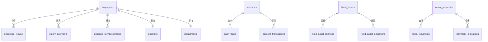

# 数据库设计文档

> **技术栈**：Cloudflare D1 (SQLite) + Drizzle ORM  
> **Schema 文件**：`backend/src/db/schema.ts`

---

## 📋 表结构总览

| 模块 | 表名 | 说明 |
|------|------|------|
| **系统** | `system_config` | 系统配置键值对 |
| | `sessions` | 会话管理 |
| | `trusted_devices` | 可信设备 |
| | `audit_logs` | 审计日志 |
| | `business_operation_history` | 业务操作历史 |
| | `ip_whitelist_rule` | IP 白名单规则 |
| **组织** | `employees` | 员工（含认证字段） |
| | `positions` | 职位 |
| | `departments` | 项目/部门 |
| | `headquarters` | 总部 |
| | `org_departments` | 组织部门树 |
| | `vendors` | 供应商 |
| | `sites` | 工地/站点 |
| **财务** | `accounts` | 账户 |
| | `currencies` | 币种 |
| | `categories` | 收支分类 |
| | `cash_flows` | 现金流水 |
| | `account_transactions` | 账户事务 |
| | `account_transfers` | 账户转账 |
| | `opening_balances` | 期初余额 |
| | `ar_ap_docs` | 应收应付 |
| | `settlements` | 结算 |
| **薪资** | `employee_salaries` | 员工薪资设置 |
| | `salary_payments` | 薪资发放 |
| | `salary_payment_allocations` | 薪资分配 |
| | `employee_allowances` | 员工津贴设置 |
| | `allowance_payments` | 津贴发放 |
| | `employee_leaves` | 员工请假 |
| | `expense_reimbursements` | 费用报销 |
| | `attendance_records` | 考勤记录 |
| **资产** | `fixed_assets` | 固定资产 |
| | `fixed_asset_depreciations` | 资产折旧 |
| | `fixed_asset_changes` | 资产变更 |
| | `fixed_asset_allocations` | 资产分配 |
| **租赁** | `rental_properties` | 租赁物业 |
| | `rental_payments` | 租金支付 |
| | `rental_changes` | 租赁变更 |
| | `rental_payable_bills` | 应付租金 |
| | `dormitory_allocations` | 宿舍分配 |
| **站点** | `site_bills` | 站点账单（水电网） |
| **项目管理** | `projects` | 项目（原 departments） |
| | `requirements` | 需求 |
| | `tasks` | 任务（支持多人员分配） |
| | `task_timelogs` | 工时记录 |

---

## 🔑 核心设计原则

### 1. ID 策略
- **主键**：UUID 字符串 (`text('id').primaryKey()`)
- **生成方式**：`crypto.randomUUID()`

### 2. 金额存储
- **单位**：整数（分/cents），如 `amountCents: integer(...)`
- **计算**：避免浮点数精度问题
- **显示**：前端除以 100 显示

### 3. 时间存储
- **时间戳**：Unix 毫秒 (`integer`)
- **日期字符串**：`YYYY-MM-DD` 格式 (`text`)

### 4. 软删除
- **方式**：`active: integer('active').default(1)`
- **查询**：默认过滤 `active = 1`

### 5. 乐观锁
- **字段**：`version: integer('version').default(1)`
- **应用表**：`accounts`, `employee_leaves`, `salary_payments`, `expense_reimbursements`

---

## 🏢 核心表详解

### employees（员工）
- **合并了 users 表**：认证字段直接在此表
- **关键字段**：
  - `positionId` → 职位（权限来源）
  - `orgDepartmentId` → 组织部门
  - `departmentId` → 项目/部门
  - `passwordHash`, `totpSecret` → 认证
  - `activationToken`, `resetToken` → 账户激活/重置

### positions（职位）
- **权限核心**：
  - `dataScope`: `all` | `project` | `group` | `self`
  - `permissions`: JSON 字符串（权限列表）

### cash_flows（现金流水）
- **红冲支持**：
  - `isReversal`: 是否为红冲记录
  - `reversalOfFlowId`: 冲正的原始流水
  - `isReversed`: 是否已被冲正
  - `reversedByFlowId`: 冲正记录 ID

---

## 📊 索引策略

```sql
-- cash_flows 复合索引
idx_cash_flows_account_biz(accountId, bizDate)
idx_cash_flows_type(type)
idx_cash_flows_reversal(reversalOfFlowId)

-- account_transactions 复合索引
idx_acc_tx_account_date(accountId, transactionDate)

-- audit_logs 索引
idx_audit_logs_time(at)
idx_audit_logs_entity(entityId)
```

---

## 🔗 表关系



---

**最后更新**：2025-12-28
