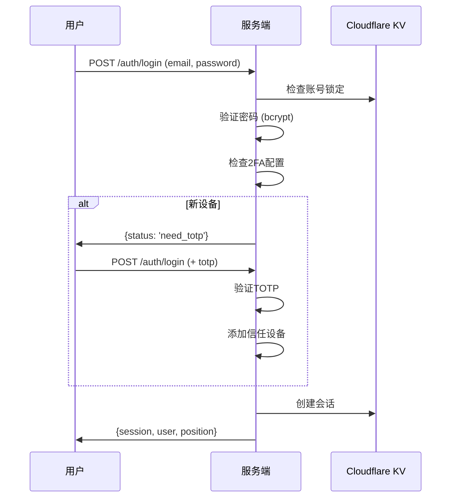

# 安全与认证文档

> **核心文件**：`backend/src/services/auth/AuthService.ts`

---

## 🔐 认证流程

### 登录流程



### 账号激活流程

1. 管理员创建员工 → 发送激活邮件
2. 用户点击链接 → 设置密码 + 绑定 TOTP
3. 激活成功 → 自动登录

---

## 🛡️ 安全机制

### 1. 账号锁定

| 事件 | 处理 |
|------|------|
| 连续 5 次密码错误 | 锁定 15 分钟 |
| 锁定期间尝试登录 | 拒绝并提示 |
| 密码正确 | 清除失败计数 |

```typescript
// KV 存储
lockout:email:xxx@xxx.com  // 锁定标记，15分钟TTL
login_fail:xxx@xxx.com     // 失败计数
```

### 2. TOTP 双因素认证

- **算法**：TOTP (RFC 6238)
- **窗口**：30 秒
- **重放保护**：同一验证码 60 秒内不可重用

```typescript
// KV 重放保护
totp_used:{userId}:{code}  // 60秒TTL
```

### 3. 信任设备

- **指纹生成**：SHA-256(userId + UserAgent)
- **有效期**：90 天
- **信任设备**：跳过 TOTP 验证

### 4. 会话管理

- **存储**：KV（高速缓存）+ D1（持久化）
- **有效期**：7 天
- **刷新策略**：剩余 < 24h 时自动刷新
- **单点登录**：新登录踢掉旧会话

---

## 🔑 JWT 配置

| 参数 | 值 |
|------|------|
| 算法 | HS256 |
| 载荷 | sessionId, employeeId |
| 有效期 | 7 天 |
| 刷新阈值 | 剩余 < 24h |

---

## 📧 安全邮件

| 场景 | 有效期 |
|------|--------|
| 账户激活 | 24 小时 |
| 密码重置 | 1 小时 |
| TOTP 重置 | 30 分钟 |

---

## 🌐 IP 白名单

通过 Cloudflare WAF 规则限制访问：
- 管理接口仅允许白名单 IP
- 规则配置存储在 `ip_whitelist_rule` 表

---

**最后更新**：2025-12-27
