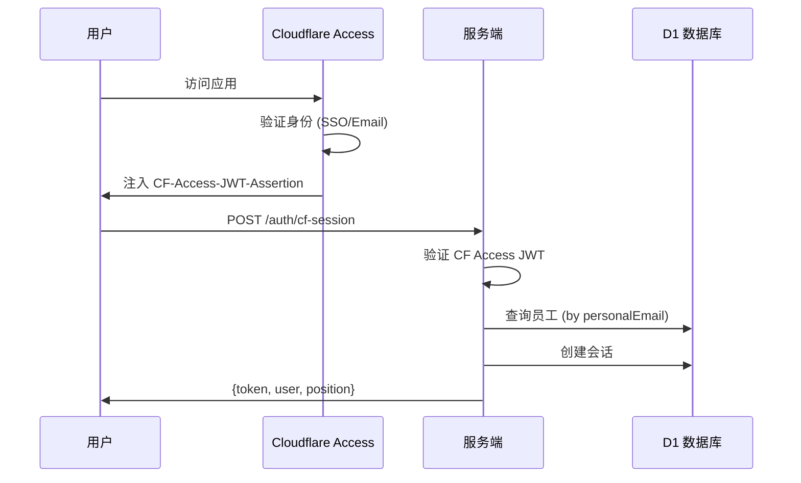

# 安全与认证文档

> **核心文件**：`backend/src/routes/v2/auth.ts`、`backend/src/middleware/cfAccess.ts`

---

## 🔐 认证架构

系统使用 **Cloudflare Access Zero Trust** 模式进行用户认证。

### 登录流程

### 认证端点

| 方法 | 路径 | 说明 |
|------|------|------|
| POST | `/auth/cf-session` | CF Access 登录 |
| POST | `/auth/logout` | 登出 |
| GET | `/auth/me` | 获取当前用户 |
| GET | `/my-permissions` | 获取权限 |

---

## 🛡️ 安全机制

### 1. Zero Trust 边缘防护

- 未验证流量在 Cloudflare 边缘被拦截
- 仅验证通过的请求携带 `CF-Access-JWT-Assertion` header
- JWT 验证：aud、iss、exp、签名

### 2. 环境变量配置

| 变量 | 说明 |
|------|------|
| `CF_ACCESS_AUD` | Access Application Audience Tag |
| `CF_ACCESS_TEAM_DOMAIN` | Access Team Domain |
| `AUTH_JWT_SECRET` | 应用内部 JWT 密钥 |

### 3. 会话管理

- **存储**：D1 `sessions` 表
- **有效期**：7 天
- **JWT 载荷**：sessionId, employeeId, email, position, cfSub

### 4. 双重 JWT

| JWT | 来源 | 用途 |
|-----|------|------|
| CF Access JWT | Cloudflare | 边缘身份验证 |
| 应用 JWT | 后端签发 | 应用内授权 |

---

## 🔑 权限控制

- **RBAC**：基于职位 (position) 的权限
- **DataScope**：数据范围控制 (all/project/group/self)
- **权限配置**：存储在 `positions.permissions` JSON 字段

---

## 🌐 IP 白名单

通过 Cloudflare Access 策略控制：
- 可配置国家/地区限制
- 可配置设备姿态策略
- 规则在 Cloudflare Dashboard 管理

---

**最后更新**: 2025-12-29
